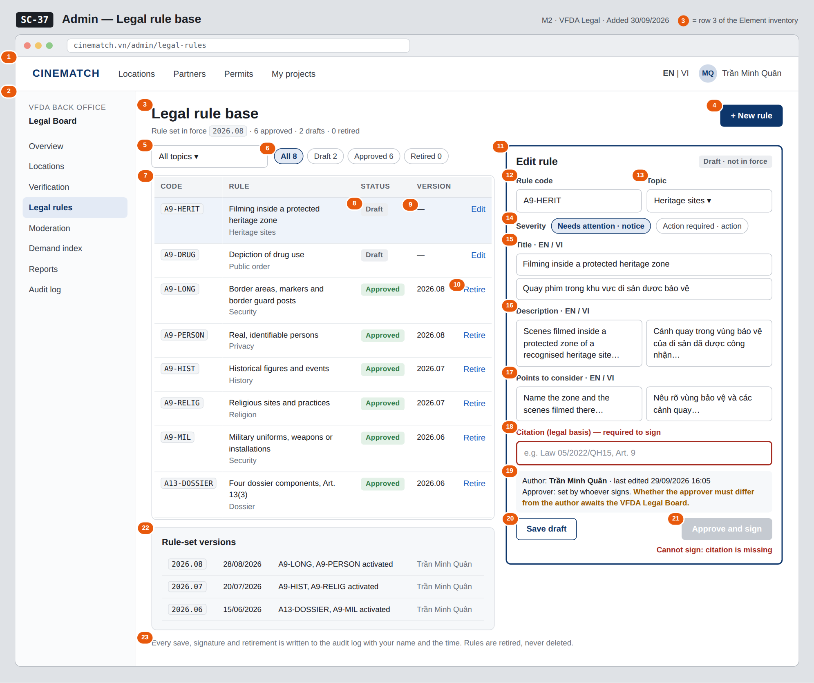

# Screen Spec: SC-37 Admin — Legal rule base

> DBIZ3 Session 4 template — one file per screen. The Screen ID is kept from the DBIZ2 Screen List.
> The mockup image stays an image; everything around it is text.
> **Each orange numbered badge on the mockup is the row with the same number in section 3 (Element inventory).**

| Field | Value |
|---|---|
| Screen ID | `SC-37` |
| Screen name | Admin — Legal rule base |
| Actor | VFDA Legal (Legal Board) |
| Priority | Must |
| Belongs to module | `docs/spec/spec-M2.md` |
| Mockup image | `img/SC-37.png` |
| Status | Draft |

*Route:* `/admin/legal-rules` · *Screen list file:* M2, item #30 (Added 30/09/2026 — Must) · *Design note from the screen list file:* Write, sign, version rules.

**Notes against Screen List v2.0**

- **Screen Spec added 30/09/2026.** `SC-37` is a Must screen that had no mockup (Screen List: *Must screens still without a mockup*). The M2 checks cannot run without it.

## 1. Purpose

**Shown when:** A VFDA Legal Board member signs in and chooses *Legal rules* in the admin menu (from `SC-34` or any admin screen).

**The user leaves this screen when:** The officer moves to another admin screen through the menu (for example `SC-41` to see the audit trail) or opens the public page of a rule (`SC-31`).

## 2. Mockup

> The image is the visual contract (layout, grouping, hierarchy); the tables below are the behavioural contract.
> All data in the mockup is sample data for one fictional project (*The Last Ferry*, Harbour Line Films); organisation names, people and phone numbers are examples, not real records.

## 3. Element inventory

| # | Element | Type | Content / data source | Required | Validation |
|---|---|---|---|---|---|
| 1 | Navigation bar | Header | static; signed in as a VFDA Legal Board member | — | — |
| 2 | Admin menu | List | static; *Legal rules* selected | — | items shown according to the user's role |
| 3 | Title + rule-set summary | Header | current `rule_version`; counts of `legal_rule` by status | — | — |
| 4 | *+ New rule* button | Button | static | — | opens an empty editor with status *draft* |
| 5 | Topic filter | Toggle (dropdown) | `filter_topic` — security / history / religion / privacy / dossier / public_order / heritage | No | enum or *All topics* |
| 6 | Status filter with counts | Toggle (single choice) | `filter_status` — draft / approved / retired | No | enum or *All* |
| 7 | Rule table | List | `legal_rule` (`legal_rule[]`): `rule_code`, `title_en`, `topic` | — | visible to the `vfda_legal` role only (Row Level Security) |
| 8 | Rule status | Text | status — Draft / Approved / Retired; *Approved* means `is_active` = true | — | enum |
| 9 | Rule version | Text | `version` / `rule_version` in which the rule was activated | — | *—* for drafts |
| 10 | Row action *Edit* / *Retire* | Link | draft → *Edit*; approved → *Retire* (confirmation dialog); retired → *View* | — | *Retire* needs a confirmation; retired rules are read-only |
| 11 | Rule editor | Container | the selected rule | — | editable only while the rule is a draft |
| 12 | Rule code | Input | `rule_code` | Yes | max 40 characters, capitals, digits and hyphens; unique |
| 13 | Topic | Toggle (dropdown) | `topic` | Yes | one of the 7 topic values |
| 14 | Severity | Toggle (single choice) | `severity` — notice (*Needs attention*) / action (*Action required*) | Yes | enum, 2 values |
| 15 | Title EN / VI | Input (2 fields) | `title_en`, `title_vi` | Yes | max 200 characters each; both required |
| 16 | Description EN / VI | Input (multi-line, 2 fields) | `description_en`, `description_vi` | Yes | both required |
| 17 | Points to consider EN / VI | Input (multi-line, 2 fields) | `guidance_en`, `guidance_vi` | Yes | both required |
| 18 | Citation | Input | `citation` | Yes | max 200 characters; required to sign — highlighted when missing |
| 19 | Author and approver line | Text | author, last edit time; `approver_id` and `approved_at` once signed | — | — |
| 20 | *Save draft* button | Button | static | — | enabled when a field changed |
| 21 | *Approve and sign* button | Button | records `approver_id`, `approved_at`, sets `is_active` | — | disabled while `citation` or any required field is empty (database CHECK) |
| 22 | Rule-set version history | List | `rule_version`, `created_at`, `created_by` and the rules activated in each | — | newest first; read-only |
| 23 | Audit note | Text | static | — | always shown |

## 4. States

| State | What the user sees | Trigger |
|---|---|---|
| Default | All rules in the table, the selected rule in the editor, version history below the table. | Open `/admin/legal-rules` |
| Empty (no data) | No rules yet: the table shows *No rules yet — create the first rule* with *+ New rule*; version history reads *No rule set in force yet*. A filter with no match shows *No rules for this filter*. | 0 rules / filter returns 0 |
| Loading | Grey skeleton rows in the table; the editor shows a skeleton until the rule has loaded. | Loading rules |
| Error | Signing refused by the database: red strip *Cannot sign — citation missing* and the citation field outlined. Duplicate rule code: message under the code field. Save fails: *Couldn't save — your text is kept*. | CHECK constraint / unique constraint / write error |
| Success / confirmation | Signed: strip *A9-HERIT signed — rule set 2026.09 is now in force*, status turns *Approved*, a new row appears in the version history. Retired: status *Retired*, strip *Rule retired — past results still show its text*. Saved draft: *Draft saved*. | Sign / retire / save succeeded |

## 5. Interactions and navigation

| # | Element | User action | System response | Goes to screen |
|---|---|---|---|---|
| 1 | Admin menu item | tap | Opens that admin screen | SC-34 |
| 2 | Topic / status filter | tap | Filters the table | stays |
| 3 | Rule row / *Edit* | tap | Loads the rule into the editor | stays |
| 4 | *+ New rule* button | tap | Empty editor, status draft | stays |
| 5 | *Save draft* button | tap | Saves the draft and writes an audit record | stays |
| 6 | *Approve and sign* button | tap | Confirmation dialog; on confirm records the approver, activates the rule, creates a new rule-set version and writes an audit record | stays |
| 7 | *Retire* link | tap | Confirmation dialog; on confirm sets status *retired*, removes the rule from future checks and writes an audit record | stays |
| 8 | Rule code of an approved rule | tap | Opens its public page in a new tab | SC-31 |
| 9 | Audit note | tap | Opens the audit log filtered to legal rules (admin role) | SC-41 |

## 6. Screen-level rules

| Rule ID | Rule | Source |
|---|---|---|
| SR-301 | A rule becomes active only when it has a **citation and an approver**; enforced by a database CHECK constraint, not only by the disabled button. | M2 BR-002, M2 FR-003 (F-M2-03) |
| SR-302 | Every activation creates a **new rule-set version**; every later check records the version it used. | M2 FR-004 (F-M2-04), M2 BR-007 |
| SR-303 | Rules are **retired, never deleted** (`status = retired`); findings keep showing the text of the rule version they cited. There is no *Delete* action. | M2 BR-008 |
| SR-304 | Only the VFDA Legal Board writes and signs rules; developers and the language model never change rule text. | M2 US-3, M2 BR-001 |
| SR-305 | Every save, signature and retirement writes one audit record in the same transaction. | M10 BR-005 (F-M10-08) |

## 7. Linked requirements

| FR ID (from the module spec) | What this screen does for it |
|---|---|
| FR-001 · spec-M2.md (F-M2-01) | List rules filtered by topic and status |
| FR-002 · spec-M2.md (F-M2-02) | Create and edit bilingual rules with citation and severity |
| FR-003 · spec-M2.md (F-M2-03) | Sign (approve) a rule; activation refused without citation or approver |
| FR-004 · spec-M2.md (F-M2-04) | New rule-set version on every activation; version history |
| FR-008 · spec-M10.md (F-M10-08) | Audit record for every save, signature and retirement |

## 8. Responsive and accessibility notes

- Minimum supported width: **360px** (admin work is expected on desktop; below 1024px the editor opens full screen over the table).
- The admin menu collapses into a menu button on narrow screens.
- Required fields are marked in the label text, not only by colour; the missing citation message is linked to the field with `aria-describedby`.
- Sign and retire confirmations are `dialog`s with a focus trap.

## 9. Open questions

| # | Question | Blocking? | Status |
|---|---|---|---|
| 1 | [NEEDS CLARIFICATION: Must rule signing require two different people (author ≠ approver)?] | Yes | Open |
| 2 | [NEEDS CLARIFICATION: when an approved rule needs a correction, is a new draft revision created while the signed text stays in force, and does retiring a rule also create a new rule-set version?] | Yes | Open |
| 3 | [NEEDS CLARIFICATION: format of `rule_version` (the mockups use year.month, e.g. 2026.08) when more than one rule is signed in the same month] | No | Open |

## Completion checklist

- [x] The mockup is a separate cropped image file, named with the Screen ID (`img/SC-37.png`).
- [x] Every visible element in the mockup appears in the element inventory — machine-checked: badge numbers on the image = row numbers in section 3.
- [x] Every input element has a validation rule or an explicit "—".
- [x] All five states are filled in, or marked "Not applicable" with a reason.
- [x] Every navigation target is a Screen ID that exists in `docs/screen-list.md` — machine-checked.
- [x] Every element that displays data names the field it displays, matching `docs/spec/spec-M2.md` section 5.1.
- [ ] **Checked by a person:** _(not signed — a Group C member compares the image with the tables and signs here)_

---
*DBIZ3 Session 4 · Group C · CINEMATCH. Built on the DBIZ2 Screen Design (Screen List and Screen Layout).*
