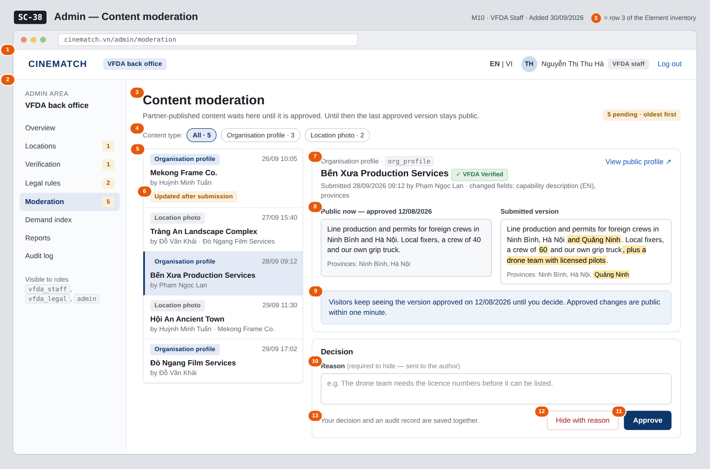

# Screen Spec: SC-38 Admin — Content moderation

> DBIZ3 Session 4 template — one file per screen. The Screen ID is kept from the DBIZ2 Screen List.
> The mockup image stays an image; everything around it is text.
> **Each orange numbered badge on the mockup is the row with the same number in section 3 (Element inventory).**

| Field | Value |
|---|---|
| Screen ID | `SC-38` |
| Screen name | Admin — Content moderation |
| Actor | VFDA Staff |
| Priority | Must |
| Belongs to module | `docs/spec/spec-M10.md` |
| Mockup image | `img/SC-38.png` |
| Status | Draft |

*Route:* `/admin/moderation` · *Screen list file:* M10, item #38 (Added 30/09/2026 — Must (raised 01/10/2026, M10 FR-001–002)) · *Design note from the screen list file:* Queue of content awaiting review

**Notes against Screen List v2.0**

- **New Screen Spec (30/09/2026).** Written with the M10 Spec Document. Content types limited to `org_profile` and `location_image`; `showcase` waits for phase 2.

## 1. Purpose

**Shown when:** Staff click the *Moderation queue* tile or the menu item on `SC-34`, or open the admin menu from any admin screen.

**The user leaves this screen when:** Staff decide item after item and stay; *View public profile* opens `SC-20` (or `SC-16` for a location photo); the menu leads back to `SC-34`.

## 2. Mockup

> The image is the visual contract (layout, grouping, hierarchy); the tables below are the behavioural contract.
> All data in the mockup is sample data for one fictional project (*The Last Ferry*, Harbour Line Films); organisation names, people and phone numbers are examples, not real records.

## 3. Element inventory

| # | Element | Type | Content / data source | Required | Validation |
|---|---|---|---|---|---|
| 1 | Admin top bar | Header | static; signed-in user and role | — | — |
| 2 | Admin menu | List | static; *Moderation* selected, pending count | — | — |
| 3 | Title and pending count | Header | count of `moderation_queue` items with `content_status = pending` | Yes | — |
| 4 | Content type filter | Toggle | `content_type` — All / Organisation profile (`org_profile`) / Location photo (`location_image`), with counts | No | enum; `showcase` not offered in this release |
| 5 | Queue list | List | `moderation_queue`: `content_type`, target name, `submitted_by` → name, `submitted_at` | Yes | oldest `submitted_at` first |
| 6 | *Updated after submission* label | Text | item edited again before review; queue keeps only the latest version | — | — |
| 7 | Item header | Header + Link | `content_id` → organisation name or location name; `submitted_by`, `submitted_at`; changed fields | Yes | — |
| 8 | Public now / submitted comparison | Text | last approved version vs submitted version (e.g. `capability_desc_en`, `province`); changes highlighted | Yes | for `location_image`: the photo with `image_source` and `usage_right` |
| 9 | Public-version note | Text | date of the last approval of this content | Yes | — |
| 10 | Reason | Input (multi-line) | `reason` | Required when hiding | required when `decision = hidden`; 10–1000 characters |
| 11 | *Approve* button | Button | `decision = approved` → `content_status = approved`, `audit_log_id` | — | — |
| 12 | *Hide with reason* button | Button | `decision = hidden` → `content_status = hidden`, reason sent to the author, `audit_log_id` | — | refused without a reason: *A reason is required to hide content* |
| 13 | Audit note | Text | static | — | — |

## 4. States

| State | What the user sees | Trigger |
|---|---|---|
| Default | Queue on the left (oldest first), selected item on the right with the public and submitted versions side by side, reason box and the two decision buttons. | Screen opens; first item selected |
| Empty (no data) | *Nothing waiting for review* with the date of the last decision; the detail area is hidden. | No item with `content_status = pending` (or none of the filtered type) |
| Loading | Skeleton rows in the queue; the detail shows a skeleton while the item and its approved version load. Buttons are disabled while a decision is saving. | Queue loads / decision saving |
| Error | *Hide* without a reason: *A reason is required to hide content* under the reason box, nothing saved. Save failure: *Decision not saved — nothing changed* (decision and audit record are committed together or not at all). | Validation / write failure |
| Success / confirmation | Green strip *Approved — public within one minute* or *Hidden — the reason was sent to Phạm Ngọc Lan*; the item leaves the queue and the next one opens. | Decision saved |

## 5. Interactions and navigation

| # | Element | User action | System response | Goes to screen |
|---|---|---|---|---|
| 1 | Content type chip | tap | Filters the queue | stays |
| 2 | Queue item | tap | Opens the item in the detail area | stays |
| 3 | *View public profile* | tap | Opens the public page (new tab) for an organisation profile | SC-20 |
| 4 | *View public profile* (location photo) | tap | Opens the location page (new tab) | SC-16 |
| 5 | *Approve* | tap | Saves `approved`, writes `content.approve` to the audit log, opens the next item | stays |
| 6 | *Hide with reason* | tap | Checks the reason, saves `hidden`, notifies the author, writes the audit record, opens the next item | stays |
| 7 | Admin menu | tap an item | Opens that admin screen | SC-34 / SC-35 / SC-36 / SC-37 / SC-38 / SC-39 / SC-40 / SC-41 |

## 6. Screen-level rules

| Rule ID | Rule | Source |
|---|---|---|
| SR-381 | Partner-published profile text and photos are public only after approval; until then the last approved version stays public. | M10 BR-001 |
| SR-382 | Hiding requires a written reason, which is sent to the author. | M10 BR-002 |
| SR-383 | Every decision writes one audit record naming the staff member, the item and the time, in the same transaction as the decision. | M10 BR-005; F-M10-08 |
| SR-384 | Only `org_profile` and `location_image` are moderated; locations themselves are published on `SC-35`. | Spec M10 §5.1 FR-001 note; §9 |
| SR-385 | The queue is oldest first and keeps only the latest version of an item edited again before review, labelled *Updated after submission*. | Spec M10 §9 (test value); §3 edge cases |

## 7. Linked requirements

| FR ID (from the module spec) | What this screen does for it |
|---|---|
| FR-001 · spec-M10.md (F-M10-01) | Queue of content awaiting review, filter by type |
| FR-002 · spec-M10.md (F-M10-02) | Approve or hide with a reason |
| FR-008 · spec-M10.md (F-M10-08) | Audit record for each decision |

## 8. Responsive and accessibility notes

- Minimum supported width: **360px**.
- Narrow screens: the queue and the detail become two steps (list → item, with *Back to queue*); the two versions stack, *Public now* first.
- Highlighted changes are also marked for screen readers (*inserted*); colour is never the only signal.
- The reason box has a visible label and its error is announced (`aria-live`).

## 9. Open questions

| # | Question | Blocking? | Status |
|---|---|---|---|
| 1 | [NEEDS CLARIFICATION: Must profile edits by an already verified partner also go through moderation, or only the first publication?] | No | Open |

## Completion checklist

- [x] The mockup is a separate cropped image file, named with the Screen ID (`img/SC-38.png`).
- [x] Every visible element in the mockup appears in the element inventory — machine-checked: badge numbers on the image = row numbers in section 3.
- [x] Every input element has a validation rule or an explicit "—".
- [x] All five states are filled in, or marked "Not applicable" with a reason.
- [x] Every navigation target is a Screen ID that exists in `docs/screen-list.md` — machine-checked.
- [x] Every element that displays data names the field it displays, matching `docs/spec/spec-M10.md` section 5.1.
- [ ] **Checked by a person:** _(not signed — a Group C member compares the image with the tables and signs here)_

---
*DBIZ3 Session 4 · Group C · CINEMATCH. Built on the DBIZ2 Screen Design (Screen List and Screen Layout).*
