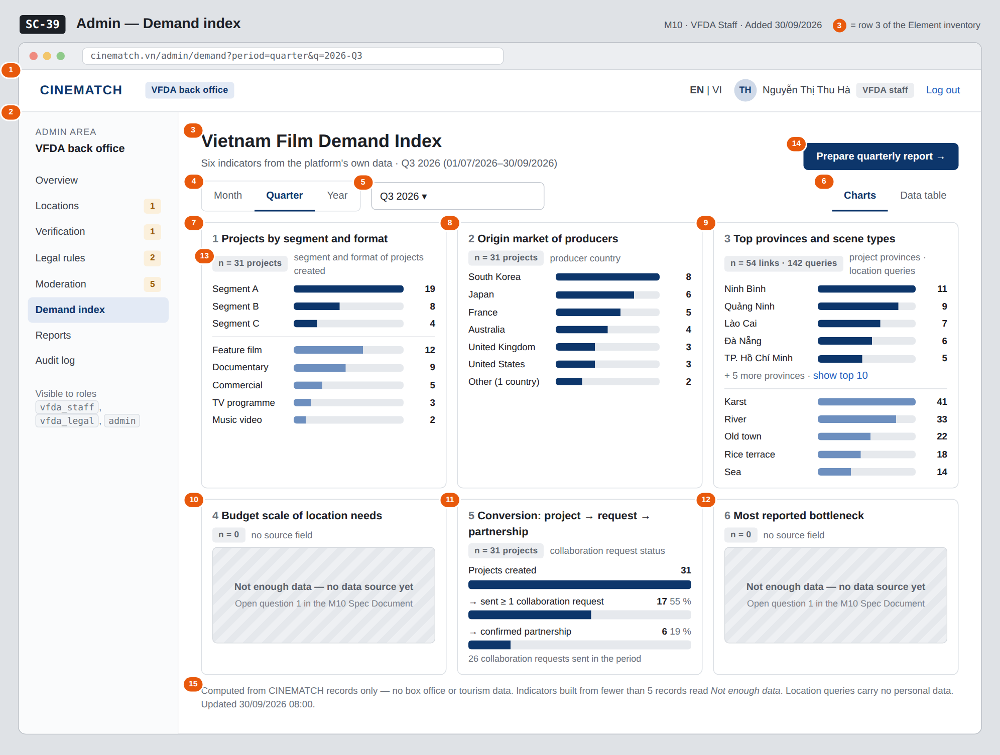

# Screen Spec: SC-39 Admin — Demand index

> DBIZ3 Session 4 template — one file per screen. The Screen ID is kept from the DBIZ2 Screen List.
> The mockup image stays an image; everything around it is text.
> **Each orange numbered badge on the mockup is the row with the same number in section 3 (Element inventory).**

| Field | Value |
|---|---|
| Screen ID | `SC-39` |
| Screen name | Admin — Demand index |
| Actor | VFDA Staff |
| Priority | Should |
| Belongs to module | `docs/spec/spec-M10.md` |
| Mockup image | `img/SC-39.png` |
| Status | Draft |

*Route:* `/admin/demand` · *Screen list file:* M10, item #39 (Added 30/09/2026 — Should) · *Design note from the screen list file:* Six indicators and charts

**Notes against Screen List v2.0**

- **New Screen Spec (30/09/2026).** Written with the M10 Spec Document. Indicators 4 and 6 are shown as *no data source yet* until open question 1 of the M10 Spec Document is decided.

## 1. Purpose

**Shown when:** Staff click the *Demand index* summary on `SC-34`, the menu item, or *Open in demand index* on `SC-40`.

**The user leaves this screen when:** Staff click *Prepare quarterly report* (to `SC-40`) or leave through the admin menu.

## 2. Mockup

> The image is the visual contract (layout, grouping, hierarchy); the tables below are the behavioural contract.
> All data in the mockup is sample data for one fictional project (*The Last Ferry*, Harbour Line Films); organisation names, people and phone numbers are examples, not real records.

## 3. Element inventory

| # | Element | Type | Content / data source | Required | Validation |
|---|---|---|---|---|---|
| 1 | Admin top bar | Header | static; signed-in user and role | — | — |
| 2 | Admin menu | List | static; *Demand index* selected | — | — |
| 3 | Title and period | Header | `period_start`, `period_end` of the selected period | Yes | — |
| 4 | Period granularity | Toggle | `period` — Month / Quarter / Year | Yes | enum `month`, `quarter`, `year` |
| 5 | Period picker | Toggle (dropdown) | `period_start`, `period_end` derived from the choice (e.g. Q3 2026 = 01/07/2026–30/09/2026) | Yes | `period_start` ≤ `period_end`; not after the current period |
| 6 | Charts / Data table switch | Toggle | `dashboard_view` — same figures as charts or as a table (indicator, value, sample size, source) | — | — |
| 7 | Indicator 1 — projects by segment and format | Chart | `demand_index` from `project.segment`, `project.format` created in the period | Yes | counts; *Not enough data* below 5 records |
| 8 | Indicator 2 — origin market | Chart | `demand_index` from `producer_organisation.country` (ISO code shown as country name) | Yes | same rule |
| 9 | Indicator 3 — top 10 provinces and scene types | Chart | `demand_index` from `project_province.province_id` (34-province list) and `location_query.attributes.scene_types` (readable labels) | Yes | same rule |
| 10 | Indicator 4 — budget scale | Text | no source field yet | Yes | always *Not enough data — no data source yet* until a field exists |
| 11 | Indicator 5 — conversion | Chart | `demand_index` from projects → `collab_request` sent → `collab_request.status = confirmed` | Yes | percentages only when the base has ≥ 5 records |
| 12 | Indicator 6 — most reported bottleneck | Text | no source field yet | Yes | same as row 10 |
| 13 | Sample size label | Text | number of records each indicator was computed from | Yes | shown on every indicator (M10 BR-003) |
| 14 | *Prepare quarterly report* button | Button | static | — | shown when the Quarter view is selected; disabled when the period has no data |
| 15 | Data-source note | Text | static; time of the last aggregation | — | — |

## 4. States

| State | What the user sees | Trigger |
|---|---|---|
| Default | Q3 2026 selected, six indicator cards in charts view, each with its sample size; indicators 4 and 6 read *Not enough data — no data source yet*. | Screen opens (current quarter) |
| Empty (no data) | A period with no records: every indicator reads *Not enough data*, sample sizes read *n = 0*, and *Prepare quarterly report* is disabled with *No figures for this period*. | Period without data |
| Loading | Skeleton cards with the text *Computing indicators for September 2026…*; the period controls stay usable. | Period changed / screen opens |
| Error | *The indicators could not be computed — try again.* No partial figures are shown. | Aggregation query fails |
| Success / confirmation | **Not applicable** — the screen only reads; changing the period recomputes every indicator for that period (e.g. September 2026: indicators with fewer than 5 records switch to *Not enough data*). | — |

## 5. Interactions and navigation

| # | Element | User action | System response | Goes to screen |
|---|---|---|---|---|
| 1 | Month / Quarter / Year | tap | Changes the granularity; the picker offers matching periods | stays |
| 2 | Period picker | choose | Recomputes all six indicators for the chosen period | stays |
| 3 | Charts / Data table | tap | Switches the view; figures stay the same | stays |
| 4 | *show top 10* link in indicator 3 | tap | Expands the list to ten provinces | stays |
| 5 | *Prepare quarterly report* | tap | Opens the report for the selected quarter | SC-40 |
| 6 | Admin menu | tap an item | Opens that admin screen | SC-34 / SC-35 / SC-36 / SC-37 / SC-38 / SC-39 / SC-40 / SC-41 |

## 6. Screen-level rules

| Rule ID | Rule | Source |
|---|---|---|
| SR-391 | Every indicator shows the number of records it was computed from; below 5 records it shows *Not enough data* instead of a value. | M10 BR-003 |
| SR-392 | Indicators are built from the platform's own data only; no external source. | F-M10-03; Spec M10 §1 Out of scope |
| SR-393 | The screen is visible to the roles `vfda_staff` and `admin` only. | M10 FR-004 |
| SR-394 | Indicators 4 and 6 are never estimated: until a source field exists they read *Not enough data — no data source yet*. | Spec M10 §10 question 1 |
| SR-395 | A *brief* counts as a project with its location queries; location queries carry no personal data. | Spec M10 §9; M3 BR-009 |

## 7. Linked requirements

| FR ID (from the module spec) | What this screen does for it |
|---|---|
| FR-003 · spec-M10.md (F-M10-03) | Six indicators aggregated for the period |
| FR-004 · spec-M10.md (F-M10-04) | Charts and data table |
| FR-005 · spec-M10.md (F-M10-05) | Month / quarter / year filter |

## 8. Responsive and accessibility notes

- Minimum supported width: **360px**.
- Narrow screens: indicator cards stack one per row; indicator 3 shows provinces and scene types one under the other.
- Every chart has the *Data table* view as its text alternative; bar values are printed as numbers.
- Sample-size labels are read out with each indicator title.

## 9. Open questions

| # | Question | Blocking? | Status |
|---|---|---|---|
| 1 | [NEEDS CLARIFICATION: Indicator 4 (budget scale of location needs) and indicator 6 (bottleneck most reported) need fields that no function collects today. Add a budget band and a *main obstacle* question to project creation, or drop the two indicators?] | Yes | Open |
| 2 | [NEEDS CLARIFICATION: Is indicator 2 (origin market) counted per project or per producer organisation — a company with three projects in the quarter counts once or three times?] | No | Open |

## Completion checklist

- [x] The mockup is a separate cropped image file, named with the Screen ID (`img/SC-39.png`).
- [x] Every visible element in the mockup appears in the element inventory — machine-checked: badge numbers on the image = row numbers in section 3.
- [x] Every input element has a validation rule or an explicit "—".
- [x] All five states are filled in, or marked "Not applicable" with a reason.
- [x] Every navigation target is a Screen ID that exists in `docs/screen-list.md` — machine-checked.
- [x] Every element that displays data names the field it displays, matching `docs/spec/spec-M10.md` section 5.1.
- [ ] **Checked by a person:** _(not signed — a Group C member compares the image with the tables and signs here)_

---
*DBIZ3 Session 4 · Group C · CINEMATCH. Built on the DBIZ2 Screen Design (Screen List and Screen Layout).*
