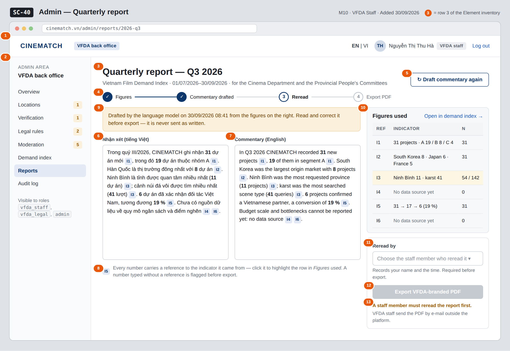

# Screen Spec: SC-40 Admin — Quarterly report

> DBIZ3 Session 4 template — one file per screen. The Screen ID is kept from the DBIZ2 Screen List.
> The mockup image stays an image; everything around it is text.
> **Each orange numbered badge on the mockup is the row with the same number in section 3 (Element inventory).**

| Field | Value |
|---|---|
| Screen ID | `SC-40` |
| Screen name | Admin — Quarterly report |
| Actor | VFDA Staff |
| Priority | Should |
| Belongs to module | `docs/spec/spec-M10.md` |
| Mockup image | `img/SC-40.png` |
| Status | Draft |

*Route:* `/admin/reports` · *Screen list file:* M10, item #40 (Added 30/09/2026 — Should) · *Design note from the screen list file:* Generate and export the PDF report

**Notes against Screen List v2.0**

- **New Screen Spec (30/09/2026).** Written with the M10 Spec Document; the reread gate (`reread_by`, M10 BR-004) is a Group C addition recorded in its §11.1.

## 1. Purpose

**Shown when:** Staff click *Prepare quarterly report* on `SC-39`, *Prepare Q3 2026 report* on `SC-34`, or *Reports* in the admin menu.

**The user leaves this screen when:** Staff export the PDF and stay; *Open in demand index* goes to `SC-39`; the menu leads elsewhere.

## 2. Mockup

> The image is the visual contract (layout, grouping, hierarchy); the tables below are the behavioural contract.
> All data in the mockup is sample data for one fictional project (*The Last Ferry*, Harbour Line Films); organisation names, people and phone numbers are examples, not real records.

## 3. Element inventory

| # | Element | Type | Content / data source | Required | Validation |
|---|---|---|---|---|---|
| 1 | Admin top bar | Header | static; signed-in user and role | — | — |
| 2 | Admin menu | List | static; *Reports* selected | — | — |
| 3 | Report title and period | Header | `report_id` → period (quarter, `period_start`–`period_end`) | Yes | — |
| 4 | Progress steps | Text | Figures → Commentary drafted (`narrative_vi`, `narrative_en`) → Reread (`reread_by`) → Export (`report_pdf_url`) | — | — |
| 5 | *Draft commentary* button | Button | calls the draft from `demand_index` (F-M10-06) | — | disabled when the period has no data |
| 6 | Vietnamese commentary | Input (multi-line) | `narrative_vi` | Yes | not empty for export; every number keeps a reference to its indicator |
| 7 | English commentary | Input (multi-line) | `narrative_en` | Yes | same as row 6 |
| 8 | Figure reference | Link | reference from a number to its indicator (I1–I6) in `demand_index` | Yes | a number without a reference is flagged before export |
| 9 | Model-draft notice | Text | draft time; static wording | Yes | — |
| 10 | *Figures used* panel | List | `demand_index` the draft was built from: value and sample size per indicator | Yes | same sample-size rule as `SC-39` (M10 BR-003) |
| 11 | *Reread by* | Toggle (dropdown) | `reread_by` — staff member (UUID) and time | Yes | a user with role `vfda_staff` |
| 12 | *Export VFDA-branded PDF* button | Button | `report_pdf_url` | — | disabled until `reread_by` is set |
| 13 | Export gate message | Text | static: *A staff member must reread the report first* | — | shown while `reread_by` is empty |

## 4. States

| State | What the user sees | Trigger |
|---|---|---|
| Default | Commentary drafted in both languages with a reference chip after every number, figures panel on the right, reread not yet recorded, export disabled with the gate message. | Draft exists, not reread |
| Empty (no data) | Period without data: *No figures for this period — the report cannot be drafted*; both editors and all buttons are disabled. | Every indicator below 5 records |
| Loading | *Drafting commentary…* in both editors; *Building the PDF…* on the export button. | Draft requested / export requested |
| Error | Model unavailable: *Draft unavailable — write it by hand*; editors stay empty and editable, figures and export still work. Export without reread: *A staff member must reread the report first*. | Model call fails / export refused |
| Success / confirmation | Green strip *Report exported — VFDA_Q3-2026_demand-index.pdf* with a download link; the export is written to the audit log; step 4 turns complete. | PDF exported |

## 5. Interactions and navigation

| # | Element | User action | System response | Goes to screen |
|---|---|---|---|---|
| 1 | Figure reference chip | tap | Highlights the indicator row in *Figures used* | stays |
| 2 | *Open in demand index* | tap | Opens the index for the same quarter | SC-39 |
| 3 | *Draft commentary again* | tap | Asks for confirmation, then replaces both drafts | stays |
| 4 | Commentary editors | type | Saves the draft as the user types | stays |
| 5 | *Reread by* | choose | Records `reread_by` and the time; enables export | stays |
| 6 | *Export VFDA-branded PDF* | tap | Builds the PDF, stores `report_pdf_url`, writes the audit record, offers the download | stays |
| 7 | Admin menu | tap an item | Opens that admin screen | SC-34 / SC-35 / SC-36 / SC-37 / SC-38 / SC-39 / SC-40 / SC-41 |

## 6. Screen-level rules

| Rule ID | Rule | Source |
|---|---|---|
| SR-401 | A report can be exported only after a named staff member has marked it reread; the model draft is never sent as written. | M10 BR-004 |
| SR-402 | Every number in the commentary carries a reference to the indicator it came from. | F-M10-06; Spec M10 §5.1 FR-006 note |
| SR-403 | Indicators with no data source are reported as such in the commentary, never estimated. | M10 BR-003; Spec M10 §10 question 1 |
| SR-404 | Each export writes an audit record in the same transaction. | M10 BR-005; §3 US-3 |
| SR-405 | The platform only produces the PDF; VFDA staff send it by e-mail outside the platform. | Spec M10 §1 Out of scope; §9 |

## 7. Linked requirements

| FR ID (from the module spec) | What this screen does for it |
|---|---|
| FR-006 · spec-M10.md (F-M10-06) | Vietnamese and English commentary with figure references |
| FR-007 · spec-M10.md (F-M10-07) | Export of the reread report as a VFDA-branded PDF |
| FR-008 · spec-M10.md (F-M10-08) | Audit record for the export |

## 8. Responsive and accessibility notes

- Minimum supported width: **360px**.
- Narrow screens: the two editors become tabs (VI | EN); *Figures used* and the reread box move below the editors.
- Reference chips are links with text (*indicator 5*) for screen readers.
- The disabled export button carries the gate message as its accessible description.

## 9. Open questions

| # | Question | Blocking? | Status |
|---|---|---|---|
| 1 | [NEEDS CLARIFICATION: Who must reread and sign the quarterly report before it is sent — any staff member, or a named VFDA leader?] | No | Open |
| 2 | [NEEDS CLARIFICATION: If the commentary is edited after the reread is recorded, must the reread be recorded again before export?] | No | Open |

## Completion checklist

- [x] The mockup is a separate cropped image file, named with the Screen ID (`img/SC-40.png`).
- [x] Every visible element in the mockup appears in the element inventory — machine-checked: badge numbers on the image = row numbers in section 3.
- [x] Every input element has a validation rule or an explicit "—".
- [x] All five states are filled in, or marked "Not applicable" with a reason.
- [x] Every navigation target is a Screen ID that exists in `docs/screen-list.md` — machine-checked.
- [x] Every element that displays data names the field it displays, matching `docs/spec/spec-M10.md` section 5.1.
- [ ] **Checked by a person:** _(not signed — a Group C member compares the image with the tables and signs here)_

---
*DBIZ3 Session 4 · Group C · CINEMATCH. Built on the DBIZ2 Screen Design (Screen List and Screen Layout).*
