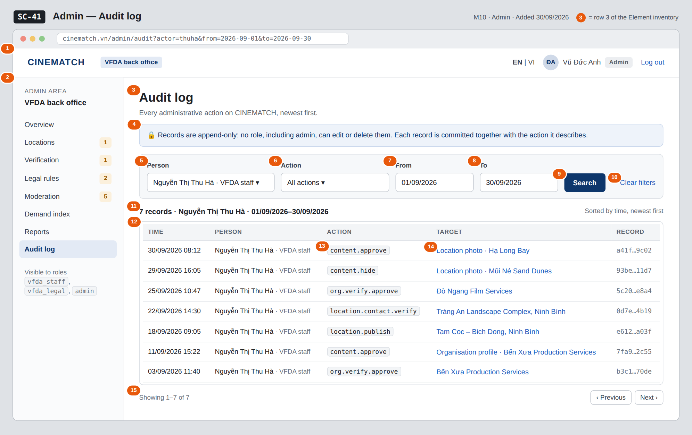

# Screen Spec: SC-41 Admin — Audit log

> DBIZ3 Session 4 template — one file per screen. The Screen ID is kept from the DBIZ2 Screen List.
> The mockup image stays an image; everything around it is text.
> **Each orange numbered badge on the mockup is the row with the same number in section 3 (Element inventory).**

| Field | Value |
|---|---|
| Screen ID | `SC-41` |
| Screen name | Admin — Audit log |
| Actor | Admin |
| Priority | Should |
| Belongs to module | `docs/spec/spec-M10.md` |
| Mockup image | `img/SC-41.png` |
| Status | Draft |

*Route:* `/admin/audit` · *Screen list file:* M10, item #41 (Added 30/09/2026 — Should) · *Design note from the screen list file:* Search admin actions

**Notes against Screen List v2.0**

- **New Screen Spec (30/09/2026).** Written with the M10 Spec Document. The four typed filters replace the DBIZ2 `filter JSONB` (M10 §11.1).

## 1. Purpose

**Shown when:** An admin clicks *Open audit log* on `SC-34` or *Audit log* in the admin menu.

**The user leaves this screen when:** The admin opens the target of a record (`SC-38`, `SC-35` or `SC-36`) or leaves through the admin menu.

## 2. Mockup

> The image is the visual contract (layout, grouping, hierarchy); the tables below are the behavioural contract.
> All data in the mockup is sample data for one fictional project (*The Last Ferry*, Harbour Line Films); organisation names, people and phone numbers are examples, not real records.

## 3. Element inventory

| # | Element | Type | Content / data source | Required | Validation |
|---|---|---|---|---|---|
| 1 | Admin top bar | Header | static; signed-in user (Vũ Đức Anh) and role | — | — |
| 2 | Admin menu | List | static; *Audit log* selected | — | *Audit log* shown to `admin` only |
| 3 | Title | Header | static | — | — |
| 4 | Append-only notice | Text | static | Yes | — |
| 5 | Person filter | Toggle (dropdown, searchable) | `actor_id` — users with role `vfda_staff`, `vfda_legal` or `admin` | No | an existing user; empty = everyone |
| 6 | Action filter | Toggle (dropdown) | `action` — action codes present in the log | No | max 60 characters; empty = all actions |
| 7 | From | Input (date) | `from_date` | No | dd/mm/yyyy; on or before *To* |
| 8 | To | Input (date) | `to_date` | No | dd/mm/yyyy; on or after *From*; not after today |
| 9 | *Search* button | Button | runs the search → `audit_entries` | — | — |
| 10 | *Clear filters* link | Link | static | — | — |
| 11 | Result count and active filters | Text | count of `audit_entries` for the filters | Yes | — |
| 12 | Results table | List | `audit_entries`: `logged_at`, `admin_id` → name and role, `action`, `target_id`, `audit_log_id` | Yes | newest `logged_at` first; no edit or delete control |
| 13 | Action code | Text | `action` | Yes | e.g. `content.approve`, `location.publish` |
| 14 | Target link | Link | `target_id` → readable label of the organisation, location, content item or rule | — | plain text when the target is no longer published or deactivated |
| 15 | Pagination | Button | page of `audit_entries` | — | 50 records per page |

## 4. States

| State | What the user sees | Trigger |
|---|---|---|
| Default | Filters for person, action, from and to; the matching records newest first; append-only notice above — as in the mockup (Nguyễn Thị Thu Hà, September 2026). | Admin runs a search |
| Empty (no data) | *No admin actions match these filters* with a *Clear filters* link; the table is hidden. | No matching record |
| Loading | Skeleton rows in the table; the *Search* button shows a pending state. | Search running |
| Error | *From* after *To*: *The start date must be on or before the end date* under the date fields, no search sent. Search failure: *The log could not be searched — try again.* | Validation / query failure |
| Success / confirmation | **Not applicable** — the audit log is read-only; no action on this screen writes data. | — |

## 5. Interactions and navigation

| # | Element | User action | System response | Goes to screen |
|---|---|---|---|---|
| 1 | Filters + *Search* | tap | Runs the search with the four typed filters | stays |
| 2 | *Clear filters* | tap | Resets the filters and shows the latest records | stays |
| 3 | Target link (content item) | tap | Opens the moderation item | SC-38 |
| 4 | Target link (location) | tap | Opens the location in the admin list | SC-35 |
| 5 | Target link (organisation) | tap | Opens the organisation's verification record | SC-36 |
| 6 | *Previous* / *Next* | tap | Pages through the results | stays |
| 7 | Admin menu | tap an item | Opens that admin screen | SC-34 / SC-35 / SC-36 / SC-37 / SC-38 / SC-39 / SC-40 / SC-41 |

## 6. Screen-level rules

| Rule ID | Rule | Source |
|---|---|---|
| SR-411 | Audit records are append-only: no role, including admin, can update or delete them; the screen offers no edit or delete control. | M10 BR-005 |
| SR-412 | One record is written for every administrative action by a database trigger in the same transaction; an action whose record fails is rolled back. | F-M10-08; Spec M10 §4.3, §3 edge cases |
| SR-413 | Search is available to the role `admin` only. | F-M10-09 (actor Admin) |
| SR-414 | Results are listed newest first and filtered only by person, action type, from and to. | Spec M10 §3 US-4; §11.1 |
| SR-415 | Records about accounts that were deleted keep their entries; the person appears as *Former member* after anonymisation. | SYS BR-005 |

## 7. Linked requirements

| FR ID (from the module spec) | What this screen does for it |
|---|---|
| FR-008 · spec-M10.md (F-M10-08) | Records written for every admin action (shown here) |
| FR-009 · spec-M10.md (F-M10-09) | Search by person, action type and time |

## 8. Responsive and accessibility notes

- Minimum supported width: **360px**.
- Narrow screens: filters stack in one column behind a *Filters* button; each record becomes a card (time, person, action, target).
- The table has a caption and header cells (`th scope`); action codes are also read as text.
- Date fields accept typed dates as well as the picker.

## 9. Open questions

| # | Question | Blocking? | Status |
|---|---|---|---|
| 1 | [NEEDS CLARIFICATION: How long are audit records kept (proposed: for the life of the platform)?] | No | Open |
| 2 | [NEEDS CLARIFICATION: The specs name only the action codes `content.approve` and `location.publish`; the full list of action codes (verification, contact check, hide, role grant, rule signing, report export) must be fixed before the Action filter can be built.] | No | Open |

## Completion checklist

- [x] The mockup is a separate cropped image file, named with the Screen ID (`img/SC-41.png`).
- [x] Every visible element in the mockup appears in the element inventory — machine-checked: badge numbers on the image = row numbers in section 3.
- [x] Every input element has a validation rule or an explicit "—".
- [x] All five states are filled in, or marked "Not applicable" with a reason.
- [x] Every navigation target is a Screen ID that exists in `docs/screen-list.md` — machine-checked.
- [x] Every element that displays data names the field it displays, matching `docs/spec/spec-M10.md` section 5.1.
- [ ] **Checked by a person:** _(not signed — a Group C member compares the image with the tables and signs here)_

---
*DBIZ3 Session 4 · Group C · CINEMATCH. Built on the DBIZ2 Screen Design (Screen List and Screen Layout).*
