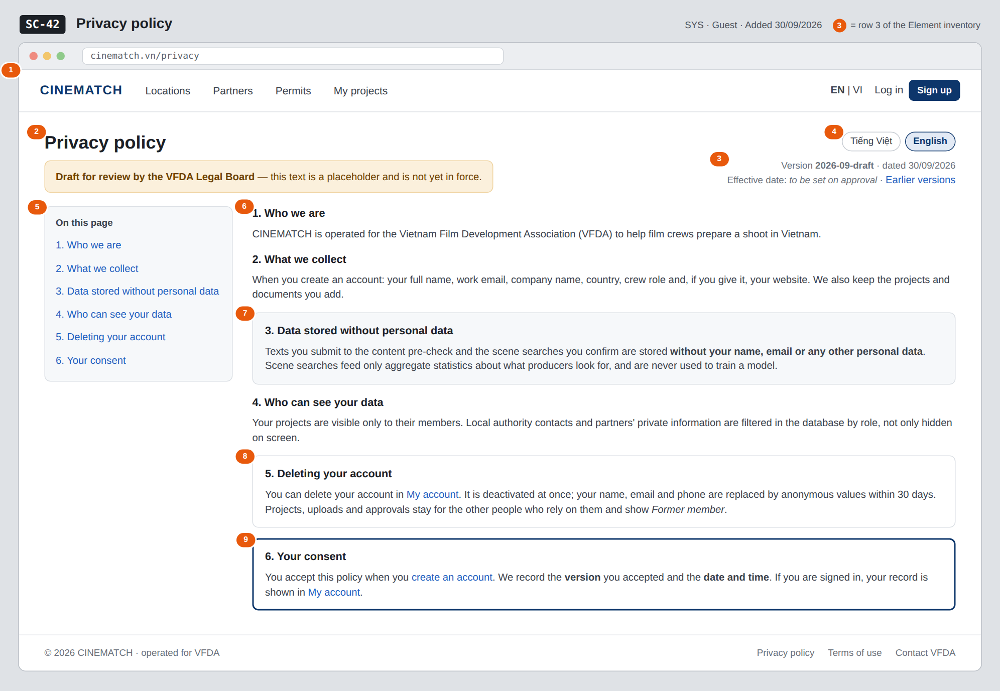

# Screen Spec: SC-42 Privacy policy

> DBIZ3 Session 4 template — one file per screen. The Screen ID is kept from the DBIZ2 Screen List.
> The mockup image stays an image; everything around it is text.
> **Each orange numbered badge on the mockup is the row with the same number in section 3 (Element inventory).**

| Field | Value |
|---|---|
| Screen ID | `SC-42` |
| Screen name | Privacy policy |
| Actor | Guest |
| Priority | Must |
| Belongs to module | `docs/spec/spec-SYS.md` |
| Mockup image | `img/SC-42.png` |
| Status | Draft |

*Route:* `/privacy` · *Screen list file:* SYS, item #25 (Added 30/09/2026 — Must) · *Design note from the screen list file:* Bilingual, consent recorded.

**Notes against Screen List v2.0**

- New Screen Spec written 30/09/2026. The policy text in the mockup is a short placeholder, marked as a draft for review by the VFDA Legal Board.

## 1. Purpose

**Shown when:** Anyone clicks *Privacy policy* in the page footer, in the consent line of `SC-04`, or in *Documents you accepted* on `SC-08`.

**The user leaves this screen when:** The reader goes back, opens `SC-04` to create an account, `SC-08` to delete an account, or `SC-43`.

## 2. Mockup

> The image is the visual contract (layout, grouping, hierarchy); the tables below are the behavioural contract.
> All data in the mockup is sample data for one fictional project (*The Last Ferry*, Harbour Line Films); organisation names, people and phone numbers are examples, not real records.

## 3. Element inventory

| # | Element | Type | Content / data source | Required | Validation |
|---|---|---|---|---|---|
| 1 | Navigation bar | Header | static; logged out or in | — | — |
| 2 | Title + draft banner | Header | static; banner shown while the version is a draft | Yes | — |
| 3 | Version and date | Text | document version = `consent_version` value; date of the version | Yes | ≤ 20 characters |
| 4 | Language switch VI / EN | Toggle | `locale` | Yes | enum vi / en |
| 5 | Table of contents | List | section headings of the current version | — | — |
| 6 | Policy sections | Text | policy text of the current version, per `locale` | Yes | both languages must exist before publishing |
| 7 | *Data stored without personal data* section | Text | static text of the current version | Yes | — |
| 8 | *Deleting your account* section | Text + link | static text of the current version | Yes | — |
| 9 | *Your consent* box | Text + link | signed in: `consent_version` + acceptance timestamp; guest: explanation | Yes | — |

## 4. States

| State | What the user sees | Trigger |
|---|---|---|
| Default | Current version in the user's language, table of contents on the left, draft banner while the Legal Board has not approved it. | Open `/privacy` |
| Empty (no data) | Not applicable — the page is static text; publishing requires both language versions. | — |
| Loading | Not applicable — the page is rendered on the server with its text; switching language reloads it in place. | — |
| Error | Requested earlier version not found: *This version does not exist — showing the current version*. | Unknown `?version=` parameter |
| Success / confirmation | Signed in: the consent box reads *You accepted version 2026-09-draft on 18/09/2026 at 10:42*. | Signed-in user with a consent record |

## 5. Interactions and navigation

| # | Element | User action | System response | Goes to screen |
|---|---|---|---|---|
| 1 | Language switch | tap | Shows the same version in the other language, keeps the scroll position | stays |
| 2 | Table of contents entry | tap | Scrolls to the section | stays |
| 3 | *Earlier versions* | tap | Lists past versions with dates; opens one read-only | stays |
| 4 | *My account* link | tap | Signed in: opens the account page; guest: log in first | SC-08 |
| 5 | *create an account* link | tap | — | SC-04 |
| 6 | Footer *Terms of use* | tap | — | SC-43 |

## 6. Screen-level rules

| Rule ID | Rule | Source |
|---|---|---|
| SR-251 | Acceptance is stored with the **document version and timestamp**; the page always shows which version is current. | SYS BR-003 |
| SR-252 | Pre-check texts and confirmed scene searches are described as **stored without personal data** and never used to train a model. | M3 BR-009; M2 FR-007 |
| SR-253 | Account deletion is described exactly as decided: deactivated at once, anonymised within 30 days, records kept as *Former member*. | SYS BR-005 |
| SR-254 | The text is shown in Vietnamese and English; a version is published only when both languages exist. | SYS FR-005; FR-006 |
| SR-255 | The text is a **draft** until approved by the VFDA Legal Board; the draft banner stays until then. | Group C decision 30/09/2026 |

## 7. Linked requirements

| FR ID (from the module spec) | What this screen does for it |
|---|---|
| FR-001 · spec-SYS.md (F-SYS-01) | Policy accepted at sign-up; version recorded in `consent_version` |
| FR-005 · spec-SYS.md (F-SYS-05) | Show the policy in Vietnamese or English |

## 8. Responsive and accessibility notes

- Minimum supported width: **360px**.
- Narrow screens: the table of contents becomes a collapsible *On this page* menu above the text.
- Headings use a proper outline (`h1` → `h3`) so screen readers can jump between sections.
- Line length is kept under about 80 characters for readability.

## 9. Open questions

| # | Question | Blocking? | Status |
|---|---|---|---|
| 1 | [NEEDS CLARIFICATION: How long are pre-check texts kept, and may they be used to improve the rule base? (same question as spec-M2.md question 6)] | Yes | Open |
| 2 | [NEEDS CLARIFICATION: Does one `consent_version` cover both the privacy policy and the terms of use, or does each document need its own version and acceptance record?] | No | Open |

## Completion checklist

- [x] The mockup is a separate cropped image file, named with the Screen ID (`img/SC-42.png`).
- [x] Every visible element in the mockup appears in the element inventory — machine-checked: badge numbers on the image = row numbers in section 3.
- [x] Every input element has a validation rule or an explicit "—".
- [x] All five states are filled in, or marked "Not applicable" with a reason.
- [x] Every navigation target is a Screen ID that exists in `docs/screen-list.md` — machine-checked.
- [x] Every element that displays data names the field it displays, matching `docs/spec/spec-SYS.md` section 5.1.
- [ ] **Checked by a person:** _(not signed — a Group C member compares the image with the tables and signs here)_

---
*DBIZ3 Session 4 · Group C · CINEMATCH. Built on the DBIZ2 Screen Design (Screen List and Screen Layout).*
