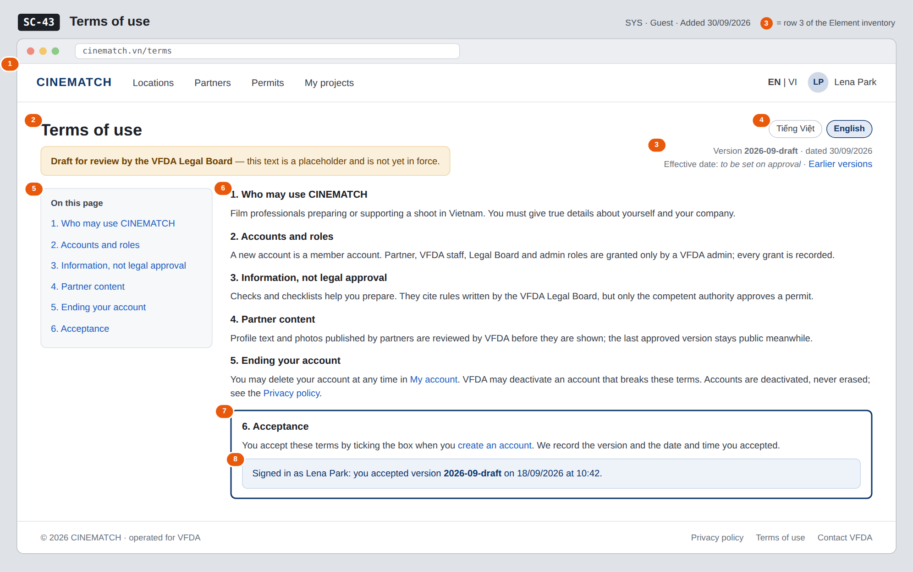

# Screen Spec: SC-43 Terms of use

> DBIZ3 Session 4 template — one file per screen. The Screen ID is kept from the DBIZ2 Screen List.
> The mockup image stays an image; everything around it is text.
> **Each orange numbered badge on the mockup is the row with the same number in section 3 (Element inventory).**

| Field | Value |
|---|---|
| Screen ID | `SC-43` |
| Screen name | Terms of use |
| Actor | Guest |
| Priority | Must |
| Belongs to module | `docs/spec/spec-SYS.md` |
| Mockup image | `img/SC-43.png` |
| Status | Draft |

*Route:* `/terms` · *Screen list file:* SYS, item #26 (Added 30/09/2026 — Must) · *Design note from the screen list file:* Bilingual.

**Notes against Screen List v2.0**

- New Screen Spec written 30/09/2026. The terms text in the mockup is a short placeholder, marked as a draft for review by the VFDA Legal Board. The mockup shows a signed-in visitor so the acceptance record (row 8) is visible.

## 1. Purpose

**Shown when:** Anyone clicks *Terms of use* in the page footer, in the consent line of `SC-04`, or in *Documents you accepted* on `SC-08`.

**The user leaves this screen when:** The reader goes back, opens `SC-04` to create an account, `SC-08`, or `SC-42`.

## 2. Mockup

> The image is the visual contract (layout, grouping, hierarchy); the tables below are the behavioural contract.
> All data in the mockup is sample data for one fictional project (*The Last Ferry*, Harbour Line Films); organisation names, people and phone numbers are examples, not real records.

## 3. Element inventory

| # | Element | Type | Content / data source | Required | Validation |
|---|---|---|---|---|---|
| 1 | Navigation bar | Header | static; logged out or in | — | — |
| 2 | Title + draft banner | Header | static; banner shown while the version is a draft | Yes | — |
| 3 | Version and date | Text | document version = `consent_version` value; date of the version | Yes | ≤ 20 characters |
| 4 | Language switch VI / EN | Toggle | `locale` | Yes | enum vi / en |
| 5 | Table of contents | List | section headings of the current version | — | — |
| 6 | Terms sections | Text | terms text of the current version, per `locale` | Yes | both languages must exist before publishing |
| 7 | *Acceptance* section | Text + link | static text of the current version | Yes | — |
| 8 | Acceptance record | Text | `consent_version` + acceptance timestamp of the signed-in user | — | shown to signed-in users only |

## 4. States

| State | What the user sees | Trigger |
|---|---|---|
| Default | Current version in the user's language, table of contents, draft banner while not approved. | Open `/terms` |
| Empty (no data) | Not applicable — static text; a version is published only with both languages. | — |
| Loading | Not applicable — rendered on the server with its text. | — |
| Error | Requested earlier version not found: *This version does not exist — showing the current version*. | Unknown `?version=` parameter |
| Success / confirmation | Signed in: row 8 shows the version and time the user accepted. If that is older than the current version, it reads *You accepted an earlier version (…)* with a link to it. | Signed-in user with a consent record |

## 5. Interactions and navigation

| # | Element | User action | System response | Goes to screen |
|---|---|---|---|---|
| 1 | Language switch | tap | Shows the same version in the other language, keeps the scroll position | stays |
| 2 | Table of contents entry | tap | Scrolls to the section | stays |
| 3 | *My account* link | tap | Signed in: opens the account page; guest: log in first | SC-08 |
| 4 | *Privacy policy* link | tap | — | SC-42 |
| 5 | *create an account* link | tap | — | SC-04 |

## 6. Screen-level rules

| Rule ID | Rule | Source |
|---|---|---|
| SR-261 | Acceptance is recorded with the **version and timestamp** at sign-up; the terms box on `SC-04` must be ticked to create an account. | SYS BR-003; FR-001 |
| SR-262 | The text states that partner and VFDA roles are granted only by an admin. | SYS BR-002 |
| SR-263 | The text never calls a check result *approved*, *accepted*, *legally compliant* or *safe*. | M2 BR-003 |
| SR-264 | The text matches the decided behaviour for partner content and account deletion. | M10 BR-001; SYS BR-005 |
| SR-265 | The text is a **draft** until approved by the VFDA Legal Board; shown in Vietnamese and English. | SYS FR-005; Group C decision 30/09/2026 |

## 7. Linked requirements

| FR ID (from the module spec) | What this screen does for it |
|---|---|
| FR-001 · spec-SYS.md (F-SYS-01) | Terms accepted at sign-up; version recorded in `consent_version` |
| FR-005 · spec-SYS.md (F-SYS-05) | Show the terms in Vietnamese or English |

## 8. Responsive and accessibility notes

- Minimum supported width: **360px**.
- Narrow screens: the table of contents becomes a collapsible *On this page* menu above the text.
- Headings use a proper outline (`h1` → `h3`).
- The acceptance record is plain text, not colour-only.

## 9. Open questions

| # | Question | Blocking? | Status |
|---|---|---|---|
| 1 | [NEEDS CLARIFICATION: When the terms get a new version, must existing members accept it again (e.g. at their next sign-in) before continuing?] | No | Open |

## Completion checklist

- [x] The mockup is a separate cropped image file, named with the Screen ID (`img/SC-43.png`).
- [x] Every visible element in the mockup appears in the element inventory — machine-checked: badge numbers on the image = row numbers in section 3.
- [x] Every input element has a validation rule or an explicit "—".
- [x] All five states are filled in, or marked "Not applicable" with a reason.
- [x] Every navigation target is a Screen ID that exists in `docs/screen-list.md` — machine-checked.
- [x] Every element that displays data names the field it displays, matching `docs/spec/spec-SYS.md` section 5.1.
- [ ] **Checked by a person:** _(not signed — a Group C member compares the image with the tables and signs here)_

---
*DBIZ3 Session 4 · Group C · CINEMATCH. Built on the DBIZ2 Screen Design (Screen List and Screen Layout).*
