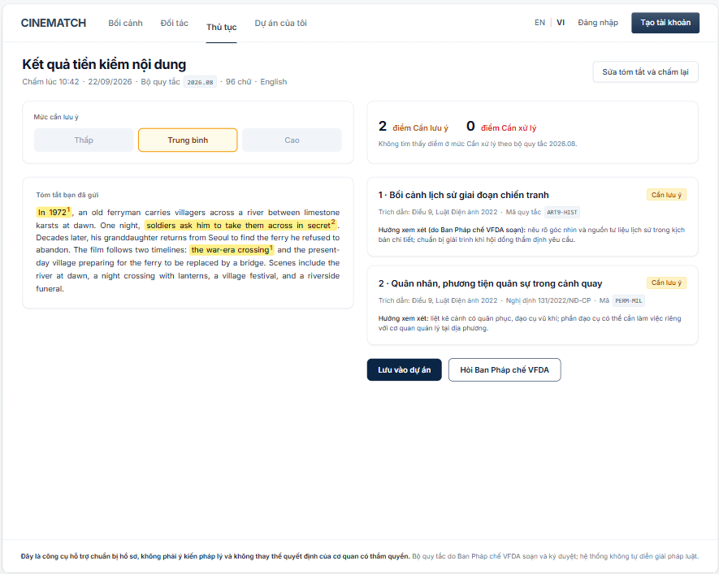

# Screen Spec: SC-48 Content check results

> DBIZ3 Session 4 template — one file per screen. The Screen ID is kept from the DBIZ2 Screen List.
> The mockup image stays an image; everything around it is text.
> **Each orange numbered badge on the mockup is the row with the same number in section 3 (Element inventory).**

| Field | Value |
|---|---|
| Screen ID | `SC-48` |
| Screen name | Content check results |
| Actor | Guest / Member |
| Priority | Must |
| Belongs to module | `docs/spec/spec-M2.md` |
| Mockup image | `img/SC-48.png` |
| Status | Draft |

*Route:* `/pre-check/r/[id]` · *Screen list file:* M2, item #7 (Tier 1 — Must) · *Design note from the screen list file:* Highlight risk points, suggest how to adjust.

**Notes against Screen List v2.0**

- **New Screen ID.** Screen List v2.0 did not have this screen (results were part of `SC-03`). `SC-48` has been added to `docs/screen-list.md`.
- The screen list file says *"highlight risk points under Article 13"*. The mockup and spec use **Article 9** for content, because Article 9 of the Cinema Law 2022 defines prohibited content; Article 13 defines the dossier components and is checked on `SC-27`. The team needs to confirm this interpretation.

## 1. Purpose

**Shown when:** A pre-check finishes from `SC-03`, or a member reopens a saved check from the *Content & compliance* gauge on `SC-12`.

**The user leaves this screen when:** The user edits and re-checks (`SC-03`), saves to a project (`SC-12`, login required) or books a consultation (`SC-33`).

## 2. Mockup

> The image is the visual contract (layout, grouping, hierarchy); the tables below are the behavioural contract.
> All data in the mockup is sample data for one fictional project (*The Last Ferry*, Harbour Line Films); organisation names, people and phone numbers are examples, not real records.

## 3. Element inventory

| # | Element | Type | Content / data source | Required | Validation |
|---|---|---|---|---|---|
| 1 | Navigation bar | Header | static | — | — |
| 2 | Title + check run details | Header + Text | `precheck_runs.created_at`, `ruleset_version`, word count, language | Yes | must include the rule set version |
| 3 | Attention level scale | Chart (3 levels) | computed deterministically from number of findings × severity (`F-M2-06`) | Yes | Low / Medium / High — no 0–100 score |
| 4 | Point count by level | Text | count of `precheck_findings` by `severity` | Yes | — |
| 5 | Submitted text | Text | `precheck_runs.summary_text` | Yes | shown verbatim, unedited |
| 6 | Highlighted passage | Text (highlight) | `precheck_findings.span_start/end`, finding number | — | yellow = Needs attention, red = Action required; always with a number |
| 7 | Finding card | List | `precheck_findings` + `rules.title` | — | shown only with a valid citation |
| 8 | Severity label | Text | `rules.severity` | Yes | Needs attention / Action required |
| 9 | Provision citation + rule code | Text | `rules.citation`, `rules.code` | **Yes** | **no citation, no finding shown** (`F-M2-12`) |
| 10 | Points to consider | Text | `rules.guidance_vi/en` — written by the VFDA Legal Board | Yes | taken verbatim from the rule; **not** written by a language model |
| 11 | *Edit summary and re-check* button | Button | static | — | — |
| 12 | *Save to project* button | Button | static | — | requires login and at least one project |
| 13 | *Ask the VFDA Legal Board* button | Button | static | — | — |
| 14 | Disclaimer | Text | static | **Yes** | fixed at the bottom of the screen, never collapsed |

## 4. States

| State | What the user sees | Trigger |
|---|---|---|
| Default | Attention level scale, point counts by level, numbered highlighted text on the left, finding cards on the right, disclaimer at the bottom. | At least 1 finding |
| Empty (no data) | No findings: scale at *Low*, line *No content needing attention found under rule set 2026.08*. **Never** say *passed*, *permitted* or *safe*. | 0 findings |
| Loading | When reopening a saved check: grey skeletons for both columns. (New checks wait on `SC-03`.) | Loading check run |
| Error | A finding with an invalid citation is **dropped from the list** and logged for VFDA; if all findings are dropped: *We couldn't complete this check — try again or ask VFDA*. Never show a finding without a citation. | Citation verification fails / load error |
| Success / confirmation | Click *Save to project* → green strip *Saved to The Last Ferry* and the *Content & compliance* gauge is updated. | Saved successfully |

## 5. Interactions and navigation

| # | Element | User action | System response | Goes to screen |
|---|---|---|---|---|
| 1 | Highlighted passage | tap | Scrolls to and highlights the finding card with the same number | stays |
| 2 | Finding card | tap | Expands the full rule text; re-highlights the related passage | stays |
| 3 | *Edit summary and re-check* button | tap | Carries over the previous text | SC-03 |
| 4 | *Save to project* button | tap | Not logged in → `SC-04` then back; logged in → choose a project, save the check run | SC-12 |
| 5 | *Ask the VFDA Legal Board* button | tap | Opens booking, topic *Script content*, attaches the check run ID | SC-33 |
| 6 | Rule code | tap | Opens regulation details | SC-31 |

## 6. Screen-level rules

| Rule ID | Rule | Source |
|---|---|---|
| SR-071 | **Every finding comes with a cited provision; if it can't be cited, it isn't shown.** Citations are matched by code against the `rules` table before display. | TL5 §M2 — anti-fabrication |
| SR-072 | Results use a **3-level scale**, not a 0–100 score: a precise number from a language model creates false certainty. | No-guessing principle |
| SR-073 | **Adjustment suggestions** are only *points to consider* taken verbatim from VFDA-written rules. The system **never** rewrites film content itself. | Screen list file — note #7; TL3 |
| SR-074 | **Banned wording:** *approved*, *accepted*, *legally compliant*, *safe* — even when there are no findings. | Legal liability principle |
| SR-075 | Highlights always come with a number — information is never conveyed by colour alone. | Accessibility |
| SR-076 | Each check run stores `ruleset_version` so it can be explained later after the rule set changes. | TL5 §M2 |

## 7. Linked requirements

| FR ID (from the module spec) | What this screen does for it |
|---|---|
| FR-006 · spec-M2.md (F-M2-06) | Review and return preliminary warnings |
| FR-011 · spec-M2.md (F-M2-11) | Call the model with the rule set |
| FR-012 · spec-M2.md (F-M2-12) | Verify citations by code |
| FR-013 · spec-M2.md (F-M2-13) | Display findings with provisions |
| FR-014 · spec-M2.md (F-M2-14) | Mark as reviewed (once saved to a project) |

## 8. Responsive and accessibility notes

- Minimum supported width: **360px**.
- Narrow screens: submitted text on top, finding cards below; tapping a number in a highlight scrolls to the matching card.
- Highlights use `<mark>` with a `` number; screen readers announce *point of attention number 1*.
- Provision citations are selectable, copyable text.

## 9. Open questions

| # | Question | Blocking? | Status |
|---|---|---|---|
| 1 | [NEEDS CLARIFICATION: team to confirm that content uses Article 9 (prohibited content) instead of Article 13 as stated in the screen list file] | Yes | Open |
| 2 | [NEEDS CLARIFICATION: the specific clause of Article 9 for each rule is to be filled in `rules.citation` by the VFDA Legal Board; the mockup only goes to Article level] | No | Open |
| 3 | [NEEDS CLARIFICATION: thresholds for mapping number of findings × severity to Low / Medium / High] | Yes | Open |

## Completion checklist

- [x] The mockup is a separate cropped image file, named with the Screen ID (`img/SC-48.png`).
- [x] Every visible element in the mockup appears in the element inventory — machine-checked: badge numbers on the image = row numbers in section 3.
- [x] Every input element has a validation rule or an explicit "—".
- [x] All five states are filled in, or marked "Not applicable" with a reason.
- [x] Every navigation target is a Screen ID that exists in `docs/screen-list.md` — machine-checked.
- [x] Every element that displays data names the field it displays, matching `docs/spec/spec-M2.md` section 5.1.
- [ ] **Checked by a person:** _(not signed — a Group C member compares the image with the tables and signs here)_

---
*DBIZ3 Session 4 · Group C · CINEMATCH. Built on the DBIZ2 Screen Design (Screen List and Screen Layout).*
