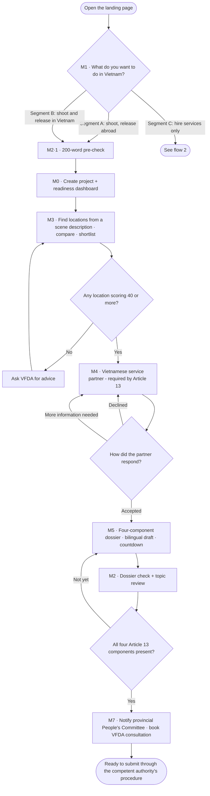
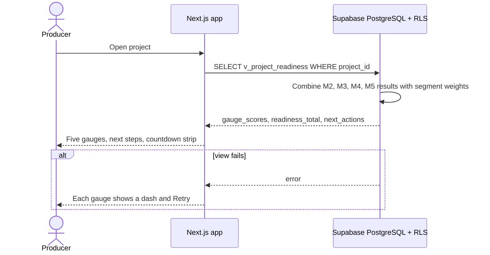

# Spec Document: Project workspace and readiness dashboard

> DBIZ3 Session 4 template — one file per module. Written for a reader who has never seen the DBIZ2 report.

| Field | Value |
|---|---|
| Module ID | M0 |
| Module name | Project workspace and readiness dashboard |
| Spec version | v0.1 |
| Author (team member) | Nam Tran — Group C |
| Date | 22/09/2026 |
| Status | Draft |
| Approved by (Client role) | *Not yet — VFDA project lead (and VFDA Legal Board for legal rules)* |
| DBIZ2 source | Function List rows 12–20 (F-M0-01 .. F-M0-09); Use Case UC-05, UC-06; Screens SC-10, SC-11, SC-12, SC-13 |

## 1. Purpose and scope

This module gives each production one place to prepare its shoot in Vietnam and shows, on five gauges, how ready it is and what to do next. Every other module reports its progress here.

**In scope**

- Creating, editing and listing projects; inviting colleagues.
- Five readiness gauges (content and compliance, locations, partners, dossier and permits, logistics) and one overall score.
- One *Next step* per gauge.
- Nightly readiness snapshots and (Could) a progress chart.

**Out of scope**

- The work behind each gauge (M2, M3, M4, M5) — M0 only displays their results.
- The logistics gauge content (M6, phase 2) — shown as not yet available.
- Budgeting and scheduling of the shoot itself.

**Depends on**

- M1 (segment)
- M2 (compliance score)
- M3 (shortlist)
- M4 (partner status)
- M5 (dossier status, countdown)
- SYS (roles, notifications)

## 2. Actors

| Actor | Role in this module | Where it comes from |
|---|---|---|
| Member | Primary — creates and follows a project | Function List (F-M0-01..04, 06, 09) |
| System | Computes scores, next steps and snapshots | Function List (F-M0-05, 07, 08) |

## 3. User scenarios and acceptance criteria

### US-1 (P1): Create a project with three fields

**Journey.** As a producer, I want to create a project with only a name, a format and my segment, so that I can start before I know every detail.

**Acceptance scenarios**

1. **Given** a member arriving from the router with segment A, **When** they open *New project*, **Then** the segment field is pre-filled with A.
2. **Given** name, format and segment filled, **When** they click *Create project*, **Then** the project exists, the creator is its owner, and the dashboard (SC-12) opens with every gauge at 0% and a first next step.

### US-2 (P1): See what to do next

**Journey.** As a producer, I want each gauge to tell me the single next thing to do, so that I never wonder what is blocking my shoot.

**Acceptance scenarios**

1. **Given** a segment A project with 2 of 4 Article 13 components present, **When** the dashboard loads, **Then** the *Dossier & permits* gauge shows its score and the next step names the missing components.
2. **Given** a segment C project, **When** the dashboard loads, **Then** the *Dossier & permits* gauge is not shown (BR-002).
3. **Given** the score view fails, **When** the dashboard loads, **Then** each gauge shows `—` and *Retry*, never a fake 0%.

### US-3 (P2): Invite a colleague

**Journey.** As a project owner, I want to invite my line producer, so that we work on the same project.

**Acceptance scenarios**

1. **Given** an owner, **When** they invite an email with permission *edit*, **Then** an invitation is sent and the person sees the project after accepting.

### Edge cases

- A module fails to report: its gauge shows `—` with *not calculated yet*; the overall score is computed only from gauges that reported, and says so.
- Two members edit the project name at the same time: last write wins; the other sees a toast *updated by …*.
- The first shooting day is moved earlier than today + safe deadline: the countdown turns red (M5).

## 4. Flows

### 4.1 Usage flow — main producer journey (segments A and B)

> Textualised from `docs/architecture/usage-flow.md` flow 1 (FLOW-01, Figure 3), translated to English. M0 is the hub node *DASH*. Diamonds Q2–Q4 were added in Session 4 Step 3 from Function List rules (not in the original figure) — **still awaiting Client confirmation**.

### 4.2 Sequence — dashboard load

> **Derived — no DBIZ2 sequence exists for the dashboard.** Written from F-M0-05..07 and SC-12. SEQ-05 (`sequence-diagrams.md`) shows the gauge being recalculated after a shortlist, which is the same mechanism.

## 5. Functional requirements

| FR ID | DBIZ2 Subfunction ID | Requirement (system MUST ...) | Actor | Priority |
|---|---|---|---|---|
| FR-001 | F-M0-01 | The system MUST create a project from a name, a format and a segment, make the creator its owner and open its dashboard. | Member | Must |
| FR-002 | F-M0-02 | The system MUST let project members with *edit* permission update project details, including the first shooting day. | Member | Must |
| FR-003 | F-M0-03 | The system MUST list the projects a user belongs to, each with readiness, first shooting day and next step. | Member | Must |
| FR-004 | F-M0-04 | The system MUST let an owner invite people by email with *view* or *edit* permission. | Member | Must |
| FR-005 | F-M0-05 | The system MUST compute the five gauge scores and the overall readiness in a database view, weighted by segment. | System | Must |
| FR-006 | F-M0-06 | The system MUST show the dashboard with the gauges that apply to the project's segment. | Member | Must |
| FR-007 | F-M0-07 | The system MUST give every gauge exactly one next step, generated by rules, never left empty. | System | Must |
| FR-008 | F-M0-08 | The system MUST store a readiness snapshot for every active project every night. | System | Must |
| FR-009 | F-M0-09 | The system SHOULD draw the readiness trend from the snapshots. | Member | Could |

### 5.1 Input / Output contract

Types and required flags come from `docs/function-list.md` (columns *Input — type and required* and *Output — type*). Changes made in Session 4 are stated in *Notes* and listed in 11.1.

| FR ID | Input field | Type | Required | Output field | Type | Notes / validation |
|---|---|---|---|---|---|---|
| FR-001 | `project_name` | `VARCHAR(200)` | Yes | `project_id` | `UUID` | format, shoot_days_vn, crew_size_band, provinces added (SC-10); provinces from the 34-province list |
|  | `format` | `ENUM(feature, documentary, commercial, tv, music_video)` | Yes | `readiness_total` | `NUMERIC(5,2)` |  |
|  | `segment` | `ENUM(A, B, C)` | Yes |  |  |  |
|  | `shoot_date` | `DATE` | No |  |  |  |
|  | `shoot_days_vn` | `INTEGER` | No |  |  |  |
|  | `crew_size_band` | `ENUM(u15, 15_50, o50)` | No |  |  |  |
|  | `provinces` | `ARRAY<INTEGER>` | No |  |  |  |
|  | `logline` | `VARCHAR(500)` | No |  |  |  |
| FR-002 | `project_id` | `UUID` | Yes | `updated_at` | `TIMESTAMPTZ` | shoot_date must be after today |
|  | `project_name` | `VARCHAR(200)` | No |  |  |  |
|  | `shoot_date` | `DATE` | No |  |  |  |
|  | `logline` | `VARCHAR(500)` | No |  |  |  |
| FR-003 | `user_id` | `UUID` | Yes | `projects` | `ARRAY<project_summary>` | RLS: member projects only |
| FR-004 | `project_id` | `UUID` | Yes | `member_id` | `UUID` | owner only |
|  | `invitee_email` | `VARCHAR(254)` | Yes | `invite_status` | `ENUM(pending, accepted)` |  |
|  | `permission` | `ENUM(view, edit)` | Yes |  |  |  |
| FR-005 | `project_id` | `UUID` | Yes | `gauge_scores` | `JSONB` | weights from `segment_requirements` |
|  |  |  |  | `readiness_total` | `NUMERIC(5,2)` |  |
| FR-006 | `project_id` | `UUID` | Yes | `dashboard_view` | `JSONB` |  |
| FR-007 | `gauge_scores` | `JSONB` | Yes | `next_actions` | `ARRAY<action_code VARCHAR(40)>` | one per gauge |
| FR-008 | `project_id` | `UUID` | Yes | `snapshot_id` | `UUID` | pg_cron, nightly |
|  | `snapshot_date` | `DATE` | Yes |  |  |  |
| FR-009 | `project_id` | `UUID` | Yes | `series` | `ARRAY<(date DATE, readiness_total NUMERIC(5,2))>` |  |
|  | `from_date` | `DATE` | No |  |  |  |

### 5.2 Business rules

| Rule ID | Rule | Why it exists |
|---|---|---|
| BR-001 | Scores are computed only in the database view `v_project_readiness`; the interface never recomputes them. | Every screen must show the same number. |
| BR-002 | Gauges shown depend on segment: segment C has no *Dossier & permits* gauge; the *Logistics* gauge is shown as `—` until phase 2. | 0% and *not applicable* mean different things. |
| BR-003 | Each gauge always has one next step; when a gauge is complete its next step reads *Done*. | The next step is the main information on the dashboard, not the percentage. |
| BR-004 | Weights per segment are read from `segment_requirements`, never hard-coded. | VFDA must be able to change them without a release. |

## 6. Key entities

| Entity | Attributes (from Input/Output fields) | Relationships |
|---|---|---|
| Project | project_id, project_name, format, segment, shoot_date, shoot_days_vn, crew_size_band, logline, stage | belongs to ProducerOrganisation; has many ProjectMembers |
| ProjectMember | project_id, user_id, permission, invite_status | belongs to Project and UserAccount |
| ProjectProvince | project_id, province_id | belongs to Project |
| ReadinessView | project_id, gauge_scores, readiness_total, next_actions | derived from M2, M3, M4, M5 data |
| ReadinessSnapshot | snapshot_id, project_id, snapshot_date, readiness_total | belongs to Project |

## 7. Screens involved

| Screen ID | Screen name | Priority | Screen Spec file |
|---|---|---|---|
| SC-10 | Project list / Create new project | Must | `docs/screens/screen-spec-SC-10.md` |
| SC-12 | Readiness dashboard (5 gauges) | Must | `docs/screens/screen-spec-SC-12.md` |
| SC-13 | Project settings | Must | *Not written yet — screen not in the 20-screen set* |

## 8. Success criteria

| SC ID | Criterion | How it is measured |
|---|---|---|
| SC-001 | A producer can say what their next step is within 10 seconds of opening the dashboard. | Five-second test with 5 producers: ask *what do you do next?* |
| SC-002 | A new project can be created in under 1 minute with only three fields. | Timed test with 5 producers. |
| SC-003 | The readiness shown on the project list and on the dashboard is always identical. | Compare both screens on 20 test projects. |

## 9. Assumptions

- A project belongs to one producer organisation.
- Overall readiness is a weighted average of the gauges that apply to the segment.

## 10. Open questions

_Open questions are tracked outside this repository until they are resolved._

## 11. Traceability to DBIZ2

| Spec section | DBIZ2 source | Location |
|---|---|---|
| 1. Purpose | System Design v2.0 — 1. Schematic, §1.2 (M0) | `docs/architecture/context.md` |
| 4.1 Usage flow | Usage Flow FLOW-01 (Figure 3) + Step 3 additions | `docs/architecture/usage-flow.md` §1 |
| 4.2 Sequence | Derived; mechanism shown in SEQ-05 | `docs/architecture/sequence-diagrams.md` — SEQ-05 |
| 5. Functional requirements | Function List rows 12–20 | `docs/function-list.md` rows 12–20 |
| 7. Screens | Screen List SC-10..SC-13 | `docs/screen-list.md` §1 |

### 11.1 Reconciliation with DBIZ2 (System Design v2.0)

Where the 20-screen design or this spec differs from the DBIZ2 Function List, the difference is written here instead of being silently changed.

| Topic | DBIZ2 / System Design v2.0 | This spec | Status |
|---|---|---|---|
| Project creation fields | F-M0-01: name, segment, shoot date, logline | format required; shoot days, crew size and provinces added (SC-10) | Changed — Client to confirm |
| F-M0-09 priority | Must | Could — no chart on the SC-12 mockup | Changed — Client to confirm |

## Completion checklist

- [x] Every subfunction of this module in the DBIZ2 Function List appears as an FR row (9 of 9, rows 12–20) — machine-checked.
- [x] Every Input and Output field has a type and a required flag — machine-checked.
- [x] Every Mermaid block renders without an error — rendered with mermaid-cli 11.14 on 22/09/2026.
- [ ] Every node and arrow in the Mermaid flow exists in the original DBIZ2 diagram, and nothing was invented. **Not met:** some diagrams are marked *Derived* (no DBIZ2 figure exists); each is labelled above and listed in section 10 for Client confirmation.
- [x] At least one business rule is written that is not visible in any diagram (see 5.2).
- [ ] Every screen this module touches is listed with an existing Screen Spec file. **Not met:** no Screen Spec yet for SC-13.
- [x] Success criteria contain no technology words — machine-checked against a word list.
- [x] Open questions are tracked outside this repository until they are resolved.
- [x] The traceability table points to real files and figures, not "see the report".

---
*Template source: adapted from GitHub Spec Kit `templates/spec-template.md`, mapped onto the DBIZ2 Product Design Package. DBIZ3, VJCBI College — FTU. Group C · CINEMATCH.*
