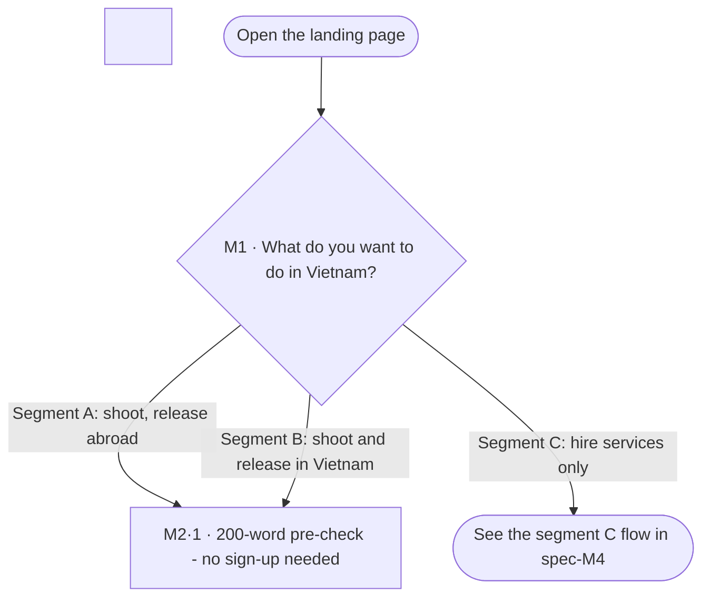

# Spec Document: Segment router

| Field | Value |
| :---- | :---- |
| Module ID | M1 |
| Module name | Segment router |
| Spec version | v0.1 |
| Author (team member) | Nam Tran — Group C |
| Date | 22/09/2026 |
| Status | Draft |
| Approved by (Client role) | *Not yet — VFDA project lead (and VFDA Legal Board for legal rules)* |
| DBIZ2 source | Function List rows 21–23 (F-M1-01 .. F-M1-03); Use Case UC-01; Screens SC-01, SC-02 |

1\. Purpose and scope

This module finds out which of three situations a production is in — shooting in Vietnam for release abroad (A), shooting and releasing in Vietnam (B), or only hiring people or services from Vietnam (C). The answer decides which documents, steps and gauges the rest of the product shows.

**In scope**

- The landing page entry point and the four-question router.  
- Showing the result with the reason and what it means (*needed / not needed*).  
- Letting the user override the result and change segment later.

**Out of scope**

- Legal advice on which licence applies — the router only applies VFDA's decision table.  
- Creating the project (module M0); the router only hands the segment over.

**Depends on**

- M0 — receives the segment when a project is created.  
- M5 — reads `segment_requirements` for the document kit.  
- SYS — bilingual text.

## 2\. Actors

| Actor | Role in this module | Where it comes from |
| :---- | :---- | :---- |
| Guest | Primary — answers the questions | Function List (F-M1-01) |
| Member | Primary — changes segment in project settings | Function List (F-M1-03) |
| System | Applies the decision table and configures the journey | Function List (F-M1-02) |

## 3\. User scenarios and acceptance criteria

### US-1 (P1): Find my segment in under a minute

**Journey.** As an international producer, I want to answer a few questions and be told what my situation requires, so that I know what I am getting into before committing.

**Acceptance scenarios**

1. **Given** the router, **When** the user answers *Yes* (shoot in Vietnam), *Outside Vietnam* (release) and *Foreign company* (producer), **Then** the result is segment A with the reason *based on answers 1, 2 and 3*.  
2. **Given** a result, **When** it is shown, **Then** it lists what is *Needed* and *Not needed* for that segment, read from `segment_requirements`.  
3. **Given** the same answers twice, **When** the router runs, **Then** it returns the same segment (decision table, no language model).

### US-2 (P2): Override the result

**Journey.** As a producer who knows my case is different, I want to pick another segment, so that the product does not force a wrong checklist on me.

**Acceptance scenarios**

1. **Given** a result A, **When** the user clicks the B card, **Then** the result becomes B and `segment_override = true` is recorded.

### US-3 (P3): Change segment on an existing project

**Journey.** As a member, I want to change my project's segment later, so that I can correct an early mistake without losing work.

**Acceptance scenarios**

1. **Given** a project in segment A with uploaded documents, **When** the member changes it to B, **Then** the journey configuration changes and no uploaded document is deleted (`data_retained = true`).

### Edge cases

- Answers match no rule (e.g. *not shooting in Vietnam* but *needs locations*): show all three segments and *Ask VFDA*.  
- The user leaves after question 2: nothing is stored server-side; answers are kept only in the browser session.  
- Co-production (answer 3 \= *co-production*): \[NEEDS CLARIFICATION: A or B?\] — shown as open question 1\.

## 4\. Flows

### 4.1 Usage flow — choosing a segment

> Textualised from `docs/architecture/usage-flow.md` flow 1 (top part) — this is the **only** decision diamond in the original DBIZ2 usage-flow figure (FLOW-01) and it is kept with its three branch labels, translated to English.



### 4.2 Sequence — router result

> **Derived — no DBIZ2 sequence exists for M1.** Written from F-M1-01..03 and SC-02; needs Client confirmation.

```mermaid
sequenceDiagram
&nbsp;&nbsp;&nbsp;&nbsp;actor GU as Guest
&nbsp;&nbsp;&nbsp;&nbsp;participant FE as Next.js app
&nbsp;&nbsp;&nbsp;&nbsp;participant DB as Supabase PostgreSQL + RLS

&nbsp;

&nbsp;&nbsp;&nbsp;&nbsp;GU->>FE: Answer questions 1 to 4
&nbsp;&nbsp;&nbsp;&nbsp;FE->>DB: Read segment_rules and segment_requirements
&nbsp;&nbsp;&nbsp;&nbsp;DB-->>FE: Decision table + requirements
&nbsp;&nbsp;&nbsp;&nbsp;FE->>FE: Apply decision table to the answers
&nbsp;&nbsp;&nbsp;&nbsp;FE-->>GU: Segment, reason, needed / not needed
&nbsp;&nbsp;&nbsp;&nbsp;alt user overrides
&nbsp;&nbsp;&nbsp;&nbsp;&nbsp;&nbsp;&nbsp;&nbsp;GU->>FE: Pick another segment card
&nbsp;&nbsp;&nbsp;&nbsp;&nbsp;&nbsp;&nbsp;&nbsp;FE->>FE: segment_override = true
&nbsp;&nbsp;&nbsp;&nbsp;end
&nbsp;&nbsp;&nbsp;&nbsp;GU->>FE: Confirm and create project
&nbsp;&nbsp;&nbsp;&nbsp;FE-->>GU: Go to project creation (SC-10)
```

## 5\. Functional requirements

| FR ID | DBIZ2 Subfunction ID | Requirement (system MUST ...) | Actor | Priority |
| :---- | :---- | :---- | :---- | :---- |
| FR-001 | F-M1-01 | The system MUST show the segment choice first on the landing page and ask at most four questions to determine the segment. | Guest | Must |
| FR-002 | F-M1-02 | The system MUST derive the segment from a decision table stored in the database, show the reason and the *needed / not needed* list, and configure the journey from table data, not code. | System | Must |
| FR-003 | F-M1-03 | The system MUST let a member change a project's segment without deleting data already entered. | Member | Must |

### 5.1 Input / Output contract

Types and required flags come from `docs/function-list.md` (columns *Input — type and required* and *Output — type*). Changes made in Session 4 are stated in *Notes* and listed in 11.1.

| FR ID | Input field | Type | Required | Output field | Type | Notes / validation |
| :---- | :---- | :---- | :---- | :---- | :---- | :---- |
| FR-001 | — | — | — | `segment_options` | `ARRAY<(code ENUM(A,B,C), label_vi TEXT, label_en TEXT)>` |  |
| FR-002 | `q1_shoot_in_vn` | `BOOLEAN` | Yes | `segment` | `ENUM(A, B, C)` | q2, q3 required when q1 \= true; answer fields added in Session 4 (DBIZ2 input was `segment` only) |
|  | `q2_release` | `ENUM(abroad, vietnam, both)` | No | `decided_by` | `ARRAY<INTEGER>` |  |
|  | `q3_producer` | `ENUM(foreign, vietnamese, coproduction)` | No | `journey_config` | `JSONB` |  |
|  | `q4_needs` | `ARRAY<ENUM(locations, crew, cast, equipment, logistics)>` | No |  |  |  |
|  | `segment_override` | `ENUM(A, B, C)` | No |  |  |  |
| FR-003 | `project_id` | `UUID` | Yes | `journey_config` | `JSONB` | data\_retained is always true |
|  | `new_segment` | `ENUM(A, B, C)` | Yes | `data_retained` | `BOOLEAN` |  |

### 5.2 Business rules

| Rule ID | Rule | Why it exists |
| :---- | :---- | :---- |
| BR-001 | The segment is decided by a deterministic decision table (`segment_rules`) approved by VFDA; the same answers always give the same segment. | Explainability: a producer must be able to see why. |
| BR-002 | Question 4 never changes the segment; it only pre-selects service groups in M4. | Keeps the decision table small and auditable. |
| BR-003 | A manual override is always allowed and always recorded. | VFDA needs to see where the router is wrong. |
| BR-004 | Changing segment never deletes documents or answers; items that no longer apply are hidden, not removed. | Producers often start in the wrong segment. |

## 6\. Key entities

| Entity | Attributes (from Input/Output fields) | Relationships |
| :---- | :---- | :---- |
| SegmentRule | rule\_id, q1, q2, q3, result\_segment, version | used by SegmentDecision |
| SegmentRequirement | segment, requirement\_code, label\_vi, label\_en, needed | belongs to a segment |
| SegmentDecision | session\_or\_project\_id, answers, segment, decided\_by, segment\_override | belongs to Project (M0) once saved |

## 7\. Screens involved

| Screen ID | Screen name | Priority | Screen Spec file |
| :---- | :---- | :---- | :---- |
| SC-01 | Landing — Introduction | Must | `screens/screen-spec-SC-01.md` |
| SC-02 | Segment router \+ A/B/C result | Must | `screens/screen-spec-SC-02.md` |
| SC-13 | Project settings (change segment) | Must | *Not written yet — screen not in the 20-screen set* |

## 8\. Success criteria

| SC ID | Criterion | How it is measured |
| :---- | :---- | :---- |
| SC-001 | A first-time visitor reaches a segment result in under 60 seconds. | Timed test with 5 international producers. |
| SC-002 | At least 4 in 5 test producers agree the segment they were given is correct for their project. | Post-test question on 5 real project descriptions. |
| SC-003 | VFDA can see how often each result is overridden. | Monthly count of `segment_override = true`. |

## 9\. Assumptions

- Three segments cover every MVP case; unusual cases go to *Ask VFDA*.  
- The decision table is small enough (≤ 20 rows) for VFDA to review by hand.

## 10\. Open questions

| \# | Question | Blocking? | Owner | Status |
| :---- | :---- | :---- | :---- | :---- |
| 1 | \[NEEDS CLARIFICATION: Co-production (question 3): segment A or B, or a separate segment?\] | Yes | Client (VFDA) | Open |
| 2 | \[NEEDS CLARIFICATION: Does segment C (only hiring Vietnamese cast or services, no shooting in Vietnam) really need no licence at all?\] | Yes | Client (VFDA) | Open |
| 3 | \[NEEDS CLARIFICATION: does VFDA allow its logo and association name on the landing page, and what is the official wording\] *(from SC-01)* | Yes | Client (VFDA) | Open |
| 4 | \[NEEDS CLARIFICATION: decision table for the *co-production* case (question 3\) — classify as A or B, and is a separate segment needed\] *(from SC-02)* | Yes | Client (VFDA) | Open |
| 5 | \[NEEDS CLARIFICATION: does segment C really need no permit at all when a foreign crew only hires Vietnamese cast to shoot abroad\] *(from SC-02)* | Yes | Client (VFDA) | Open |

## 11\. Traceability to DBIZ2

| Spec section | DBIZ2 source | Location |
| :---- | :---- | :---- |
| 1\. Purpose | System Design v2.0 — 1\. Schematic, §1.2 (M1) | `docs/architecture/context.md` |
| 4.1 Usage flow | Usage Flow FLOW-01, diamond M1 (Figure 3\) | `docs/architecture/usage-flow.md` §1 |
| 4.2 Sequence | Derived (no DBIZ2 figure) | this document |
| 5\. Functional requirements | Function List rows 21–23 | `docs/function-list.md` rows 21–23 |
| 7\. Screens | Screen List SC-01, SC-02, SC-13 | `docs/screen-list.md` §1 |

### 11.1 Reconciliation with DBIZ2 (System Design v2.0)

Where the 20-screen design or this spec differs from the DBIZ2 Function List, the difference is written here instead of being silently changed.

| Topic | DBIZ2 / System Design v2.0 | This spec | Status |
| :---- | :---- | :---- | :---- |
| Router input | F-M1-02 input: `segment` chosen from three cards | Four questions decide the segment; cards remain as override (screen list note \#3) | Changed — Client to confirm |

&nbsp;