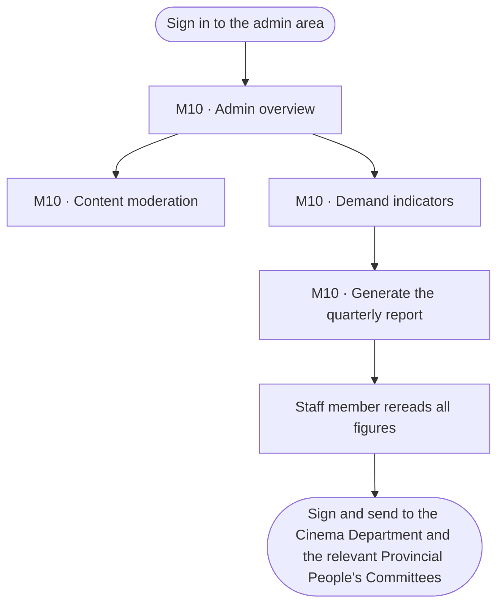
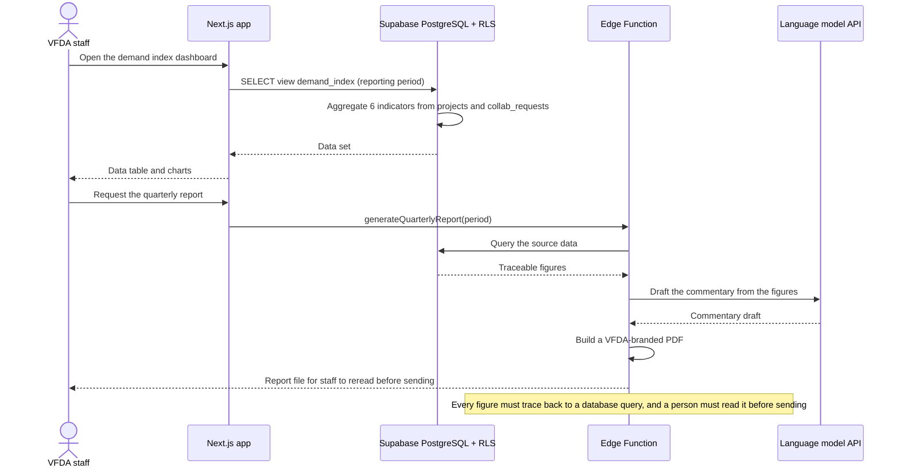
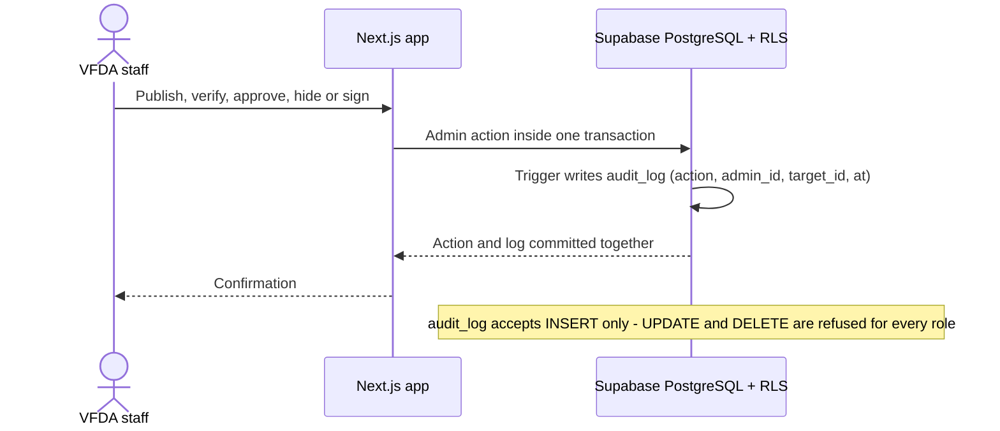

# Spec Document: VFDA back office — moderation, demand index, quarterly report, audit log

> DBIZ3 Session 4 template — one file per module. Written for a reader who has never seen the DBIZ2 report.

| Field | Value |
|---|---|
| Module ID | M10 |
| Module name | VFDA back office — moderation, demand index, quarterly report, audit log |
| Spec version | v0.1 |
| Author (team member) | Nam Tran — Group C |
| Date | 22/09/2026 |
| Status | Draft |
| Approved by (Client role) | *Not yet — VFDA project lead (and VFDA Legal Board for legal rules)* |
| DBIZ2 source | Function List rows 96–104 (F-M10-01 .. F-M10-09); Use Case UC-24, UC-25, UC-26; Screens SC-34, SC-38, SC-39, SC-40, SC-41 |

## 1. Purpose and scope

This module is VFDA's own workspace: staff review what users publish before the public sees it, follow how much international demand the platform receives, and send a quarterly report built from those figures. It also keeps a permanent record of every administrative action, so that VFDA can always show who changed what and when.

**In scope**

- Admin overview with the work waiting for each VFDA team (SC-34).
- Moderation queue for user-published content (organisation profiles, location photos submitted by partners), with approve or hide and a reason.
- Demand index: six indicators aggregated from the platform's own data, as a table and charts, filtered by month, quarter or year.
- Quarterly report: commentary drafted from the figures, reread by a staff member, exported as a VFDA-branded PDF.
- Audit log: every administrative action is written to a log that cannot be edited (Must), and admins can search it (Should).

**Out of scope**

- Managing locations, the verification queue and legal rules — those screens belong to M3 (SC-35), M4 (SC-36) and M2 (SC-37); they write to this module's audit log.
- Data from outside the platform (box office, tourism statistics).
- Sending the report automatically: a person always sends it.
- Showcase moderation (M8 is *Won't* for this release); the `showcase` content type is kept for phase 2.

**Depends on**

- SYS (roles `vfda_staff` and `admin`, notifications)
- M0 (projects), M1 (segment decisions), M2 (pre-check runs), M3 (location queries, shortlists), M4 (organisations, collaboration requests) — sources of the demand index
- M3, M4, M2 admin screens — callers of the audit log write
- External: language model API (commentary draft), PDF rendering

## 2. Actors

| Actor | Role in this module | Where it comes from |
|---|---|---|
| VFDA staff | Primary — moderates content, reads the demand index, prepares the quarterly report | Function List (F-M10-01, 02, 04, 05, 07) |
| Admin | Primary — searches the audit log | Function List (F-M10-09) |
| System | Aggregates the indicators, drafts the commentary, writes every audit record | Function List (F-M10-03, 06, 08) |
| Cinema Department; Provincial People's Committees | Secondary — receive the quarterly report outside the platform | Function List (F-M10-07); Use Case UC-25 |

## 3. User scenarios and acceptance criteria

### US-1 (P2): Nothing reaches the public unreviewed

**Journey.** As VFDA staff, I want every newly published organisation profile to wait in a queue until I approve it, so that VFDA's name is never attached to content it has not seen.

**Acceptance scenarios**

1. **Given** partner Mekong Frame Services edits its public profile description, **When** it saves, **Then** the change appears in the moderation queue with type `org_profile` and the public page keeps showing the previous approved text.
2. **Given** an item in the queue, **When** staff choose *Hide* without typing a reason, **Then** the decision is refused with *A reason is required to hide content*.
3. **Given** staff choose *Approve*, **When** the decision is saved, **Then** the new text is public within one minute and an audit record `content.approve` names the staff member, the item and the time.

### US-2 (P2): See international demand for the quarter

**Journey.** As VFDA staff, I want the six demand indicators for a period, so that I can tell VFDA's leadership which markets and provinces are asking about Vietnam.

**Acceptance scenarios**

1. **Given** the seed data and the period Q3 2026 (01/07/2026–30/09/2026), **When** staff open the demand index, **Then** the six indicators are shown, each with the number of records it was computed from.
2. **Given** an indicator built from fewer than 5 records, **When** it is shown, **Then** it reads *Not enough data* instead of a percentage.
3. **Given** the period filter is changed from *Quarter* to *Month* (September 2026), **When** the view reloads, **Then** every indicator is recomputed for that month only.

### US-3 (P2): Send a quarterly report that can be defended

**Journey.** As VFDA staff, I want a drafted quarterly report whose every number I can trace, so that I can sign it and send it to the Cinema Department without rechecking by hand.

**Acceptance scenarios**

1. **Given** the Q3 2026 indicators, **When** staff click *Draft commentary*, **Then** a Vietnamese and an English draft appear, and every number in them links to the indicator it came from.
2. **Given** a draft that has not been marked *Reread by*, **When** staff click *Export PDF*, **Then** the export is refused with *A staff member must reread the report first*.
3. **Given** the reread is recorded, **When** staff export, **Then** a PDF with VFDA branding is produced and the export is written to the audit log.

### US-4 (P1): Every admin action leaves a trace

**Journey.** As an admin, I want every change made by VFDA staff, the Legal Board or admins to be recorded permanently, so that disputes about who did what can be settled from the record.

**Acceptance scenarios**

1. **Given** VFDA staff publish location *Tràng An* on SC-35, **When** the publish succeeds, **Then** one audit record is written with action `location.publish`, the staff member's ID, the location ID and the time.
2. **Given** any user, including an admin, **When** they try to update or delete an audit record, **Then** the database refuses the change.
3. **Given** an admin filters the log by person *Nguyễn Thị Thu Hà* and September 2026, **When** the search runs, **Then** only her actions in that month are listed, newest first.

### Edge cases

- The commentary draft fails (model unavailable): the indicators and the PDF export still work; the commentary field stays empty with *Draft unavailable — write it by hand*.
- An item in the moderation queue is edited again before it is reviewed: the queue keeps only the latest version and says *Updated after submission*.
- A period with no data at all: every indicator shows *Not enough data*; the report cannot be drafted.
- The audit log write fails: the admin action it belongs to is rolled back — an action without a record is not allowed.

## 4. Flows

### 4.1 Usage flow — VFDA staff (back office excerpt)

> Excerpt of `docs/architecture/usage-flow.md` flow 4 (VFDA staff), M10 branches only. The M3 and M4 branches of the same flow are in `spec-M3.md` and `spec-M4.md`.

### 4.2 Sequence — demand index and quarterly report (SEQ-12)

> Textualised from SEQ-12 (Figure 15). 5 participants, 13 messages. DBIZ2 wrote *briefs*; in this spec a brief is a project (M0) with its location queries (M3).

### 4.3 Sequence — writing the audit log (every admin screen)

> Derived — no DBIZ2 figure exists for F-M10-08; drawn from the Function List note *records cannot be edited* and from SYS BR-002.

## 5. Functional requirements

| FR ID | DBIZ2 Subfunction ID | Requirement (system MUST ...) | Actor | Priority |
|---|---|---|---|---|
| FR-001 | F-M10-01 | The system SHOULD show VFDA staff a queue of user-published content awaiting review, filterable by content type. | VFDA Staff | Should |
| FR-002 | F-M10-02 | The system SHOULD let VFDA staff approve or hide an item; hiding MUST carry a reason, and every decision is written to the audit log. | VFDA Staff | Should |
| FR-003 | F-M10-03 | The system SHOULD aggregate six demand indicators for a reporting period from the platform's own data only. | System | Should |
| FR-004 | F-M10-04 | The system SHOULD show the indicators as a data table and charts, visible to the roles `vfda_staff` and `admin` only. | VFDA Staff | Should |
| FR-005 | F-M10-05 | The system SHOULD let staff choose the reporting period by month, quarter or year. | VFDA Staff | Should |
| FR-006 | F-M10-06 | The system SHOULD draft a Vietnamese and an English commentary from the indicators, where every figure is traceable to its source query. | System | Should |
| FR-007 | F-M10-07 | The system SHOULD export the reread report as a VFDA-branded PDF. | VFDA Staff | Should |
| FR-008 | F-M10-08 | The system MUST write one audit record for every administrative action, and records MUST NOT be editable or deletable by any role. | System | Must |
| FR-009 | F-M10-09 | The system SHOULD let admins search the audit log by person, action type and time. | Admin | Should |

### 5.1 Input / Output contract

Types and required flags come from `docs/function-list.md` (columns *Input — type and required* and *Output — type*). Changes made in Session 4 are stated in *Notes* and listed in 11.1.

| FR ID | Input field | Type | Required | Output field | Type | Notes / validation |
|---|---|---|---|---|---|---|
| FR-001 | `content_type` | `ENUM(org_profile, location_image, showcase)` | No | `moderation_queue` | `(content_id UUID, content_type ENUM, submitted_by UUID, submitted_at TIMESTAMPTZ)[]` | `location` in DBIZ2 renamed `location_image`: locations themselves are published through SC-35 (M3); only partner-submitted photos are moderated |
| FR-002 | `content_id` | `UUID` | Yes | `content_status` | `ENUM(pending, approved, hidden)` | reason required when decision = hidden (BR-002) |
|  | `decision` | `ENUM(approved, hidden)` | Yes | `audit_log_id` | `UUID` |  |
|  | `reason` | `TEXT` | No |  |  |  |
| FR-003 | `period_start` | `DATE` | Yes | `demand_index` | `JSONB` | 6 indicators, each with value and sample size (BR-003) |
|  | `period_end` | `DATE` | Yes |  |  |  |
| FR-004 | `demand_index` | `JSONB` | Yes | `dashboard_view` | `JSONB` | admin roles only |
| FR-005 | `period` | `ENUM(month, quarter, year)` | Yes | `filtered_index` | `JSONB` |  |
| FR-006 | `demand_index` | `JSONB` | Yes | `narrative_vi` | `TEXT` | every number carries a reference to its indicator |
|  |  |  |  | `narrative_en` | `TEXT` |  |
| FR-007 | `report_id` | `UUID` | Yes | `report_pdf_url` | `TEXT` | reread_by added (BR-004) |
|  | `narrative_vi` | `TEXT` | Yes |  |  |  |
|  | `demand_index` | `JSONB` | Yes |  |  |  |
|  | `reread_by` | `UUID` | Yes |  |  |  |
| FR-008 | `action` | `VARCHAR(60)` | Yes | `audit_log_id` | `UUID` | written by a database trigger in the same transaction as the action |
|  | `admin_id` | `UUID` | Yes | `logged_at` | `TIMESTAMPTZ` |  |
|  | `target_id` | `UUID` | No |  |  |  |
| FR-009 | `actor_id` | `UUID` | No | `audit_entries` | `audit_log[]` | DBIZ2 `filter JSONB` split into four typed filters |
|  | `action` | `VARCHAR(60)` | No |  |  |  |
|  | `from_date` | `DATE` | No |  |  |  |
|  | `to_date` | `DATE` | No |  |  |  |

### 5.2 Business rules

| Rule ID | Rule | Why it exists |
|---|---|---|
| BR-001 | Content published by partners (profile text, photos) is shown to the public only after VFDA staff approve it; until then the last approved version stays public. | VFDA's name is on the platform; phase 1 is reviewed before display (Function List F-M10-01). |
| BR-002 | Hiding content requires a written reason, which is sent to the author. | The author must know what to fix; it also protects VFDA against claims of arbitrary removal. |
| BR-003 | Every indicator shows the number of records it was computed from; below 5 records it shows *Not enough data* instead of a value. | A percentage from three records misleads leadership. |
| BR-004 | A quarterly report can be exported only after a named staff member has marked it reread; the draft commentary is never sent as written by the model. | The report goes out in VFDA's name to state bodies. |
| BR-005 | Audit records are append-only: no role, including admin, can update or delete them, and the admin action and its record are committed together or not at all. | An audit log that can be edited proves nothing (Function List F-M10-08). |

## 6. Key entities

| Entity | Attributes (from Input/Output fields) | Relationships |
|---|---|---|
| ModerationItem | content_id, content_type, submitted_by, submitted_at, content_status, reason, decided_by, decided_at | refers to Organisation or LocationImage; decided by UserAccount |
| AuditLog | audit_log_id, action, admin_id, target_id, logged_at | written for every admin action; belongs to UserAccount |
| DemandIndex | period, indicators (6 values with sample sizes) | derived from Project, ProducerOrganisation, LocationQuery, ProjectProvince, CollabRequest — not stored |
| QuarterlyReport | report_id, period, demand_index, narrative_vi, narrative_en, reread_by, report_pdf_url, exported_at | prepared by UserAccount |

## 7. Screens involved

| Screen ID | Screen name | Priority | Screen Spec file |
|---|---|---|---|
| SC-34 | Admin — Overview | Should | `docs/screens/screen-spec-SC-34.md` |
| SC-38 | Admin — Content moderation | Should | `docs/screens/screen-spec-SC-38.md` |
| SC-39 | Admin — Demand index | Should | `docs/screens/screen-spec-SC-39.md` |
| SC-40 | Admin — Quarterly report | Should | `docs/screens/screen-spec-SC-40.md` |
| SC-41 | Admin — Audit log | Should | `docs/screens/screen-spec-SC-41.md` |

## 8. Success criteria

| SC ID | Criterion | How it is measured |
|---|---|---|
| SC-001 | VFDA staff clear the day's moderation queue in under 15 minutes when it holds 20 items. | Timed session with 2 staff members on 20 seeded items. |
| SC-002 | A staff member produces a reread, exportable quarterly report in under one working hour. | Timed walkthrough on the Q3 2026 seed data. |
| SC-003 | Every figure in an exported report can be traced to its indicator by a second person without asking the author. | A second member checks all figures of one report; target 100 %. |
| SC-004 | No administrative action in a test session is missing from the audit log. | Perform 30 scripted admin actions; count matching log records (target 30 of 30). |

## 9. Assumptions

- Test values used until VFDA confirms: minimum sample size for an indicator = 5 records; the moderation queue shows items oldest first.
- Only `org_profile` and `location_image` are moderated in this release; `showcase` waits for M8 (phase 2).
- The quarterly report is sent by e-mail by VFDA staff outside the platform; the platform only produces the PDF.
- A *brief* in DBIZ2 means a project (M0) together with its location queries (M3).

## 10. Open questions

| # | Question | Blocking? | Owner | Status |
|---|---|---|---|---|
| 1 | [NEEDS CLARIFICATION: Indicator 4 (budget scale of location needs) and indicator 6 (bottleneck most reported) need fields that no function collects today. Add a budget band and a *main obstacle* question to project creation, or drop the two indicators?] *(also raised in SC-39)* | Yes | Group C (M0 owner) with VFDA | Open |
| 2 | [NEEDS CLARIFICATION: Who must reread and sign the quarterly report before it is sent — any staff member, or a named VFDA leader?] *(also raised in SC-40)* | No | Client (VFDA) | Open |
| 3 | [NEEDS CLARIFICATION: How long are audit records kept (proposed: for the life of the platform)?] *(also raised in SC-41)* | No | Client (VFDA) | Open |
| 4 | [NEEDS CLARIFICATION: Must profile *edits* by an already verified partner also go through moderation, or only the first publication?] *(also raised in SC-38)* | No | Client (VFDA) | Open |
| 5 | [NEEDS CLARIFICATION: May VFDA staff (not only admins) read the latest audit entries on the overview, given that the audit log search F-M10-09 is for admins?] *(from SC-34)* | No | Client (VFDA) | Open |
| 6 | [NEEDS CLARIFICATION: Is indicator 2 (origin market) counted per project or per producer organisation — a company with three projects in the quarter counts once or three times?] *(from SC-39)* | No | Client (VFDA) | Open |
| 7 | [NEEDS CLARIFICATION: If the commentary is edited after the reread is recorded, must the reread be recorded again before export?] *(from SC-40)* | No | Group C | Open |
| 8 | [NEEDS CLARIFICATION: The specs name only the action codes `content.approve` and `location.publish`; the full list of action codes (verification, contact check, hide, role grant, rule signing, report export) must be fixed before the Action filter can be built.] *(from SC-41)* | No | Group C | Open |

## 11. Traceability to DBIZ2

| Spec section | DBIZ2 source | Location |
|---|---|---|
| 1. Purpose | System Design v2.0 — 1. Schematic, §1.2 (M10); TL1 D1 *Vietnam Film Demand Index*, D3 quarterly report, C4 moderation | `docs/architecture/context.md` |
| 4.1 Usage flow | FLOW-01 flow 4, VFDA staff (Figure 3) | `docs/architecture/usage-flow.md` §4 |
| 4.2 Sequence | SEQ-12 (Figure 15) | `docs/architecture/sequence-diagrams.md` — SEQ-12 |
| 5. Functional requirements | Function List rows 96–104 | `docs/function-list.md` rows 96–104 |
| 7. Screens | Screen List SC-34, SC-38 .. SC-41 | `docs/screen-list.md` §1 |
| Use cases | UC-24, UC-25, UC-26 | `docs/architecture/use-case.md` |

### 11.1 Reconciliation with DBIZ2 (System Design v2.0)

Where the 20-screen design or this spec differs from the DBIZ2 Function List, the difference is written here instead of being silently changed.

| Topic | DBIZ2 / System Design v2.0 | This spec | Status |
|---|---|---|---|
| Module priority | Must (all nine subfunctions) | Should, except F-M10-08 (audit log write) which stays Must because M2, M3 and M4 depend on it | Changed — Group C proposal |
| Moderated content types | org_profile, location, showcase | org_profile, location_image; showcase kept for phase 2 | Changed — Group C proposal |
| Audit log filters | filter JSONB | four typed filters (person, action, from, to) | Changed — Group C proposal |
| Report reread | Implicit (SEQ-12 note) | Explicit reread_by field and export gate (BR-004) | Added — Group C proposal |

## Completion checklist

- [x] Every subfunction of this module in the DBIZ2 Function List appears as an FR row (9 of 9, rows 96–104) — machine-checked.
- [x] Every Input and Output field has a type and a required flag — machine-checked.
- [x] Every Mermaid block renders without an error — rendered with mermaid-cli 11.14 on 22/09/2026.
- [ ] Every node and arrow in the Mermaid flow exists in the original DBIZ2 diagram, and nothing was invented. **Not met:** some diagrams are marked *Derived* (no DBIZ2 figure exists); each is labelled above as a Group C proposal.
- [x] At least one business rule is written that is not visible in any diagram (see 5.2).
- [x] Every screen this module touches is listed with an existing Screen Spec file.
- [x] Success criteria contain no technology words — machine-checked against a word list.
- [x] Open questions carry the unresolved items from the Session 3 scope review (recorded in `docs/prd.md` section 5) and every point found while writing this spec; each has an owner.
- [x] The traceability table points to real files and figures, not "see the report".

---
*Template source: adapted from GitHub Spec Kit `templates/spec-template.md`, mapped onto the DBIZ2 Product Design Package. DBIZ3, VJCBI College — FTU. Group C · CINEMATCH.*
