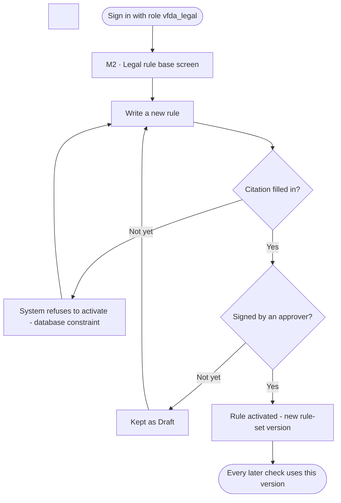
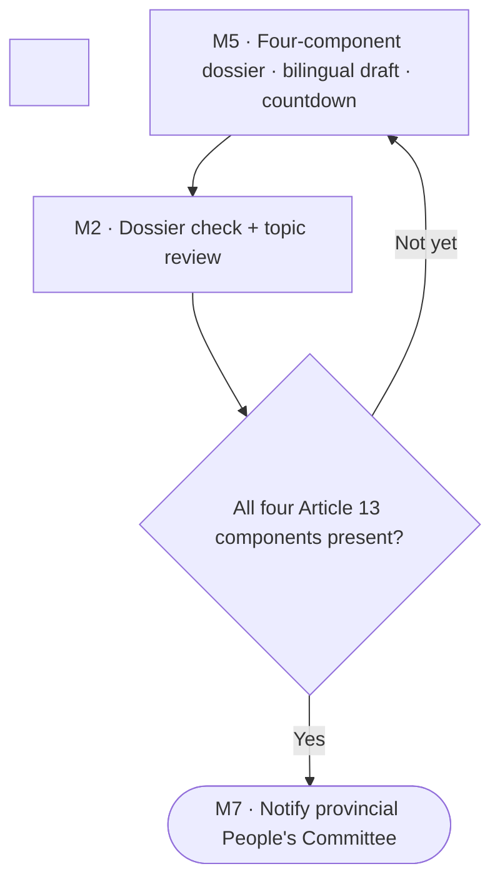

# Spec Document: Content pre-check and Article 13 dossier check

| Field | Value |
| :---- | :---- |
| Module ID | M2 |
| Module name | Content pre-check and Article 13 dossier check |
| Spec version | v0.1 |
| Author (team member) | Nam Tran — Group C |
| Date | 22/09/2026 |
| Status | Draft |
| Approved by (Client role) | *Not yet — VFDA project lead (and VFDA Legal Board for legal rules)* |
| DBIZ2 source | Function List rows 24–41 (F-M2-01 .. F-M2-18); Use Case UC-02, UC-03, UC-04, UC-19, UC-21; Screens SC-03, SC-48, SC-27, SC-29, SC-30, SC-31, SC-37 |

1\. Purpose and scope

This module tells a producer, before they commit, which parts of their story are likely to be looked at closely by the reviewing authority and whether their licence dossier has the four components Article 13 requires. Every finding cites the rule written and signed by the VFDA Legal Board; the system never interprets the law on its own.

**In scope**

- The legal rule base: VFDA Legal Board writes, signs and versions rules.  
- The 200-word content pre-check (no sign-up) and its result with highlighted passages and cited findings.  
- The deterministic check of the four Article 13 clause 3 dossier components.  
- Topic review of a project synopsis against the rule base.  
- The public requirements library.  
- The 20-day licensing timeline calculation (Article 13 clause 4).

**Out of scope**

- Deciding whether a film is approved — the reviewing authority decides.  
- Rewriting the producer's story — the system only shows the rule's own *Points to consider*.  
- Submitting the dossier to the Ministry (phase 3 integration).  
- Film classification for release in Vietnam (M9, phase 2).

**Depends on**

- SYS (roles, notifications)  
- M0 (compliance gauge)  
- M5 (uploaded documents, countdown screen)  
- M4 (service agreement status for component c)  
- External: language model API

## 2\. Actors

| Actor | Role in this module | Where it comes from |
| :---- | :---- | :---- |
| Guest | Primary — runs the 200-word pre-check | Function List (F-M2-05, 15, 16\) |
| Member | Primary — runs checks on a project, marks findings reviewed | Function List (F-M2-09, 13, 14, 18\) |
| VFDA Legal Board (`vfda_legal`) | Primary — writes, signs and versions rules | Function List (F-M2-01..03) |
| System | Runs the checks, verifies citations, computes timelines | Function List (F-M2-04, 06–08, 10–12, 17\) |

## 3\. User scenarios and acceptance criteria

### US-1 (P1): Pre-check my story without signing up

**Journey.** As an international producer, I want to paste a 200-word summary and see which topics may be scrutinised, so that I can prepare before I invest.

**Acceptance scenarios**

1. **Given** a guest with a 96-word summary, **When** they click *Check content*, **Then** within 30 seconds they see an attention level (Low / Medium / High), the highlighted passages and one card per finding.  
2. **Given** a finding produced by the model whose rule code is not in the approved rule base, **When** results are verified, **Then** the finding is dropped and never shown (F-M2-12).  
3. **Given** no findings, **When** the result is shown, **Then** it reads *No points needing attention were found under rule set 2026.08* and never *approved* or *compliant* (BR-003).

### US-2 (P1): Know whether my dossier is complete

**Journey.** As a producer, I want to see which of the four Article 13 components I still miss, so that I do not submit an incomplete dossier and lose the 20 days.

**Acceptance scenarios**

1. **Given** a project with the application form uploaded and nothing else, **When** the check runs, **Then** it shows 1 / 4 and *Not ready to submit*, and lists the three missing components.  
2. **Given** a Vietnamese synopsis with paragraphs not yet proofread, **When** the check runs, **Then** component b shows *Needs fixing*, not *Present*.

### US-3 (P1): VFDA Legal Board signs a rule

**Journey.** As a member of the VFDA Legal Board, I want to write and sign rules myself, so that VFDA — not the developers — owns what the product says about the law.

**Acceptance scenarios**

1. **Given** a draft rule without a citation, **When** the officer clicks *Approve and sign*, **Then** the database rejects activation and the citation field is highlighted.  
2. **Given** a rule with a citation, **When** it is approved, **Then** a new rule-set version is created and every later check records that version.

### US-4 (P2): See my licensing timeline

**Journey.** As a producer, I want to know the latest safe date to file, so that a resubmission does not push my shoot.

**Acceptance scenarios**

1. **Given** a first shooting day of 15/03/2027 and a 7-day buffer, **When** the timeline is computed, **Then** the safe submission deadline is 27/01/2027 and the latest deadline is 16/02/2027.

### US-5 (P3): Read requirements without an account

**Journey.** As a visitor, I want to browse the requirements by topic, so that I understand the rules before using the tools.

**Acceptance scenarios**

1. **Given** the requirements library, **When** a visitor filters by segment A, **Then** only approved rules for segment A are listed, each with its bilingual description and citation.

### Edge cases

- The language model API is down: the pre-check shows *Could not check right now — your text is kept*; the dossier completeness check (deterministic) still works.  
- Every finding fails citation verification: the result says *Could not check this time* rather than showing an empty *Low* result.  
- The rule set changes while a producer is reading an old result: the old result keeps its version label; \[NEEDS CLARIFICATION: re-run automatically or notify?\].  
- A guest runs the pre-check 50 times in an hour: rate limit per IP returns *You have used today's checks — create a free account to continue*.

## 4\. Flows

### 4.1 Usage flow — VFDA Legal Board

> Textualised from `docs/architecture/usage-flow.md` flow 5, translated to English. Diamonds Q1, Q2 were added in Step 3 from F-M2-02/03 — awaiting Client confirmation.



### 4.1b Usage flow — dossier loop (excerpt of the producer journey)

> Excerpt of `usage-flow.md` flow 1 (nodes DOS, CHK, Q4, NOTI). Diamond Q4 added in Step 3\.



### 4.2 Sequence — 200-word pre-check (SEQ-02)

> Textualised from SEQ-02 (Figure 5). 5 participants, 11 messages, translated to English.

```mermaid
sequenceDiagram
&nbsp;&nbsp;&nbsp;&nbsp;actor GU as Guest
&nbsp;&nbsp;&nbsp;&nbsp;participant FE as Next.js app
&nbsp;&nbsp;&nbsp;&nbsp;participant EF as Edge Function
&nbsp;&nbsp;&nbsp;&nbsp;participant DB as Supabase PostgreSQL + RLS
&nbsp;&nbsp;&nbsp;&nbsp;participant AI as Language model API

&nbsp;

&nbsp;&nbsp;&nbsp;&nbsp;GU->>FE: Paste a summary of up to 200 words
&nbsp;&nbsp;&nbsp;&nbsp;FE->>FE: Check the rate limit
&nbsp;&nbsp;&nbsp;&nbsp;FE->>EF: preCheck(text)
&nbsp;&nbsp;&nbsp;&nbsp;EF->>DB: Read approved legal_rules
&nbsp;&nbsp;&nbsp;&nbsp;DB-->>EF: Rules + citations
&nbsp;&nbsp;&nbsp;&nbsp;EF->>AI: Call the model with the rule set, structured output
&nbsp;&nbsp;&nbsp;&nbsp;AI-->>EF: findings[] (rule_code, quoted_text)
&nbsp;&nbsp;&nbsp;&nbsp;EF->>EF: Drop findings whose quote does not exist
&nbsp;&nbsp;&nbsp;&nbsp;EF->>DB: Write a record to briefs
&nbsp;&nbsp;&nbsp;&nbsp;EF-->>FE: Topics needing attention
&nbsp;&nbsp;&nbsp;&nbsp;FE-->>GU: Show warnings with the cited article
&nbsp;&nbsp;&nbsp;&nbsp;Note over EF: Never concludes approved or not — only raises points for a human to consider
```

### 4.3 Sequence — Article 13 completeness check (SEQ-08)

> Textualised from SEQ-08 (Figure 11). 4 participants, 12 messages.

```mermaid
sequenceDiagram
&nbsp;&nbsp;&nbsp;&nbsp;actor U as Producer
&nbsp;&nbsp;&nbsp;&nbsp;participant FE as Next.js app
&nbsp;&nbsp;&nbsp;&nbsp;participant ST as Supabase Storage
&nbsp;&nbsp;&nbsp;&nbsp;participant DB as Supabase PostgreSQL + RLS

&nbsp;

&nbsp;&nbsp;&nbsp;&nbsp;U->>FE: Open the project's document kit
&nbsp;&nbsp;&nbsp;&nbsp;FE->>DB: SELECT required_documents for the segment
&nbsp;&nbsp;&nbsp;&nbsp;DB-->>FE: The four required components
&nbsp;&nbsp;&nbsp;&nbsp;FE-->>U: Checklist with the status of each item
&nbsp;&nbsp;&nbsp;&nbsp;U->>FE: Upload the application form and the service agreement
&nbsp;&nbsp;&nbsp;&nbsp;FE->>ST: Store the documents
&nbsp;&nbsp;&nbsp;&nbsp;ST-->>FE: Paths
&nbsp;&nbsp;&nbsp;&nbsp;FE->>DB: INSERT documents
&nbsp;&nbsp;&nbsp;&nbsp;FE->>DB: check_dossier_completeness(project_id)
&nbsp;&nbsp;&nbsp;&nbsp;DB->>DB: Compare documents present with the checklist
&nbsp;&nbsp;&nbsp;&nbsp;DB-->>FE: 2 of 4 present · missing: Vietnamese script, Article 9 commitment
&nbsp;&nbsp;&nbsp;&nbsp;FE-->>U: List of missing components
&nbsp;&nbsp;&nbsp;&nbsp;Note over DB: Deterministic logic, no language model
```

### 4.4 Sequence — topic review of a project (SEQ-09)

> Textualised from SEQ-09 (Figure 12). 5 participants, 12 messages. None of the three DBIZ2 sequences draws an error branch — see open question 6\.

```mermaid
sequenceDiagram
&nbsp;&nbsp;&nbsp;&nbsp;actor U as Producer
&nbsp;&nbsp;&nbsp;&nbsp;participant FE as Next.js app
&nbsp;&nbsp;&nbsp;&nbsp;participant EF as Edge Function
&nbsp;&nbsp;&nbsp;&nbsp;participant DB as Supabase PostgreSQL + RLS
&nbsp;&nbsp;&nbsp;&nbsp;participant AI as Language model API

&nbsp;

&nbsp;&nbsp;&nbsp;&nbsp;U->>FE: Run a content check for the project
&nbsp;&nbsp;&nbsp;&nbsp;FE->>EF: reviewTopics(project_id)
&nbsp;&nbsp;&nbsp;&nbsp;EF->>DB: SELECT legal_rules WHERE approved_by IS NOT NULL
&nbsp;&nbsp;&nbsp;&nbsp;DB-->>EF: Rule set + version number
&nbsp;&nbsp;&nbsp;&nbsp;EF->>AI: Compare the synopsis with the rule catalogue
&nbsp;&nbsp;&nbsp;&nbsp;AI-->>EF: findings[] with quoted_text
&nbsp;&nbsp;&nbsp;&nbsp;EF->>EF: Drop unknown rule codes and quotes that do not exist
&nbsp;&nbsp;&nbsp;&nbsp;EF->>DB: INSERT compliance_runs (rule_version)
&nbsp;&nbsp;&nbsp;&nbsp;EF->>DB: INSERT compliance_findings
&nbsp;&nbsp;&nbsp;&nbsp;EF-->>FE: Filtered findings
&nbsp;&nbsp;&nbsp;&nbsp;FE-->>U: Show with the cited article and the disclaimer
&nbsp;&nbsp;&nbsp;&nbsp;U->>FE: Mark each finding as reviewed
&nbsp;&nbsp;&nbsp;&nbsp;Note over EF: No warning is ever shown without a cited article
```

## 5\. Functional requirements

| FR ID | DBIZ2 Subfunction ID | Requirement (system MUST ...) | Actor | Priority |
| :---- | :---- | :---- | :---- | :---- |
| FR-001 | F-M2-01 | The system MUST list legal rules, filterable by topic and status, to the VFDA Legal Board. | VFDA Legal | Must |
| FR-002 | F-M2-02 | The system MUST let the VFDA Legal Board create and edit rules with bilingual title, description and *Points to consider*, a citation and a severity. | VFDA Legal | Must |
| FR-003 | F-M2-03 | The system MUST activate a rule only after an approver signs it; a rule without a citation or an approver MUST NOT become active (database constraint). | VFDA Legal | Must |
| FR-004 | F-M2-04 | The system MUST create a new rule-set version on every activation and record the version used by every check. | System | Must |
| FR-005 | F-M2-05 | The system MUST accept a summary of 20–200 words from a guest without sign-up, rate-limited per IP. | Guest | Must |
| FR-006 | F-M2-06 | The system MUST compare the summary with the active rule set and return findings, each with rule code, quoted passage and explanation, plus an attention level (Low / Medium / High). | System | Must |
| FR-007 | F-M2-07 | The system MUST record every pre-check (hash, language, time) as a demand data point. | System | Must |
| FR-008 | F-M2-08 | The system MUST check the four Article 13 clause 3 components deterministically, without a language model. | System | Must |
| FR-009 | F-M2-09 | The system MUST show which components are missing, with a status and an action for each. | Member | Must |
| FR-010 | F-M2-10 | The system MUST push the completeness result to the dashboard's compliance gauge. | System | Must |
| FR-011 | F-M2-11 | The system MUST call the language model with only the codes of approved rules and require structured output. | System | Must |
| FR-012 | F-M2-12 | The system MUST drop every finding whose rule code is unknown or whose quoted text does not appear in the submitted text. | System | Must |
| FR-013 | F-M2-13 | The system MUST show every finding with its citation and never show a finding without one. | Member | Must |
| FR-014 | F-M2-14 | The system MUST let a member mark each finding as reviewed, with an optional note. | Member | Must |
| FR-015 | F-M2-15 | The system SHOULD publish the approved rules as a public library filterable by topic and segment. | Guest | Should |
| FR-016 | F-M2-16 | The system SHOULD publish one page per rule with its bilingual description and citation. | Guest | Should |
| FR-017 | F-M2-17 | The system MUST compute the safe and latest submission deadlines from the first shooting day, the safety buffer and Article 13 clause 4 (20 \+ 20 days). | System | Must |
| FR-018 | F-M2-18 | The system MUST always show both scenarios: smooth path and one resubmission. | Member | Must |

### 5.1 Input / Output contract

Types and required flags come from `docs/function-list.md` (columns *Input — type and required* and *Output — type*). Changes made in Session 4 are stated in *Notes* and listed in 11.1.

| FR ID | Input field | Type | Required | Output field | Type | Notes / validation |
| :---- | :---- | :---- | :---- | :---- | :---- | :---- |
| FR-001 | `filter_topic` | `VARCHAR(60)` | No | `rules` | `ARRAY<legal_rule>` | vfda\_legal only (RLS) |
|  | `filter_status` | `ENUM(draft, approved)` | No |  |  |  |
| FR-002 | `rule_code` | `VARCHAR(40)` | Yes | `rule_id` | `UUID` | guidance fields added (SC-48 *Points to consider*); severity reduced to two values — see §11 |
|  | `title_vi` | `VARCHAR(200)` | Yes | `version` | `INTEGER` |  |
|  | `title_en` | `VARCHAR(200)` | Yes |  |  |  |
|  | `description_vi` | `TEXT` | Yes |  |  |  |
|  | `description_en` | `TEXT` | Yes |  |  |  |
|  | `guidance_vi` | `TEXT` | Yes |  |  |  |
|  | `guidance_en` | `TEXT` | Yes |  |  |  |
|  | `citation` | `VARCHAR(200)` | Yes |  |  |  |
|  | `severity` | `ENUM(notice, action)` | Yes |  |  |  |
| FR-003 | `rule_id` | `UUID` | Yes | `approved_at` | `TIMESTAMPTZ` | CHECK: citation and approver not null |
|  | `approver_id` | `UUID` | Yes | `is_active` | `BOOLEAN` |  |
| FR-004 | `rule_change_event` | `JSONB` | Yes | `rule_version` | `VARCHAR(20)` | format \[NEEDS CLARIFICATION\] |
| FR-005 | `synopsis_text` | `TEXT` | Yes | `form_state` | `JSONB` | 20–200 words; flags \= real\_person, military, heritage\_site (yes / no / unsure) |
|  | `lang` | `ENUM(en, vi)` | Yes |  |  |  |
|  | `flags` | `JSONB` | No |  |  |  |
| FR-006 | `synopsis_text` | `TEXT` | Yes | `findings` | `ARRAY<(rule_code VARCHAR(40), quoted_text TEXT, explanation_vi TEXT, explanation_en TEXT)>` | attention\_level added (SC-48) |
|  | `active_rules` | `ARRAY<legal_rule>` | Yes | `attention_level` | `ENUM(low, medium, high)` |  |
| FR-007 | `synopsis_hash` | `TEXT` | Yes | `brief_id` | `UUID` | text itself not stored for guests \[NEEDS CLARIFICATION\] |
|  | `locale` | `ENUM(vi, en)` | Yes |  |  |  |
|  | `country_guess` | `VARCHAR(2)` | No |  |  |  |
| FR-008 | `project_id` | `UUID` | Yes | `completeness_pct` | `NUMERIC(5,2)` | exactly 4 components |
|  |  |  |  | `missing_documents` | `ARRAY<doc_code VARCHAR(40)>` |  |
| FR-009 | `missing_documents` | `ARRAY<doc_code>` | Yes | `checklist_view` | `JSONB` | status per component: present / needs\_fix / pending / missing |
| FR-010 | `completeness_pct` | `NUMERIC(5,2)` | Yes | `gauge_compliance` | `NUMERIC(5,2)` |  |
| FR-011 | `synopsis` | `TEXT` | Yes | `raw_findings` | `JSONB` | structured output only |
|  | `active_rules` | `ARRAY<legal_rule>` | Yes |  |  |  |
| FR-012 | `raw_findings` | `JSONB` | Yes | `verified_findings` | `JSONB` | dropped findings logged for VFDA |
|  | `synopsis` | `TEXT` | Yes | `dropped_count` | `INTEGER` |  |
| FR-013 | `verified_findings` | `JSONB` | Yes | `findings_view` | `JSONB` | citation mandatory per item |
| FR-014 | `finding_id` | `UUID` | Yes | `finding_status` | `ENUM(open, reviewed)` |  |
|  | `reviewer_note` | `TEXT` | No |  |  |  |
| FR-015 | `topic` | `VARCHAR(60)` | No | `rules` | `ARRAY<legal_rule_public>` | approved rules only |
|  | `segment` | `ENUM(A, B, C)` | No |  |  |  |
| FR-016 | `rule_slug` | `VARCHAR(120)` | Yes | `rule_detail` | `JSONB` |  |
| FR-017 | `shoot_date` | `DATE` | Yes | `submit_by` | `DATE` | buffer\_days default 7 (added, SC-29) |
|  | `buffer_days` | `INTEGER` | Yes | `result_by` | `DATE` |  |
|  |  |  |  | `result_by_worst` | `DATE` |  |
| FR-018 | `milestones` | `JSONB` | Yes | `timeline_view` | `JSONB` | both scenarios always shown |

### 5.2 Business rules

| Rule ID | Rule | Why it exists |
| :---- | :---- | :---- |
| BR-001 | Every finding shown to a user cites a rule written and signed by the VFDA Legal Board; findings without a valid citation are dropped by code before display. | The product must never invent law. |
| BR-002 | A rule becomes active only when it has a citation **and** an approver; this is enforced by a database CHECK constraint. | Signing is VFDA's act, not the developers'. |
| BR-003 | The words *approved*, *accepted*, *legally compliant* and *safe* never appear in results, including when nothing is found. | Only the competent authority decides. |
| BR-004 | The attention level is derived deterministically from the number and severity of verified findings, never from a model score. | A precise-looking number from a model gives false certainty. |
| BR-005 | The dossier completeness check uses fixed rules, not a language model. | A missing document is a fact, not a judgement. |
| BR-006 | Safe deadline \= first shooting day − buffer − 20 − 20 days; latest deadline \= first shooting day − buffer − 20 days. | Article 13 clause 4: 20 days, plus up to 20 more if the script must be revised. |
| BR-007 | Every check stores the rule-set version it used. | An old result must remain explainable after rules change. |

## 6\. Key entities

| Entity | Attributes (from Input/Output fields) | Relationships |
| :---- | :---- | :---- |
| LegalRule | rule\_id, rule\_code, title\_vi/en, description\_vi/en, guidance\_vi/en, citation, severity, status, approved\_by, approved\_at | belongs to RuleSetVersion |
| RuleSetVersion | rule\_version, created\_at, created\_by | has many LegalRules |
| PrecheckRun (brief) | brief\_id, synopsis\_hash, lang, flags, attention\_level, rule\_version, created\_at | has many PrecheckFindings; may belong to a Project |
| PrecheckFinding | rule\_code, quoted\_text, span\_start, span\_end, explanation | belongs to PrecheckRun |
| ComplianceRun | run\_id, project\_id, rule\_version, run\_at | has many ComplianceFindings; belongs to Project |
| ComplianceFinding | finding\_id, rule\_code, quoted\_text, finding\_status, reviewer\_note | belongs to ComplianceRun |
| DossierCheck | project\_id, checked\_at, completeness\_pct, missing\_documents | derived from DocumentSlots (M5) |
| LicensingTimeline | project\_id, submit\_by, result\_by, result\_by\_worst, buffer\_days | derived from Project.shoot\_date |

## 7\. Screens involved

| Screen ID | Screen name | Priority | Screen Spec file |
| :---- | :---- | :---- | :---- |
| SC-03 | Script content input (200-word pre-check) | Must | `screens/screen-spec-SC-03.md` |
| SC-48 | Content check results | Must | `screens/screen-spec-SC-48.md` |
| SC-27 | Article 13 dossier completeness check | Must | `screens/screen-spec-SC-27.md` |
| SC-29 | 20-day countdown | Must | `screens/screen-spec-SC-29.md` |
| SC-37 | Admin — legal rule base | Must | *Not written yet — screen not in the 20-screen set* |
| SC-30 | Requirements library | Should | *Not written yet — screen not in the 20-screen set* |
| SC-31 | Requirement detail | Should | *Not written yet — screen not in the 20-screen set* |

## 8\. Success criteria

| SC ID | Criterion | How it is measured |
| :---- | :---- | :---- |
| SC-001 | A guest gets a pre-check result for a 200-word summary in under 30 seconds. | Timed on 20 sample summaries. |
| SC-002 | No finding is ever shown without a citation to an approved rule. | Audit 100 results: count findings without a valid rule code (target 0). |
| SC-003 | A producer can name their missing Article 13 components after one visit to the check screen. | Task walkthrough with 5 producers. |
| SC-004 | The VFDA Legal Board can add and sign a rule without developer help. | Observed session with one VFDA officer. |
| SC-005 | The deadlines shown on the dashboard, the check screen and the countdown are always identical. | Compare three screens on 20 projects. |

## 9\. Assumptions

- The rule base starts with about 25 rules written by the VFDA Legal Board before launch.  
- Content risk is assessed against Article 9 (prohibited content); dossier completeness against Article 13 clause 3 — see open question 1\.  
- Deadlines are computed in calendar days until the Legal Board confirms otherwise.

## 10\. Open questions

| \# | Question | Blocking? | Owner | Status |
| :---- | :---- | :---- | :---- | :---- |
| 1 | \[NEEDS CLARIFICATION: The screen list file says *highlight risk points under Article 13*; this spec uses Article 9 (prohibited content) for content and Article 13 for dossier components. Confirm.\] | Yes | Group C | Open |
| 2 | \[NEEDS CLARIFICATION: Is the 20-day period in Article 13 clause 4 calendar days or working days?\] | Yes | Client (VFDA Legal Board) | Open |
| 3 | \[NEEDS CLARIFICATION: Must rule signing require two different people (author ≠ approver)?\] | Yes | Client (VFDA Legal Board) | Open |
| 4 | \[NEEDS CLARIFICATION: When the rule set gets a new version, are open projects re-checked automatically or only notified?\] | Yes | Client (VFDA) | Open |
| 5 | \[NEEDS CLARIFICATION: Thresholds that turn findings into Low / Medium / High.\] | Yes | Client (VFDA Legal Board) | Open |
| 6 | \[NEEDS CLARIFICATION: None of SEQ-02, SEQ-08, SEQ-09 draws an error branch (model down, file too large). Confirm the behaviour in the edge cases.\] | No | Client (VFDA) | Open |
| 7 | \[NEEDS CLARIFICATION: How long is a guest's pre-check text kept, and may it be used to improve the rule base?\] | Yes | Client (VFDA) | Open |
| 8 | \[NEEDS CLARIFICATION: how long are guest summaries kept, and are they used to improve the rule set — privacy policy wording needed\] *(from SC-03)* | Yes | Client (VFDA) | Open |
| 9 | \[NEEDS CLARIFICATION: team to confirm that content uses Article 9 (prohibited content) instead of Article 13 as stated in the screen list file\] *(from SC-48)* | Yes | Client (VFDA) | Open |
| 10 | \[NEEDS CLARIFICATION: thresholds for mapping number of findings × severity to Low / Medium / High\] *(from SC-48)* | Yes | Client (VFDA) | Open |
| 11 | \[NEEDS CLARIFICATION: are the "20 days" in Article 13 cl.4 working days or calendar days — this directly affects the countdown\] *(from SC-27)* | Yes | Client (VFDA) | Open |
| 12 | \[NEEDS CLARIFICATION: which application form is currently in force, and may VFDA provide a bilingual version of it\] *(from SC-27)* | Yes | Client (VFDA) | Open |

## 11\. Traceability to DBIZ2

| Spec section | DBIZ2 source | Location |
| :---- | :---- | :---- |
| 1\. Purpose | System Design v2.0 — 1\. Schematic, §1.2 (M2) | `docs/architecture/context.md` |
| 4.1 Usage flow | Usage Flow FLOW-01 flows 1 and 5 (Figure 3\) \+ Step 3 additions | `docs/architecture/usage-flow.md` §1, §5 |
| 4.2–4.4 Sequences | SEQ-02 (Fig. 5), SEQ-08 (Fig. 11), SEQ-09 (Fig. 12\) | `docs/architecture/sequence-diagrams.md` |
| 5\. Functional requirements | Function List rows 24–41 | `docs/function-list.md` rows 24–41 |
| 5.2 BR-006 | Cinema Law 2022 (Law No. 05/2022/QH15), Article 13 clause 4 | legal source |
| 7\. Screens | Screen List SC-03, SC-27, SC-29, SC-30, SC-31, SC-37, SC-48 | `docs/screen-list.md` §1 |

### 11.1 Reconciliation with DBIZ2 (System Design v2.0)

Where the 20-screen design or this spec differs from the DBIZ2 Function List, the difference is written here instead of being silently changed.

| Topic | DBIZ2 / System Design v2.0 | This spec | Status |
| :---- | :---- | :---- | :---- |
| Pre-check result screen | Result shown inside SC-03 | Separate screen SC-48 (screen list items \#6, \#7) | Changed — new Screen ID |
| Rule severity | ENUM(info, notice, action) | ENUM(notice, action) — the screens show only *Needs attention* / *Action required* | Changed — Client to confirm |
| Rule guidance | not in DBIZ2 | guidance\_vi / guidance\_en added to show *Points to consider* (SC-48) | Added — Client to confirm |
| F-M2-15, F-M2-16 priority | Must | Should — screens SC-30 / SC-31 are not in the 20-screen set | Changed — Client to confirm |

&nbsp;