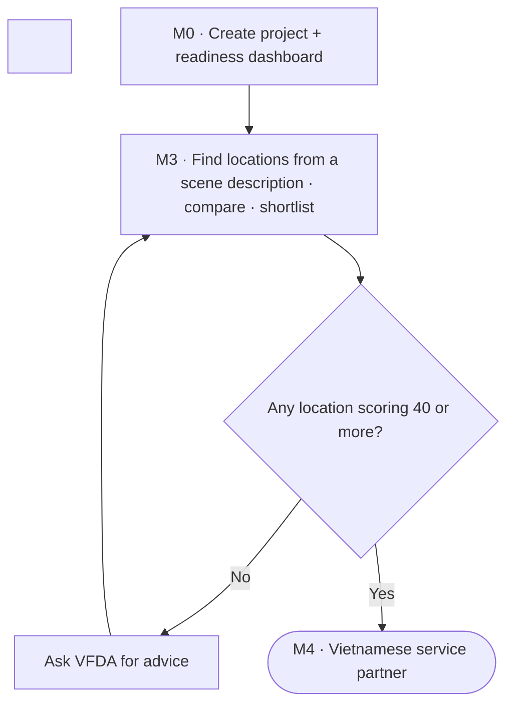
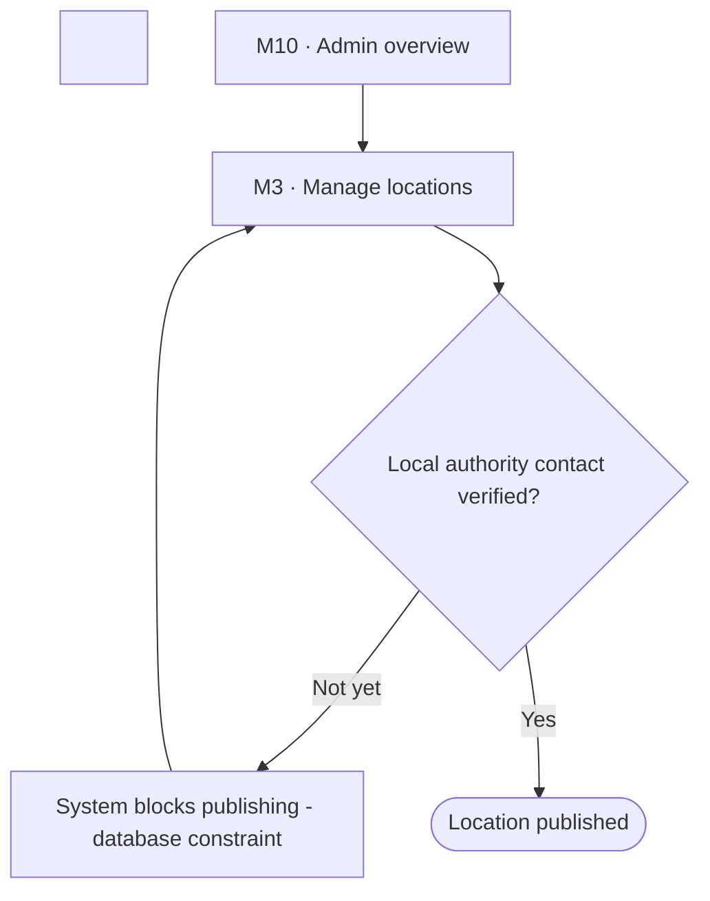

# Spec Document: Location discovery

| Field | Value |
| :---- | :---- |
| Module ID | M3 |
| Module name | Location discovery |
| Spec version | v0.1 |
| Author (team member) | Nam Tran — Group C |
| Date | 22/09/2026 |
| Status | Draft |
| Approved by (Client role) | *Not yet — VFDA project lead (and VFDA Legal Board for legal rules)* |
| DBIZ2 source | Function List rows 42–61 (F-M3-01 .. F-M3-20); Use Case UC-07 .. UC-12; Screens SC-14, SC-15, SC-16, SC-17, SC-18, SC-35 |

1\. Purpose and scope

This module helps a producer find places in Vietnam that fit the scenes they describe, explains why each place fits, and shows who in local government to contact. VFDA staff maintain and verify the location data; each province gets a readiness index built only from activity on the platform.

**In scope**

- Location data management and publishing by VFDA staff, including verified local authority contacts.  
- Accent-insensitive search and multi-criteria filters.  
- Finding locations from a free-text scene description (attributes extracted, then scored deterministically).  
- Ranked results with match score and reasons, map, and location detail pages.  
- Comparing up to four locations and shortlisting a primary and backups (Should).  
- Provincial readiness index and province pages (Should).

**Out of scope**

- Booking or paying for a location.  
- Drone permits and restricted zones (M6, phase 2).  
- Contacting the province on the producer's behalf (M7).

**Depends on**

- SYS (roles, search indexes)  
- M0 (location gauge, project context)  
- M7 (*I'm interested* creates a provincial notice)  
- External: language model API, OpenStreetMap tiles, PostGIS

## 2\. Actors

| Actor | Role in this module | Where it comes from |
| :---- | :---- | :---- |
| Guest | Primary — searches, describes scenes, compares | Function List (F-M3-06..14, 16, 17, 20\) |
| Member | Primary — sees authority contacts, shortlists | Function List (F-M3-15, 18\) |
| VFDA staff | Primary — manages, verifies and publishes locations | Function List (F-M3-01..05) |
| System | Extracts attributes, scores, computes the provincial index | Function List (F-M3-08, 11, 12, 19\) |

## 3\. User scenarios and acceptance criteria

### US-1 (P1): Describe a scene, get places that fit

**Journey.** As a producer, I want to describe my scene in my own words and get ranked places with reasons, so that I shortlist in minutes instead of weeks of scouting emails.

**Acceptance scenarios**

1. **Given** the description *A ferry landing at dawn between limestone karsts, 1970s, a waterside village, about 30 extras, night scenes too*, **When** the user clicks *Analyse description*, **Then** the system shows the extracted attributes (landing, waterside village, 1970s, dawn, night, river/lake, limestone, 15–50) and lets the user edit them before searching.  
2. **Given** confirmed attributes, **When** the user searches, **Then** only published locations scoring 40 or more are listed, best first, each with at least one *why it matches* reason.  
3. **Given** a word not in the catalogue (e.g. *fishing village*), **When** attributes are extracted, **Then** it is mapped to the nearest catalogue value and the mapping is shown to the user.

### US-2 (P1): Contact the local authority

**Journey.** As a member, I want the verified local authority contact for a location, so that I can plan permits with the right office.

**Acceptance scenarios**

1. **Given** a guest on a location page, **When** the page loads, **Then** the contact block shows a sign-up prompt and the page source contains no phone number or email.  
2. **Given** a signed-in member, **When** the page loads, **Then** the office, contact person, phone and email are shown with the date VFDA verified them.

### US-3 (P1): VFDA publishes a verified location

**Journey.** As VFDA staff, I want to publish a location only once its authority contact is verified, so that producers never get a dead end.

**Acceptance scenarios**

1. **Given** a location with an unverified contact, **When** staff click *Publish*, **Then** publishing is refused by a database constraint with the reason shown.

### US-4 (P2): Compare and shortlist

**Journey.** As a producer, I want to compare up to four places side by side and set a primary and a backup, so that my plan survives bad weather or a refusal.

**Acceptance scenarios**

1. **Given** three locations in the compare tray, **When** the comparison opens, **Then** eight criteria rows are shown and every cell is *meets*, *caution* or *to verify* — never empty.  
2. **Given** a comparison, **When** the member clicks *Set as primary* on Tràng An, **Then** it is saved to the project shortlist and the *Locations* gauge on the dashboard rises.

### US-5 (P3): Understand a province

**Journey.** As a producer or as VFDA, I want to see how ready a province is to host a shoot, so that I can judge the practical risk.

**Acceptance scenarios**

1. **Given** Ninh Bình with enough data, **When** the province page opens, **Then** the index, its components, their sample sizes and the calculation method are shown.  
2. **Given** a province with fewer than the minimum data points, **When** the page opens, **Then** the index shows `—` with *Not enough data yet*.

### Edge cases

- The model fails to extract attributes: the user is offered the filter search instead; the typed description is kept.  
- No location reaches 40 points: show the three nearest with the criteria they miss, plus *Ask VFDA* — never a blank page.  
- An old province name is searched (e.g. *Quảng Nam*): it maps to the merged province (Đà Nẵng) and says so.  
- A fifth location is added to the compare tray: refused with *Maximum 4 — remove one to add another*.

## 4\. Flows

### 4.1 Usage flow — producer excerpt

> Excerpt of `docs/architecture/usage-flow.md` flow 1\. Diamond Q2 was added in Step 3 from F-M3-08 (40-point threshold) — awaiting Client confirmation.



### 4.1b Usage flow — VFDA staff publishing a location

> Excerpt of `usage-flow.md` flow 4, translated. Diamond Q1 added in Step 3 from F-M3-05.



### 4.2 Sequence — find locations from a scene description (SEQ-03)

> Textualised from SEQ-03 (Figure 6), translated. 5 participants, 10 messages. Note: SC-15 adds a user confirmation step between extraction and search (see §11).

```mermaid
sequenceDiagram
&nbsp;&nbsp;&nbsp;&nbsp;actor U as Producer
&nbsp;&nbsp;&nbsp;&nbsp;participant FE as Next.js app
&nbsp;&nbsp;&nbsp;&nbsp;participant EF as Edge Function
&nbsp;&nbsp;&nbsp;&nbsp;participant AI as Language model API
&nbsp;&nbsp;&nbsp;&nbsp;participant DB as Supabase PostgreSQL + RLS

&nbsp;

&nbsp;&nbsp;&nbsp;&nbsp;U->>FE: Type a free-text scene description
&nbsp;&nbsp;&nbsp;&nbsp;FE->>EF: extractSceneAttributes(text)
&nbsp;&nbsp;&nbsp;&nbsp;EF->>AI: Extract attributes into a fixed template
&nbsp;&nbsp;&nbsp;&nbsp;AI-->>EF: scene_types, era, time_of_day, ...
&nbsp;&nbsp;&nbsp;&nbsp;EF->>EF: Validate against the location-type catalogue
&nbsp;&nbsp;&nbsp;&nbsp;EF->>DB: search_locations(attributes)
&nbsp;&nbsp;&nbsp;&nbsp;DB->>DB: Score out of 100 on 6 criteria
&nbsp;&nbsp;&nbsp;&nbsp;DB-->>EF: Ranked list + match_reasons[]
&nbsp;&nbsp;&nbsp;&nbsp;EF-->>FE: Results with reasons
&nbsp;&nbsp;&nbsp;&nbsp;FE-->>U: Location cards, each saying why it matches
&nbsp;&nbsp;&nbsp;&nbsp;Note over DB: Only published = true and score of 40 or more
```

### 4.3 Sequence — local authority contact gated by RLS (SEQ-04)

> Textualised from SEQ-04 (Figure 7). 4 participants, 12 messages.

```mermaid
sequenceDiagram
&nbsp;&nbsp;&nbsp;&nbsp;actor GU as Guest
&nbsp;&nbsp;&nbsp;&nbsp;actor U as Producer
&nbsp;&nbsp;&nbsp;&nbsp;participant FE as Next.js app
&nbsp;&nbsp;&nbsp;&nbsp;participant DB as Supabase PostgreSQL + RLS

&nbsp;

&nbsp;&nbsp;&nbsp;&nbsp;GU->>FE: Open a location detail page
&nbsp;&nbsp;&nbsp;&nbsp;FE->>DB: SELECT locations WHERE slug = ?
&nbsp;&nbsp;&nbsp;&nbsp;DB-->>FE: Public location data
&nbsp;&nbsp;&nbsp;&nbsp;FE->>DB: SELECT location_authority_contacts
&nbsp;&nbsp;&nbsp;&nbsp;DB->>DB: RLS: role anon gives 0 rows
&nbsp;&nbsp;&nbsp;&nbsp;DB-->>FE: Empty
&nbsp;&nbsp;&nbsp;&nbsp;FE-->>GU: Show a sign-up prompt instead of the contact
&nbsp;&nbsp;&nbsp;&nbsp;U->>FE: Sign in and reopen the page
&nbsp;&nbsp;&nbsp;&nbsp;FE->>DB: SELECT location_authority_contacts
&nbsp;&nbsp;&nbsp;&nbsp;DB->>DB: RLS: signed in, return data
&nbsp;&nbsp;&nbsp;&nbsp;DB-->>FE: Name, phone, email of the contact
&nbsp;&nbsp;&nbsp;&nbsp;FE-->>U: Show full contact details
&nbsp;&nbsp;&nbsp;&nbsp;Note over DB: Sensitive data never leaves the database for a user without the right role
```

### 4.4 Sequence — compare and shortlist (SEQ-05)

> Textualised from SEQ-05 (Figure 8). 3 participants, 10 messages.

```mermaid
sequenceDiagram
&nbsp;&nbsp;&nbsp;&nbsp;actor U as Producer
&nbsp;&nbsp;&nbsp;&nbsp;participant FE as Next.js app
&nbsp;&nbsp;&nbsp;&nbsp;participant DB as Supabase PostgreSQL + RLS

&nbsp;

&nbsp;&nbsp;&nbsp;&nbsp;U->>FE: Pick up to 4 locations to compare
&nbsp;&nbsp;&nbsp;&nbsp;FE->>FE: Keep the selection in the browser
&nbsp;&nbsp;&nbsp;&nbsp;FE->>DB: Fetch data for the 4 locations
&nbsp;&nbsp;&nbsp;&nbsp;DB-->>FE: Full attributes of each location
&nbsp;&nbsp;&nbsp;&nbsp;FE-->>U: Comparison table with 8 criteria rows
&nbsp;&nbsp;&nbsp;&nbsp;U->>FE: Click shortlist
&nbsp;&nbsp;&nbsp;&nbsp;FE->>DB: INSERT project_shortlist
&nbsp;&nbsp;&nbsp;&nbsp;DB->>DB: Recalculate the Locations gauge
&nbsp;&nbsp;&nbsp;&nbsp;DB-->>FE: New readiness score
&nbsp;&nbsp;&nbsp;&nbsp;FE-->>U: Dashboard updates at once
```

## 5\. Functional requirements

| FR ID | DBIZ2 Subfunction ID | Requirement (system MUST ...) | Actor | Priority |
| :---- | :---- | :---- | :---- | :---- |
| FR-001 | F-M3-01 | The system MUST list all locations, including unpublished ones, to VFDA staff. | VFDA Staff | Must |
| FR-002 | F-M3-02 | The system MUST let VFDA staff create and edit a location with the 18 fields of the data-entry template. | VFDA Staff | Must |
| FR-003 | F-M3-03 | The system MUST store location photos with their source and usage right. | VFDA Staff | Must |
| FR-004 | F-M3-04 | The system MUST record the local authority contact of a location with who verified it and when. | VFDA Staff | Must |
| FR-005 | F-M3-05 | The system MUST refuse to publish a location whose authority contact is not verified (database constraint). | VFDA Staff | Must |
| FR-006 | F-M3-06 | The system MUST return locations for a search typed with or without Vietnamese diacritics. | Guest | Must |
| FR-007 | F-M3-07 | The system MUST filter by scene type, province or region, crew size, shooting month and special scenes, and keep the filter state in the page URL. | Guest | Must |
| FR-008 | F-M3-08 | The system MUST score each published location from 0 to 100 on six criteria in a database function and hide results below 40\. | System | Must |
| FR-009 | F-M3-09 | The system MUST show every result with its score, at least one *why it matches* reason and any mismatch or missing data. | Guest | Must |
| FR-010 | F-M3-10 | The system MUST accept a free-text scene description in English or Vietnamese. | Guest | Must |
| FR-011 | F-M3-11 | The system MUST extract structured attributes from the description with a language model filling a fixed template; the model MUST NOT choose or rank locations. | System | Must |
| FR-012 | F-M3-12 | The system MUST drop or map attribute values that are not in the catalogue and show the user what was mapped. | System | Must |
| FR-013 | F-M3-13 | The system MUST show a location page with photos, bilingual description, logistics, season and permit complexity. | Guest | Must |
| FR-014 | F-M3-14 | The system MUST show the location on a map with nearby published locations within 30 km. | Guest | Must |
| FR-015 | F-M3-15 | The system MUST return the local authority contact only to signed-in users (RLS). | Member | Must |
| FR-016 | F-M3-16 | The system SHOULD let a user compare up to four locations and remember the selection on reload. | Guest | Should |
| FR-017 | F-M3-17 | The system SHOULD show eight criteria rows where every cell is *meets*, *caution* or *to verify*. | Guest | Should |
| FR-018 | F-M3-18 | The system SHOULD let a member add locations to the project shortlist as primary or backup and update the Locations gauge. | Member | Should |
| FR-019 | F-M3-19 | The system SHOULD compute a provincial readiness index from platform data only, with sample sizes. | System | Should |
| FR-020 | F-M3-20 | The system SHOULD show a province page linking into a pre-filtered location search. | Guest | Should |

### 5.1 Input / Output contract

Types and required flags come from `docs/function-list.md` (columns *Input — type and required* and *Output — type*). Changes made in Session 4 are stated in *Notes* and listed in 11.1.

| FR ID | Input field | Type | Required | Output field | Type | Notes / validation |
| :---- | :---- | :---- | :---- | :---- | :---- | :---- |
| FR-001 | `filter` | `JSONB` | No | `locations` | `ARRAY<location_admin>` | vfda\_staff only |
| FR-002 | `name_vi` | `VARCHAR(200)` | Yes | `location_id` | `UUID` | province\_id from the 34-province list |
|  | `name_en` | `VARCHAR(200)` | Yes | `slug` | `VARCHAR(160)` |  |
|  | `province_id` | `INTEGER` | Yes |  |  |  |
|  | `district` | `VARCHAR(120)` | No |  |  |  |
|  | `lat` | `NUMERIC(9,6)` | Yes |  |  |  |
|  | `lng` | `NUMERIC(9,6)` | Yes |  |  |  |
|  | `airport_km` | `INTEGER` | No |  |  |  |
|  | `scene_types` | `ARRAY<ENUM>` | Yes |  |  |  |
|  | `desc_vi` | `TEXT` | Yes |  |  |  |
|  | `desc_en` | `TEXT` | Yes |  |  |  |
|  | `crew_capacity` | `ENUM(u15, 15_50, o50)` | Yes |  |  |  |
|  | `lodging_20km` | `BOOLEAN` | Yes |  |  |  |
|  | `grid_power` | `BOOLEAN` | Yes |  |  |  |
|  | `truck_access` | `BOOLEAN` | Yes |  |  |  |
|  | `months_to_avoid` | `ARRAY<INTEGER>` | No |  |  |  |
|  | `permit_complexity` | `ENUM(low, medium, high)` | Yes |  |  |  |
|  | `restriction_note` | `TEXT` | No |  |  |  |
| FR-003 | `image_file` | `BYTEA` | Yes | `image_url` | `TEXT` | jpg / png, max 10 MB |
|  | `image_source` | `TEXT` | Yes |  |  |  |
|  | `usage_right` | `TEXT` | Yes |  |  |  |
| FR-004 | `location_id` | `UUID` | Yes | `contact_verified` | `BOOLEAN` |  |
|  | `authority_name` | `VARCHAR(200)` | Yes | `verified_at` | `TIMESTAMPTZ` |  |
|  | `contact_name` | `VARCHAR(120)` | Yes |  |  |  |
|  | `contact_phone` | `VARCHAR(20)` | Yes |  |  |  |
|  | `contact_email` | `VARCHAR(254)` | No |  |  |  |
|  | `verified_by` | `UUID` | Yes |  |  |  |
| FR-005 | `location_id` | `UUID` | Yes | `published` | `BOOLEAN` | CHECK: contact\_verified \= true |
|  |  |  |  | `blocked_reason` | `TEXT` |  |
| FR-006 | `query` | `VARCHAR(200)` | No | `matches` | `ARRAY<location_card>` | unaccent full-text |
| FR-007 | `scene_types` | `ARRAY<ENUM>` | No | `filtered_ids` | `ARRAY<UUID>` | shoot\_month 1–12 |
|  | `provinces` | `ARRAY<INTEGER>` | No | `url_state` | `TEXT` |  |
|  | `crew_size` | `ENUM(u15, 15_50, o50)` | No |  |  |  |
|  | `shoot_month` | `INTEGER` | No |  |  |  |
|  | `special_scenes` | `ARRAY<ENUM>` | No |  |  |  |
| FR-008 | `scene_types` | `ARRAY` | No | `ranked` | `ARRAY<(location_id UUID, score INTEGER, match_reasons ARRAY<TEXT>)>` | score 0–100; weights \[NEEDS CLARIFICATION\] |
|  | `provinces` | `ARRAY` | No |  |  |  |
|  | `crew_size` | `ENUM` | No |  |  |  |
|  | `shoot_month` | `INTEGER` | No |  |  |  |
| FR-009 | `ranked` | `ARRAY` | Yes | `cards_view` | `JSONB` | ≥ 1 reason per card |
| FR-010 | `scene_description` | `TEXT` | Yes | `form_state` | `JSONB` | 10–1000 characters |
| FR-011 | `scene_description` | `TEXT` | Yes | `attributes` | `JSONB (scene_types ARRAY, era ENUM, time_of_day ENUM, water ENUM, terrain ARRAY, crowd_scale ENUM, constraints ARRAY)` | structured output |
| FR-012 | `attributes` | `JSONB` | Yes | `valid_attributes` | `JSONB` | mapped values reported to the user |
|  | `scene_type_catalog` | `ARRAY<ENUM>` | Yes | `rejected` | `ARRAY<TEXT>` |  |
| FR-013 | `slug` | `VARCHAR(160)` | Yes | `location_detail` | `JSONB` | published only |
| FR-014 | `lat` | `NUMERIC(9,6)` | Yes | `map_view` | `JSONB` | radius default 30; max 5 nearby |
|  | `lng` | `NUMERIC(9,6)` | Yes | `nearby` | `ARRAY<(location_id UUID, distance_km NUMERIC(6,2))>` |  |
|  | `radius_km` | `INTEGER` | No |  |  |  |
| FR-015 | `location_id` | `UUID` | Yes | `authority_contact` | `JSONB` | empty for guests (RLS) |
|  | `session_role` | `ENUM` | Yes |  |  |  |
| FR-016 | `location_ids` | `ARRAY<UUID>` | Yes | `compare_set` | `ARRAY<UUID>` | max 4 |
| FR-017 | `compare_set` | `ARRAY<UUID>` | Yes | `comparison_table` | `JSONB` | 8 criteria rows; no empty cell |
| FR-018 | `project_id` | `UUID` | Yes | `shortlist_id` | `UUID` | role added (SC-17) |
|  | `location_ids` | `ARRAY<UUID>` | Yes | `gauge_location` | `NUMERIC(5,2)` |  |
|  | `role` | `ENUM(primary, backup)` | Yes |  |  |  |
| FR-019 | `province_id` | `INTEGER` | Yes | `readiness_index` | `NUMERIC(5,2)` | 4 scored components \+ 1 condition; sample size per component |
|  |  |  |  | `components` | `JSONB` |  |
| FR-020 | `province_slug` | `VARCHAR(80)` | Yes | `province_page` | `JSONB` | old slugs redirect to merged province |

### 5.2 Business rules

| Rule ID | Rule | Why it exists |
| :---- | :---- | :---- |
| BR-001 | The language model only extracts attributes; ranking is done by a deterministic scoring function in the database. The model never names or ranks a location. | Explainable results; no invented places. |
| BR-002 | A result is shown only if its score is 40 or more and it has at least one *why it matches* reason. | A score without a reason is a black box. |
| BR-003 | *Not a match* and *No data yet* are different; missing data never counts for or against a location. | No-guessing principle. |
| BR-004 | A location cannot be published until its local authority contact is verified; contacts are re-verified every 12 months \[NEEDS CLARIFICATION\]. | A dead-end contact destroys trust in VFDA's data. |
| BR-005 | Authority contacts are returned only to signed-in users, enforced by Row Level Security. | Contacts are VFDA's gated asset and personal data. |
| BR-006 | Provinces use the 34 provincial-level units after the 2025 reorganisation; old names are accepted in search and mapped to the new unit. | Producers and older guides still use pre-2025 names. |
| BR-007 | The provincial index uses only data generated on the platform and always shows its sample size. | It must not become a subjective ranking of provinces. |

## 6\. Key entities

| Entity | Attributes (from Input/Output fields) | Relationships |
| :---- | :---- | :---- |
| Location | location\_id, slug, name\_vi, name\_en, province\_id, lat, lng, scene\_types, crew\_capacity, lodging\_20km, grid\_power, truck\_access, months\_to\_avoid, permit\_complexity, intake\_status, published | belongs to Province; has many LocationImages; has one AuthorityContact |
| LocationImage | image\_url, image\_source, usage\_right, status | belongs to Location |
| AuthorityContact | authority\_name, contact\_name, contact\_phone, contact\_email, verified\_by, verified\_at | belongs to Location |
| Province | province\_id, name, slug, region, merged\_from | has many Locations |
| LocationQuery | description, attributes, month, project\_id | may belong to Project |
| ProjectShortlist | project\_id, location\_id, role | belongs to Project and Location |
| ProvinceReadiness | province\_id, readiness\_index, components, sample\_sizes, computed\_at | derived from Locations, Organisations, Notices |

## 7\. Screens involved

| Screen ID | Screen name | Priority | Screen Spec file |
| :---- | :---- | :---- | :---- |
| SC-15 | Scene description (AI Matching input) | Must | `screens/screen-spec-SC-15.md` |
| SC-14 | Location suggestions (list \+ map) | Must | `screens/screen-spec-SC-14.md` |
| SC-16 | Location detail | Must | `screens/screen-spec-SC-16.md` |
| SC-17 | Location comparison (up to 4\) | Should | `screens/screen-spec-SC-17.md` |
| SC-18 | Provincial readiness index | Should | `screens/screen-spec-SC-18.md` |
| SC-35 | Admin — locations | Must | *Not written yet — screen not in the 20-screen set* |

## 8\. Success criteria

| SC ID | Criterion | How it is measured |
| :---- | :---- | :---- |
| SC-001 | From a scene description, a producer reaches a shortlist of three suitable places in under 10 minutes. | Timed task with 5 producers using their own scenes. |
| SC-002 | Every listed result states at least one reason it matches. | Audit 50 result cards (target 100%). |
| SC-003 | Four in five producers judge the top result relevant to their described scene. | Rating task on 10 descriptions. |
| SC-004 | A guest never sees an authority phone number or email. | Private-window source check on 10 location pages. |

## 9\. Assumptions

- The MVP launches with at least 50 VFDA-verified locations across at least 8 provinces.  
- Six scoring criteria: visual fit, crew capacity, logistics, season for the shooting month, permit complexity, intake status.

## 10\. Open questions

| \# | Question | Blocking? | Owner | Status |
| :---- | :---- | :---- | :---- | :---- |
| 1 | \[NEEDS CLARIFICATION: Weights of the six scoring criteria (F-M3-08).\] | Yes | Client (VFDA) | Open |
| 2 | \[NEEDS CLARIFICATION: Who maintains the fixed attribute catalogue (scene types, terrain, era) used by F-M3-12?\] | Yes | Client (VFDA) | Open |
| 3 | \[NEEDS CLARIFICATION: Where does data for the *night shooting* and *weather in the shooting month* comparison rows come from? No field exists yet.\] | Yes | Group C | Open |
| 4 | \[NEEDS CLARIFICATION: May VFDA publish the provincial index publicly? It may be sensitive for low-scoring provinces.\] | Yes | Client (VFDA) | Open |
| 5 | \[NEEDS CLARIFICATION: Re-verification cycle for authority contacts (proposed 12 months).\] | No | Client (VFDA) | Open |
| 6 | \[NEEDS CLARIFICATION: fixed attribute catalogue (scene type, terrain, period…) — who approves and maintains it\] *(from SC-15)* | Yes | Client (VFDA) | Open |
| 7 | \[NEEDS CLARIFICATION: criterion weights in the scoring formula — VFDA to approve before configuring `scoring_weights`\] *(from SC-14)* | Yes | Client (VFDA) | Open |
| 8 | \[NEEDS CLARIFICATION: data source for the *Night shooting* and *Weather by month* criteria — no matching field in `locations` yet\] *(from SC-17)* | Yes | Client (VFDA) | Open |
| 9 | \[NEEDS CLARIFICATION: does VFDA agree to publish the provincial index — it may be sensitive for low-scoring provinces\] *(from SC-18)* | Yes | Client (VFDA) | Open |

## 11\. Traceability to DBIZ2

| Spec section | DBIZ2 source | Location |
| :---- | :---- | :---- |
| 1\. Purpose | System Design v2.0 — 1\. Schematic, §1.2 (M3) | `docs/architecture/context.md` |
| 4.1 Usage flow | FLOW-01 flows 1 and 4 (Figure 3\) \+ Step 3 additions | `docs/architecture/usage-flow.md` §1, §4 |
| 4.2–4.4 Sequences | SEQ-03 (Fig. 6), SEQ-04 (Fig. 7), SEQ-05 (Fig. 8\) | `docs/architecture/sequence-diagrams.md` |
| 5\. Functional requirements | Function List rows 42–61 | `docs/function-list.md` rows 42–61 |
| 7\. Screens | Screen List SC-14..SC-18, SC-35 | `docs/screen-list.md` §1 |

### 11.1 Reconciliation with DBIZ2 (System Design v2.0)

Where the 20-screen design or this spec differs from the DBIZ2 Function List, the difference is written here instead of being silently changed.

| Topic | DBIZ2 / System Design v2.0 | This spec | Status |
| :---- | :---- | :---- | :---- |
| Attribute confirmation | SEQ-03 goes straight from extraction to search | SC-15 shows *What the system understood* and waits for the user to confirm | Added — Client to confirm |
| F-M3-16..20 priority | Must | Should — Tier 2 of the screen list file (\#18, \#19) | Changed — Client to confirm |
| Shortlist role | no role | primary / backup (SC-17) | Added — Client to confirm |

&nbsp;

&nbsp;