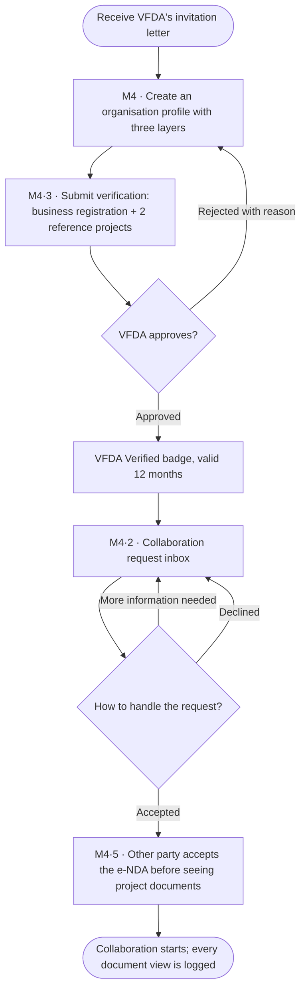
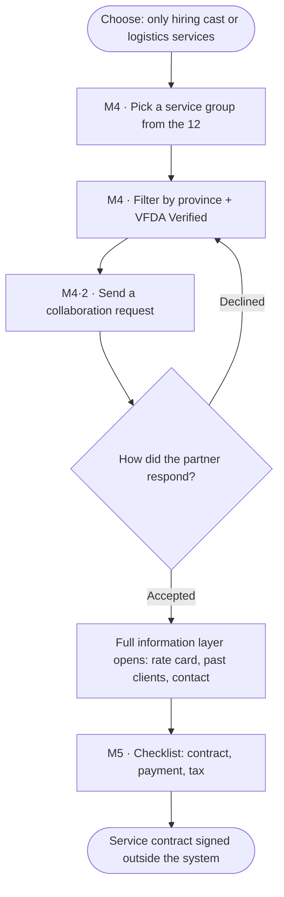
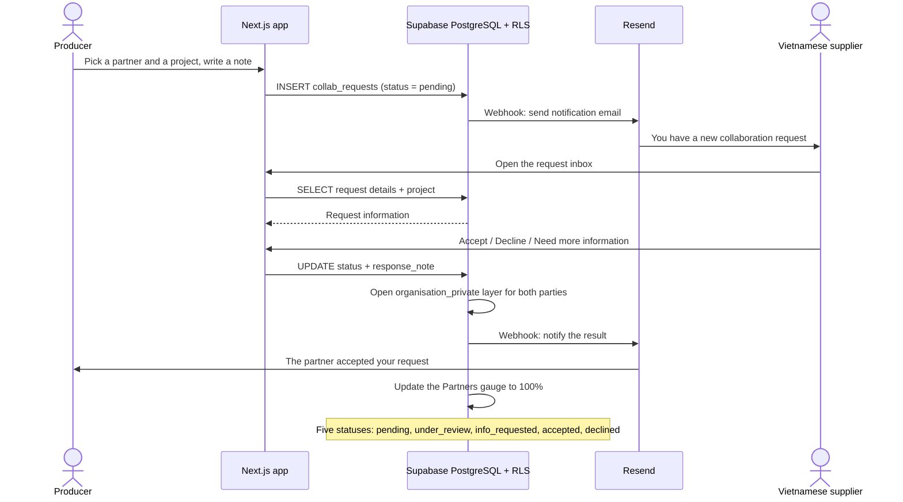
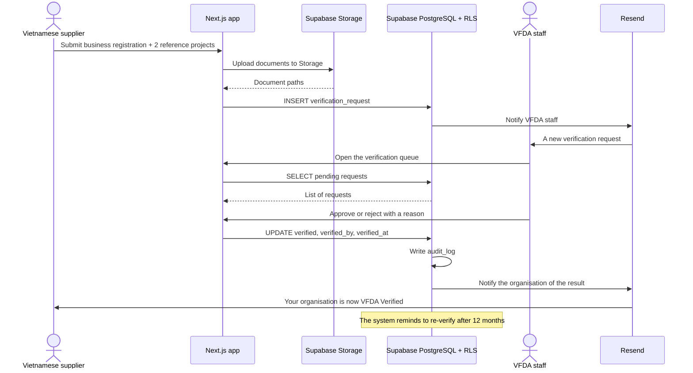

# Spec Document: Vietnamese service partners

> DBIZ3 Session 4 template — one file per module. Written for a reader who has never seen the DBIZ2 report.

| Field | Value |
|---|---|
| Module ID | M4 |
| Module name | Vietnamese service partners |
| Spec version | v0.1 |
| Author (team member) | Nam Tran — Group C |
| Date | 22/09/2026 |
| Status | Draft |
| Approved by (Client role) | *Not yet — VFDA project lead (and VFDA Legal Board for legal rules)* |
| DBIZ2 source | Function List rows 62–80 (F-M4-01 .. F-M4-19); Use Case UC-13 .. UC-17; Screens SC-19, SC-20, SC-21, SC-22, SC-23, SC-24, SC-25, SC-36 |

## 1. Purpose and scope

This module connects foreign producers with Vietnamese companies that can legally act as their service partner, which Article 13 requires for a filming licence. VFDA verifies each company; producers see more of a company's profile as trust builds, and every collaboration request is tracked to a confirmed partnership.

**In scope**

- Organisation profiles with three visibility layers (public, member, accepted).
- Directory by 12 service groups, filters by province, language and VFDA Verified.
- VFDA Verified: submission, review queue, decision, 12-month renewal reminder.
- Collaboration requests: send, respond, notify, confirm; partner gauge.
- Electronic NDA and document-access log.

**Out of scope**

- Contracts and payments between producer and partner — signed outside the system.
- Ratings and reviews (M8, phase 2).
- Open self-registration of suppliers — VFDA invites them.

**Depends on**

- SYS (roles, notifications, email, search)
- M0 (partner gauge)
- M2 (component c of the dossier check)
- M10 (audit log)

## 2. Actors

| Actor | Role in this module | Where it comes from |
|---|---|---|
| Member (producer) | Primary — browses, sends requests, confirms | Function List (F-M4-03, 04, 12, 19) |
| Partner (Vietnamese supplier) | Primary — manages its profile, applies for Verified, responds | Function List (F-M4-01, 08, 13, 14, 17) |
| VFDA staff | Primary — reviews verification requests | Function List (F-M4-09, 10) |
| Guest | Secondary — sees public layer only | Function List (F-M4-02, 05, 06) |
| System | Notifications, gauge, reminders, access log | Function List (F-M4-07, 11, 15, 16, 18) |

## 3. User scenarios and acceptance criteria

### US-1 (P1): Find a partner who can sign my service agreement

**Journey.** As a foreign producer, I want to find VFDA-verified companies in my shooting province that work in my language, so that I meet the Article 13 partner requirement quickly.

**Acceptance scenarios**

1. **Given** the directory, **When** the user picks *Full production services*, province *Ninh Bình*, language *Korean* and *VFDA Verified only*, **Then** only matching verified companies are listed with their Verified month.
2. **Given** a guest, **When** they view the list, **Then** they see name, service groups, provinces and the Verified badge only; project counts and languages require sign-in.

### US-2 (P1): Send a request and follow it to confirmation

**Journey.** As a producer, I want to send a request tied to my project and see exactly where it stands, so that I know when I have my Vietnamese partner.

**Acceptance scenarios**

1. **Given** a member with a project, **When** they send a request to Bến Xưa, **Then** the request is *Sent*, the partner is notified in-app and by email, and the tracker shows step 1 of 3.
2. **Given** the partner accepts, **When** the member opens the request, **Then** the tracker shows step 2 *Partner responded* and *Confirm partnership* is enabled once the NDA box is ticked.
3. **Given** the member confirms, **When** it is saved, **Then** the tracker shows *Confirmed*, both sides are notified, the Partners gauge reaches 100%, and component c of the Article 13 check becomes *Pending* until the signed agreement is uploaded.

### US-3 (P1): Get VFDA Verified

**Journey.** As a Vietnamese supplier, I want VFDA to verify my company, so that foreign producers trust me.

**Acceptance scenarios**

1. **Given** a partner uploads a business registration PDF and two reference projects, **When** VFDA staff approve, **Then** the badge shows with the verification date and expires after 12 months.
2. **Given** staff reject, **When** they save, **Then** a reason is mandatory and sent to the partner.

### US-4 (P2): Protect confidential material

**Journey.** As either party, I want confidential material opened only after an NDA and every view logged, so that I can share safely.

**Acceptance scenarios**

1. **Given** a confirmed-pending request, **When** the member accepts the NDA, **Then** the partner's rate card, past clients and direct contact become visible to that member (RLS).
2. **Given** a partner opens a project document, **When** it is displayed, **Then** an access-log entry records who, which document and when.

### Edge cases

- The partner never responds: [NEEDS CLARIFICATION: expiry after N days]; the member can withdraw and send elsewhere.
- Two requests from the same project to the same partner: refused — *You already have an open request with this partner*.
- Verified badge expires during an open request: the request continues; the badge disappears from listings until renewed.
- Email delivery fails: the in-app notification still appears; delivery is retried.

## 4. Flows

### 4.1 Usage flow — Vietnamese supplier

> Textualised from `docs/architecture/usage-flow.md` flow 3, translated. Diamonds Q1, Q2 added in Step 3 from F-M4-10 and F-M4-14 — awaiting Client confirmation.

### 4.1b Usage flow — segment C producer

> Textualised from `usage-flow.md` flow 2, translated.

### 4.2 Sequence — collaboration request and two-way response (SEQ-06)

> Textualised from SEQ-06 (Figure 9), translated. 5 participants, 13 messages. The SC-25 screen adds a producer *Confirm* step after acceptance — see §11.

### 4.3 Sequence — VFDA Verified (SEQ-07)

> Textualised from SEQ-07 (Figure 10). 6 participants, 14 messages.

## 5. Functional requirements

| FR ID | DBIZ2 Subfunction ID | Requirement (system MUST ...) | Actor | Priority |
|---|---|---|---|---|
| FR-001 | F-M4-01 | The system MUST let a partner create and edit its organisation profile (legal entity, service groups, provinces, capability, rate card, past clients). | Partner | Must |
| FR-002 | F-M4-02 | The system MUST show every visitor the public layer: name, service groups, provinces and Verified badge. | Guest | Must |
| FR-003 | F-M4-03 | The system MUST show signed-in members the member layer: capability, portfolio without project names, international project count and working languages. | Member | Must |
| FR-004 | F-M4-04 | The system MUST show the accepted layer (rate card, past clients, direct contact) only after the request is accepted and the NDA accepted (RLS). | Member | Must |
| FR-005 | F-M4-05 | The system MUST let users browse organisations by one of 12 fixed service groups. | Guest | Must |
| FR-006 | F-M4-06 | The system MUST filter by province, working language and VFDA Verified (default on). | Guest | Must |
| FR-007 | F-M4-07 | The system COULD rank organisations by semantic similarity to a free-text query in Vietnamese or English. | System | Could |
| FR-008 | F-M4-08 | The system MUST let a partner submit a verification request with a business registration PDF and at least two reference projects. | Partner | Must |
| FR-009 | F-M4-09 | The system MUST give VFDA staff a queue of verification requests filterable by status. | VFDA Staff | Must |
| FR-010 | F-M4-10 | The system MUST let VFDA staff approve or reject a request, with a mandatory reason when rejecting, and record who and when. | VFDA Staff | Must |
| FR-011 | F-M4-11 | The system MUST remind the partner before the 12-month validity ends and remove the badge when it expires. | System | Must |
| FR-012 | F-M4-12 | The system MUST let a member send a collaboration request tied to one of their projects, with a note. | Member | Must |
| FR-013 | F-M4-13 | The system MUST show both sides their incoming and outgoing requests with status. | Partner / Member | Must |
| FR-014 | F-M4-14 | The system MUST let the partner respond: under review, more information needed, accepted or declined; and MUST let the producer confirm an accepted request. | Partner / Member | Must |
| FR-015 | F-M4-15 | The system MUST notify both sides in-app and by email on every status change. | System | Must |
| FR-016 | F-M4-16 | The system MUST update the Partners gauge from the request status. | System | Must |
| FR-017 | F-M4-17 | The system MUST show the NDA and record each party's acceptance before confidential material is opened. | Partner / Member | Must |
| FR-018 | F-M4-18 | The system MUST log every view of a shared document: who, which document, when. | System | Must |
| FR-019 | F-M4-19 | The system COULD show a project owner the access log of their documents. | Member | Could |

### 5.1 Input / Output contract

Types and required flags come from `docs/function-list.md` (columns *Input — type and required* and *Output — type*). Changes made in Session 4 are stated in *Notes* and listed in 11.1.

| FR ID | Input field | Type | Required | Output field | Type | Notes / validation |
|---|---|---|---|---|---|---|
| FR-001 | `org_name` | `VARCHAR(200)` | Yes | `org_id` | `UUID` | service_groups from the 12-value enum; working_languages added (SC-19) |
|  | `service_groups` | `ARRAY<ENUM>` | Yes | `slug` | `VARCHAR(160)` |  |
|  | `provinces` | `ARRAY<INTEGER>` | Yes |  |  |  |
|  | `working_languages` | `ARRAY<CHAR(2)>` | No |  |  |  |
|  | `capability_desc_vi` | `TEXT` | No |  |  |  |
|  | `capability_desc_en` | `TEXT` | No |  |  |  |
|  | `rate_card` | `JSONB` | No |  |  |  |
|  | `past_clients` | `ARRAY<TEXT>` | No |  |  |  |
| FR-002 | `org_slug` | `VARCHAR(160)` | Yes | `public_profile` | `JSONB` | name, service groups, provinces, Verified badge |
| FR-003 | `org_id` | `UUID` | Yes | `member_profile` | `JSONB` | capability, portfolio, project count, languages |
|  | `session_role` | `ENUM` | Yes |  |  |  |
| FR-004 | `org_id` | `UUID` | Yes | `private_profile` | `JSONB` | rate card, past clients, direct contact |
|  | `request_status` | `ENUM` | Yes |  |  |  |
| FR-005 | `service_group` | `ENUM` | Yes | `orgs` | `ARRAY<org_card>` | 12 values |
| FR-006 | `provinces` | `ARRAY<INTEGER>` | No | `filtered` | `ARRAY<org_card>` | verified_only default true; working_language added |
|  | `working_language` | `CHAR(2)` | No |  |  |  |
|  | `verified_only` | `BOOLEAN` | No |  |  |  |
| FR-007 | `query` | `TEXT` | Yes | `ranked` | `ARRAY<(org_id UUID, similarity NUMERIC(4,3))>` |  |
| FR-008 | `org_id` | `UUID` | Yes | `verification_request_id` | `UUID` | PDF max 25 MB; ≥ 2 references |
|  | `business_license` | `FILE` | Yes |  |  |  |
|  | `reference_projects` | `ARRAY<TEXT>` | Yes |  |  |  |
| FR-009 | `status_filter` | `ENUM(pending, approved, rejected)` | No | `queue` | `ARRAY<verification_request>` | vfda_staff only |
| FR-010 | `request_id` | `UUID` | Yes | `verified` | `BOOLEAN` | reason required when rejected |
|  | `decision` | `ENUM(approved, rejected)` | Yes | `verified_at` | `TIMESTAMPTZ` |  |
|  | `reason` | `TEXT` | No |  |  |  |
| FR-011 | `verified_at` | `TIMESTAMPTZ` | Yes | `reminder_notification_id` | `UUID` | 30 days before expiry |
| FR-012 | `org_id` | `UUID` | Yes | `request_id` | `UUID` | status = pending; note max 1000 characters; services added (SC-25) |
|  | `project_id` | `UUID` | Yes | `status` | `ENUM` |  |
|  | `services` | `ARRAY<ENUM>` | Yes |  |  |  |
|  | `note` | `TEXT` | No |  |  |  |
| FR-013 | `user_id` | `UUID` | Yes | `requests` | `ARRAY<collab_request>` |  |
|  | `direction` | `ENUM(incoming, outgoing)` | No |  |  |  |
| FR-014 | `request_id` | `UUID` | Yes | `status` | `ENUM` | confirmed and withdrawn added for the producer (SC-25) |
|  | `decision` | `ENUM(under_review, info_requested, accepted, declined, confirmed, withdrawn)` | Yes | `responded_at` | `TIMESTAMPTZ` |  |
|  | `response_note` | `TEXT` | No |  |  |  |
| FR-015 | `request_id` | `UUID` | Yes | `notifications` | `ARRAY<notification>` | 2 records: one per party |
|  | `status` | `ENUM` | Yes |  |  |  |
| FR-016 | `status` | `ENUM` | Yes | `gauge_partner` | `NUMERIC(5,2)` | 100 only when confirmed — see §11 |
| FR-017 | `request_id` | `UUID` | Yes | `nda_acceptance_id` | `UUID` | party and nda_version added (mutual NDA) |
|  | `party` | `ENUM(producer, partner)` | Yes | `accepted_at` | `TIMESTAMPTZ` |  |
|  | `nda_version` | `VARCHAR(20)` | Yes |  |  |  |
|  | `accepted` | `BOOLEAN` | Yes |  |  |  |
| FR-018 | `document_id` | `UUID` | Yes | `access_log_id` | `UUID` | append-only |
|  | `viewer_id` | `UUID` | Yes | `viewed_at` | `TIMESTAMPTZ` |  |
| FR-019 | `project_id` | `UUID` | Yes | `access_log` | `ARRAY<(viewer_name TEXT, document_id UUID, viewed_at TIMESTAMPTZ)>` | owner only |

### 5.2 Business rules

| Rule ID | Rule | Why it exists |
|---|---|---|
| BR-001 | The three visibility layers are three tables with separate Row Level Security policies, not hidden columns. | Interface hiding leaks through the API. |
| BR-002 | The 12 service groups are a fixed enum; organisations cannot invent groups. | VFDA reports supply per province and group. |
| BR-003 | Supplier accounts are created only by VFDA invitation in the first phase. | Every listed supplier must be known to VFDA. |
| BR-004 | A VFDA Verified badge is valid for 12 months and states what was checked and what was not (quality and prices are not). | The badge is not a quality guarantee. |
| BR-005 | Only the producer can confirm a partnership; only the partner can accept or decline. Declined, withdrawn and confirmed are final. | Each side owns its own decision. |
| BR-006 | Confirming a partnership does not by itself mark Article 13 component c as present; the signed service agreement must be uploaded. | A confirmation in the app is not a signed contract. |
| BR-007 | Document access log entries are append-only. | The log is evidence in case of a dispute. |

## 6. Key entities

| Entity | Attributes (from Input/Output fields) | Relationships |
|---|---|---|
| Organisation | org_id, slug, org_name, legal_form, founded_year, hq_province, verified_at, verified_until, art13_eligible | has many OrganisationServices, OrganisationProvinces |
| OrganisationMemberLayer | capability_desc, portfolio, intl_project_count, working_languages | belongs to Organisation |
| OrganisationPrivateLayer | rate_card, past_clients, direct_contact | belongs to Organisation |
| VerificationRequest | request_id, org_id, business_license, reference_projects, status, decided_by, reason | belongs to Organisation |
| CollabRequest | request_id, project_id, org_id, services, note, status, sent_at, responded_at, confirmed_at | belongs to Project and Organisation; has many CollabMessages |
| CollabMessage | request_id, author_id, body, created_at | belongs to CollabRequest |
| NdaAcceptance | request_id, party, nda_version, accepted_at | belongs to CollabRequest |
| DocumentAccessLog | document_id, viewer_id, viewed_at | belongs to Document (M5) |

## 7. Screens involved

| Screen ID | Screen name | Priority | Screen Spec file |
|---|---|---|---|
| SC-19 | Partner directory (12 service groups) | Must | `docs/screens/screen-spec-SC-19.md` |
| SC-20 | Partner profile | Must | `docs/screens/screen-spec-SC-20.md` |
| SC-25 | Collaboration request + status tracking | Must | `docs/screens/screen-spec-SC-25.md` |
| SC-21 | My organisation profile | Must | *Not written yet — screen not in the 20-screen set* |
| SC-22 | Submit verification | Must | *Not written yet — screen not in the 20-screen set* |
| SC-23 | Send collaboration request | Must | *Not written yet — screen not in the 20-screen set* |
| SC-36 | Admin — verification queue | Must | *Not written yet — screen not in the 20-screen set* |

## 8. Success criteria

| SC ID | Criterion | How it is measured |
|---|---|---|
| SC-001 | A producer finds at least one verified partner in their shooting province in under 5 minutes. | Timed task with 5 producers. |
| SC-002 | Four in five requests get a partner response within 72 hours. | Response times over the first 50 requests. |
| SC-003 | A guest can never see a partner's prices or direct contact. | Private-window check on 10 profiles. |
| SC-004 | VFDA staff decide a verification request in under 15 minutes of review work. | Timed review of 5 requests. |

## 9. Assumptions

- At launch VFDA onboards at least 20 suppliers across the 12 groups.
- The NDA is one standard mutual text provided by VFDA.

## 10. Open questions

| # | Question | Blocking? | Owner | Status |
|---|---|---|---|---|
| 1 | [NEEDS CLARIFICATION: Official names of the 12 service groups (the mockup uses a proposed list).] | Yes | Client (VFDA) | Open |
| 2 | [NEEDS CLARIFICATION: Written criteria for awarding VFDA Verified.] | Yes | Client (VFDA) | Open |
| 3 | [NEEDS CLARIFICATION: Criteria for the *eligible to sign a service agreement under Article 13* flag.] | Yes | Client (VFDA) | Open |
| 4 | [NEEDS CLARIFICATION: Is the NDA mutual and standard (one VFDA text) or supplied by each partner?] | Yes | Client (VFDA) | Open |
| 5 | [NEEDS CLARIFICATION: After how many days does an unanswered request expire?] | No | Client (VFDA) | Open |
| 6 | [NEEDS CLARIFICATION: DBIZ2 F-M4-16 sets the Partners gauge to 100% on *accepted*; the screens do it on *confirmed*. Which one?] | Yes | Client (VFDA) | Open |
| 7 | [NEEDS CLARIFICATION: VFDA to confirm the official names of the 12 service groups (mockup uses a proposed list)] *(from SC-19)* | Yes | Client (VFDA) | Open |
| 8 | [NEEDS CLARIFICATION: written criteria for granting the VFDA Verified badge] *(from SC-19)* | Yes | Client (VFDA) | Open |
| 9 | [NEEDS CLARIFICATION: criteria for VFDA to grant the *Eligible to sign service agreements* badge — which registered business lines qualify] *(from SC-20)* | Yes | Client (VFDA) | Open |
| 10 | [NEEDS CLARIFICATION: will VFDA provide a standard NDA template, or does each partner use its own NDA] *(from SC-25)* | Yes | Client (VFDA) | Open |

## 11. Traceability to DBIZ2

| Spec section | DBIZ2 source | Location |
|---|---|---|
| 1. Purpose | System Design v2.0 — 1. Schematic, §1.2 (M4); Cinema Law 2022, Article 13 | `docs/architecture/context.md` |
| 4.1 Usage flow | FLOW-01 flows 2 and 3 (Figure 3) + Step 3 additions | `docs/architecture/usage-flow.md` §2, §3 |
| 4.2–4.3 Sequences | SEQ-06 (Fig. 9), SEQ-07 (Fig. 10) | `docs/architecture/sequence-diagrams.md` |
| 5. Functional requirements | Function List rows 62–80 | `docs/function-list.md` rows 62–80 |
| 7. Screens | Screen List SC-19..SC-25, SC-36 | `docs/screen-list.md` §1 |

### 11.1 Reconciliation with DBIZ2 (System Design v2.0)

Where the 20-screen design or this spec differs from the DBIZ2 Function List, the difference is written here instead of being silently changed.

| Topic | DBIZ2 / System Design v2.0 | This spec | Status |
|---|---|---|---|
| Request lifecycle | Five statuses ending at accepted / declined | Producer confirms after acceptance (*Sent → Partner responded → Confirmed*, screen list note #14) | Changed — Client to confirm |
| Partners gauge | 100% on accepted (F-M4-16) | 100% on confirmed | Open question 6 |
| NDA direction | Partner accepts before viewing project documents | Both parties accept; the producer's acceptance opens the partner's private layer | Changed — Client to confirm |
| F-M4-07, F-M4-19 priority | Must | Could | Changed — Client to confirm |

## Completion checklist

- [x] Every subfunction of this module in the DBIZ2 Function List appears as an FR row (19 of 19, rows 62–80) — machine-checked.
- [x] Every Input and Output field has a type and a required flag — machine-checked.
- [x] Every Mermaid block renders without an error — rendered with mermaid-cli 11.14 on 22/09/2026.
- [ ] Every node and arrow in the Mermaid flow exists in the original DBIZ2 diagram, and nothing was invented. **Not met:** some decision diamonds were added in Step 3 from the Function List; each is labelled above and listed in section 10 for Client confirmation.
- [x] At least one business rule is written that is not visible in any diagram (see 5.2).
- [ ] Every screen this module touches is listed with an existing Screen Spec file. **Not met:** no Screen Spec yet for SC-21, SC-22, SC-23, SC-36.
- [x] Success criteria contain no technology words — machine-checked against a word list.
- [ ] Open questions carry the unresolved items from the Session 3 Clarify meeting. **Not met:** there is no Session 3 Clarify Prep Sheet in this repository; the questions come from Session 4 Steps 2–4 and must be taken to the Clarify meeting with VFDA.
- [x] The traceability table points to real files and figures, not "see the report".

---
*Template source: adapted from GitHub Spec Kit `templates/spec-template.md`, mapped onto the DBIZ2 Product Design Package. DBIZ3, VJCBI College — FTU. Group C · CINEMATCH.*
