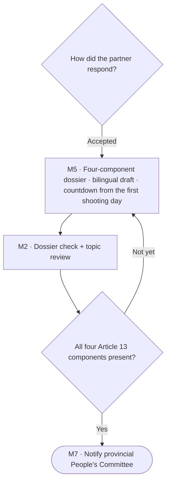
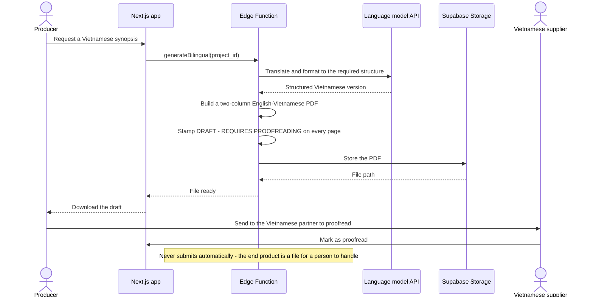

# Spec Document: Dossier kit, bilingual drafts and countdown

> DBIZ3 Session 4 template — one file per module. Written for a reader who has never seen the DBIZ2 report.

| Field | Value |
|---|---|
| Module ID | M5 |
| Module name | Dossier kit, bilingual drafts and countdown |
| Spec version | v0.1 |
| Author (team member) | Nam Tran — Group C |
| Date | 22/09/2026 |
| Status | Draft |
| Approved by (Client role) | *Not yet — VFDA project lead (and VFDA Legal Board for legal rules)* |
| DBIZ2 source | Function List rows 81–88 (F-M5-01 .. F-M5-08); Use Case UC-18, UC-20, UC-21; Screens SC-26, SC-28, SC-29 |

## 1. Purpose and scope

This module gives each project the list of documents its segment needs, stores them, helps turn the English script summary into a Vietnamese draft that a person proofreads, and counts back from the first shooting day to the latest safe date to file. Nothing it produces is presented as final: every generated document is a draft for a human.

**In scope**

- Document list per segment with the basis for each item (required by law / commonly requested / location-specific).
- Uploading and replacing documents; status per document.
- Vietnamese draft of the synopsis and Vietnam-scene script, paragraph-level proofreading, two-column PDF.
- First shooting day entry and the reverse timeline with two scenarios.

**Out of scope**

- Submitting the dossier to the Ministry (phase 3).
- Certified translation.
- Visa, equipment import, drone paperwork (M6, phase 2).

**Depends on**

- M1 (segment)
- M2 (completeness check, deadline calculation F-M2-17)
- M4 (partner who proofreads, service agreement)
- M0 (dossier gauge)
- External: language model API, Supabase Storage

## 2. Actors

| Actor | Role in this module | Where it comes from |
|---|---|---|
| Member | Primary — uploads, edits the Vietnamese draft, sets the shooting day | Function List (F-M5-01..03, 07, 08) |
| Partner (confirmed Vietnamese partner) | Secondary — confirms proofreading | Function List (F-M5-06) |
| System | Generates the draft and the PDF | Function List (F-M5-04, 05) |

## 3. User scenarios and acceptance criteria

### US-1 (P1): Know exactly which documents my segment needs

**Journey.** As a producer, I want a document list for my segment that says why each item is needed, so that I do not waste time on paperwork nobody asks for.

**Acceptance scenarios**

1. **Given** a segment A project, **When** the document kit opens, **Then** it lists the four Article 13 components marked *Required by law* and other items marked *Commonly requested* or *Location-specific*.
2. **Given** a location in a heritage area is shortlisted, **When** the kit refreshes, **Then** a *Location-specific* item for that permit appears.

### US-2 (P1): Get a Vietnamese draft I can proofread

**Journey.** As a foreign producer, I want a Vietnamese draft of my synopsis aligned paragraph by paragraph, so that my Vietnamese partner only has to proofread, not translate from scratch.

**Acceptance scenarios**

1. **Given** an English synopsis of 14 paragraphs, **When** the user clicks *Create Vietnamese draft*, **Then** 14 Vietnamese paragraphs appear, each marked *Machine translation · not proofread*.
2. **Given** a paragraph marked proofread, **When** anyone edits it, **Then** it returns to *not proofread*.
3. **Given** 14 of 14 paragraphs proofread, **When** the page updates, **Then** Article 13 component b can become *Present*.

### US-3 (P1): See my latest safe filing date

**Journey.** As a producer, I want the safe submission deadline counted back from my first shooting day, so that one resubmission cannot push my shoot.

**Acceptance scenarios**

1. **Given** first shooting day 15/03/2027 and a 7-day buffer, **When** the countdown loads, **Then** it shows the safe deadline 27/01/2027 and warns that filing on 16/02/2027 with one resubmission gives a result on 28/03/2027, after the first shooting day.
2. **Given** a public holiday period inside the processing window, **When** the countdown loads, **Then** it is shown as a band marked *expected* until official dates are published.

### Edge cases

- A file larger than 25 MB or of another type: refused at the upload area with the limit stated.
- A document is replaced: the old version is kept in history; the check reruns.
- The first shooting day is so close that the safe deadline has passed: the countdown says by how many days, in red, and offers *Book a VFDA consultation*.
- The translation call fails for one paragraph: only that paragraph shows *Could not translate — retry*.

## 4. Flows

### 4.1 Usage flow — dossier loop (excerpt of the producer journey)

> Excerpt of `docs/architecture/usage-flow.md` flow 1, translated. Diamonds Q3, Q4 added in Step 3 — awaiting Client confirmation.

### 4.2 Sequence — bilingual dossier draft (SEQ-10)

> Textualised from SEQ-10 (Figure 13), translated. 6 participants, 12 messages. SC-28 adds paragraph-level proofreading in the editor before the PDF — see §11.

## 5. Functional requirements

| FR ID | DBIZ2 Subfunction ID | Requirement (system MUST ...) | Actor | Priority |
|---|---|---|---|---|
| FR-001 | F-M5-01 | The system MUST list the documents required for the project's segment, each with name, basis and template, read from configuration tables. | Member | Must |
| FR-002 | F-M5-02 | The system MUST let project members upload and replace documents (PDF or DOCX, max 25 MB) in private storage. | Member | Must |
| FR-003 | F-M5-03 | The system MUST show a status for every document: present, needs fixing, pending or missing. | Member | Must |
| FR-004 | F-M5-04 | The system MUST generate a Vietnamese draft of the synopsis and Vietnam-scene script, aligned paragraph by paragraph with the source. | System | Must |
| FR-005 | F-M5-05 | The system MUST export a two-column English–Vietnamese PDF with *DRAFT — REQUIRES PROOFREADING* on every page. | System | Must |
| FR-006 | F-M5-06 | The system MUST record who proofread each paragraph and when, and let the confirmed Vietnamese partner confirm the document as proofread. | Partner / Member | Must |
| FR-007 | F-M5-07 | The system MUST store the project's first shooting day and safety buffer. | Member | Must |
| FR-008 | F-M5-08 | The system MUST show the reverse timeline with both scenarios and flag milestones that are late. | Member | Must |

### 5.1 Input / Output contract

Types and required flags come from `docs/function-list.md` (columns *Input — type and required* and *Output — type*). Changes made in Session 4 are stated in *Notes* and listed in 11.1.

| FR ID | Input field | Type | Required | Output field | Type | Notes / validation |
|---|---|---|---|---|---|---|
| FR-001 | `segment` | `ENUM(A, B, C)` | Yes | `required_documents` | `ARRAY<(doc_code VARCHAR(40), name_vi TEXT, name_en TEXT, basis ENUM(law, common, location), template_url TEXT)>` | basis added (SC-26) |
|  | `project_id` | `UUID` | Yes |  |  |  |
| FR-002 | `project_id` | `UUID` | Yes | `document_id` | `UUID` | PDF / DOCX, max 25 MB; previous versions kept |
|  | `doc_code` | `VARCHAR(40)` | Yes |  |  |  |
|  | `file` | `BYTEA` | Yes |  |  |  |
| FR-003 | `project_id` | `UUID` | Yes | `doc_status` | `ARRAY<(doc_code VARCHAR(40), state ENUM(present, needs_fix, pending, missing))>` | states changed from DBIZ2 — see §11 |
| FR-004 | `synopsis_en` | `TEXT` | Yes | `paragraphs` | `ARRAY<(idx INTEGER, source_text TEXT, target_text TEXT, status ENUM(machine, reviewed))>` | paragraph alignment added (SC-28) |
|  | `project_meta` | `JSONB` | Yes | `structure_version` | `VARCHAR(20)` |  |
| FR-005 | `synopsis_en` | `TEXT` | Yes | `pdf_url` | `TEXT` | watermark always true |
|  | `synopsis_vi` | `TEXT` | Yes | `watermark` | `BOOLEAN` |  |
| FR-006 | `document_id` | `UUID` | Yes | `proofread_at` | `TIMESTAMPTZ` | paragraph-level added; editing clears it |
|  | `paragraph_idx` | `INTEGER` | No |  |  |  |
|  | `reviewer_id` | `UUID` | Yes |  |  |  |
|  | `reviewer_org_id` | `UUID` | No |  |  |  |
| FR-007 | `shoot_date` | `DATE` | Yes | `shoot_date` | `DATE` | after today; buffer 0 / 7 / 14 / 21 |
|  | `buffer_days` | `INTEGER` | Yes |  |  |  |
| FR-008 | `milestones` | `JSONB` | Yes | `timeline_view` | `JSONB` | smooth path + one-resubmission path; holiday bands |

### 5.2 Business rules

| Rule ID | Rule | Why it exists |
|---|---|---|
| BR-001 | Every generated document is a draft: the PDF carries *DRAFT — REQUIRES PROOFREADING* on every page; CINEMATCH never submits anything. | Only a person can take responsibility for a filing. |
| BR-002 | Article 13 component b counts as present only when every paragraph of the Vietnamese version has been proofread by a person. | Machine translation is not a Vietnamese script. |
| BR-003 | Each document item carries its basis: *Required by law*, *Commonly requested* or *Location-specific*; nothing is presented as mandatory without a legal basis. | Honesty about what is actually required. |
| BR-004 | The document list is generated from `segment_requirements` plus shortlisted locations; it is never hard-coded. | VFDA must be able to change it. |
| BR-005 | The countdown uses the same calculation as M2 (F-M2-17) and the dashboard. | One number everywhere. |

## 6. Key entities

| Entity | Attributes (from Input/Output fields) | Relationships |
|---|---|---|
| DocumentType | doc_code, name_vi, name_en, basis, template_url, segments | has many DocumentSlots |
| DocumentSlot | project_id, doc_code, state | belongs to Project; has many Documents |
| Document | document_id, file_path, version, uploaded_by, uploaded_at | belongs to DocumentSlot |
| BilingualDocument | project_id, doc_code, structure_version | has many BilingualParagraphs |
| BilingualParagraph | idx, source_text, target_text, status, reviewed_by, reviewed_at | belongs to BilingualDocument |
| ProjectGlossary | project_id, source_term, target_term | belongs to Project |
| PublicHoliday | name, start_date, end_date, is_expected | used by the timeline |

## 7. Screens involved

| Screen ID | Screen name | Priority | Screen Spec file |
|---|---|---|---|
| SC-26 | Document kit by segment | Must | `docs/screens/screen-spec-SC-26.md` |
| SC-28 | Bilingual draft editor (Vietnamese–English) | Must | `docs/screens/screen-spec-SC-28.md` |
| SC-29 | 20-day countdown | Must | `docs/screens/screen-spec-SC-29.md` |

## 8. Success criteria

| SC ID | Criterion | How it is measured |
|---|---|---|
| SC-001 | A producer sees the full list of documents for their segment, with the reason for each, on the first visit. | Walkthrough with 5 producers: ask *why do you need item X?* |
| SC-002 | A Vietnamese partner proofreads a 14-paragraph draft in under 45 minutes. | Timed session with 2 partners. |
| SC-003 | Every producer in testing can state their safe submission deadline after opening the countdown. | Task check with 5 producers. |

## 9. Assumptions

- The Vietnamese partner (or a Vietnamese-speaking team member) does the proofreading.
- Public holidays are loaded manually by VFDA each year.

## 10. Open questions

| # | Question | Blocking? | Owner | Status |
|---|---|---|---|---|
| 1 | [NEEDS CLARIFICATION: Document list for segment C.] | Yes | Client (VFDA Legal Board) | Open |
| 2 | [NEEDS CLARIFICATION: Who may mark a paragraph proofread: any project member, or only the confirmed Vietnamese partner?] | No | Client (VFDA) | Open |
| 3 | [NEEDS CLARIFICATION: Which translation service may process scripts, which are confidential?] | Yes | Group C + Client | Open |
| 4 | [NEEDS CLARIFICATION: Are *foreign crew list* and *provincial notice* required anywhere, or only common practice?] | No | Client (VFDA Legal Board) | Open |
| 5 | [NEEDS CLARIFICATION: Official Lunar New Year 2027 holiday dates.] | No | Client (VFDA) | Open |
| 6 | [NEEDS CLARIFICATION: document checklist for segment C — needs confirmation from the VFDA Legal Board] *(from SC-26)* | Yes | Client (VFDA) | Open |
| 7 | [NEEDS CLARIFICATION: which machine translation service to use — the script is the production's confidential document] *(from SC-28)* | Yes | Client (VFDA) | Open |
| 8 | [NEEDS CLARIFICATION: are the "20 days" calendar days or working days — if working days, the safe deadline moves about 3 weeks earlier] *(from SC-29)* | Yes | Client (VFDA) | Open |

## 11. Traceability to DBIZ2

| Spec section | DBIZ2 source | Location |
|---|---|---|
| 1. Purpose | System Design v2.0 — 1. Schematic, §1.2 (M5) | `docs/architecture/context.md` |
| 4.1 Usage flow | FLOW-01 flow 1 (Figure 3) + Step 3 additions | `docs/architecture/usage-flow.md` §1 |
| 4.2 Sequence | SEQ-10 (Figure 13) | `docs/architecture/sequence-diagrams.md` — SEQ-10 |
| 5. Functional requirements | Function List rows 81–88 | `docs/function-list.md` rows 81–88 |
| 5.2 BR-002 | Cinema Law 2022, Article 13 clause 3 (script in Vietnamese) | legal source |
| 7. Screens | Screen List SC-26, SC-28, SC-29 | `docs/screen-list.md` §1 |

### 11.1 Reconciliation with DBIZ2 (System Design v2.0)

Where the 20-screen design or this spec differs from the DBIZ2 Function List, the difference is written here instead of being silently changed.

| Topic | DBIZ2 / System Design v2.0 | This spec | Status |
|---|---|---|---|
| Document states | missing / uploaded / replaced | present / needs_fix / pending / missing (shared with SC-27) | Changed — Client to confirm |
| Proofreading | Partner marks the whole document proofread | Paragraph-level proofreading in the editor + partner confirmation | Added — Client to confirm |

## Completion checklist

- [x] Every subfunction of this module in the DBIZ2 Function List appears as an FR row (8 of 8, rows 81–88) — machine-checked.
- [x] Every Input and Output field has a type and a required flag — machine-checked.
- [x] Every Mermaid block renders without an error — rendered with mermaid-cli 11.14 on 22/09/2026.
- [ ] Every node and arrow in the Mermaid flow exists in the original DBIZ2 diagram, and nothing was invented. **Not met:** some decision diamonds were added in Step 3 from the Function List; each is labelled above and listed in section 10 for Client confirmation.
- [x] At least one business rule is written that is not visible in any diagram (see 5.2).
- [x] Every screen this module touches is listed with an existing Screen Spec file. 
- [x] Success criteria contain no technology words — machine-checked against a word list.
- [ ] Open questions carry the unresolved items from the Session 3 Clarify meeting. **Not met:** there is no Session 3 Clarify Prep Sheet in this repository; the questions come from Session 4 Steps 2–4 and must be taken to the Clarify meeting with VFDA.
- [x] The traceability table points to real files and figures, not "see the report".

---
*Template source: adapted from GitHub Spec Kit `templates/spec-template.md`, mapped onto the DBIZ2 Product Design Package. DBIZ3, VJCBI College — FTU. Group C · CINEMATCH.*
