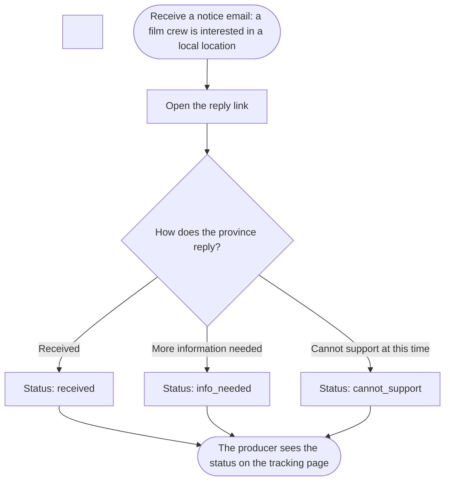

# Spec Document: VFDA support — provincial notices and consultations

&nbsp;

| Field | Value |
| :---- | :---- |
| Module ID | M7 |
| Module name | VFDA support — provincial notices and consultations |
| Spec version | v0.1 |
| Author (team member) | Nam Tran — Group C |
| Date | 22/09/2026 |
| Status | Draft |
| Approved by (Client role) | *Not yet — VFDA project lead (and VFDA Legal Board for legal rules)* |
| DBIZ2 source | Function List rows 89–95 (F-M7-01 .. F-M7-07); Use Case UC-22, UC-23; Screens SC-32, SC-33 |

1\. Purpose and scope

This module lets a producer tell the provinces where they plan to shoot, through VFDA, and see each province's reply; it also lets them book a consultation with VFDA staff. It turns VFDA's relationships with local governments into something a foreign producer can use.

**In scope**

- Registering interest in a location, generating the provincial notice, recording the province's reply, tracking status.  
- Booking, confirming and reminding VFDA consultations.

**Out of scope**

- The filming licence itself (issued by the Ministry of Culture, Sports and Tourism).  
- Negotiating with a province on the producer's behalf beyond the notice.

**Depends on**

- M3 (location, authority contact)  
- M0 (project data)  
- M4 (confirmed partner shown in the notice)  
- SYS (email, notifications)

## 2\. Actors

| Actor | Role in this module | Where it comes from |
| :---- | :---- | :---- |
| Member | Primary — registers interest, follows replies, books consultations | Function List (F-M7-01, 04, 05\) |
| Provincial People's Committee / Department of Culture | Secondary — replies to the notice | Function List (F-M7-03) |
| VFDA staff | Secondary — reviews and sends notices, confirms consultations | Function List (F-M7-06) |
| System | Generates notices and reminders | Function List (F-M7-02, 07\) |

## 3\. User scenarios and acceptance criteria

### US-1 (P2): Let the province know we are coming

**Journey.** As a producer, I want the province to be told about my shoot through VFDA, so that local officials are prepared and I am not a surprise.

**Acceptance scenarios**

1. **Given** a member clicks *I'm interested* on Tràng An for project The Last Ferry, **When** it is saved, **Then** a notice for Ninh Bình is drafted from the project data and appears on the Provinces page at step 1\.  
2. **Given** a notice missing the first shooting day, **When** the member tries to send it, **Then** sending is disabled with *A first shooting day is needed before notifying*.

### US-2 (P2): See the province's reply

**Journey.** As a producer, I want to see each province's reply and what to do next, so that I can plan meetings with the right local office.

**Acceptance scenarios**

1. **Given** the province replies *More info needed* with a note, **When** VFDA records it, **Then** the producer gets a notification and the card shows the status, the date and the note.

### US-3 (P3): Book time with VFDA

**Journey.** As a producer abroad, I want to book a call with VFDA in my own time zone, so that a real person can answer what the tools cannot.

**Acceptance scenarios**

1. **Given** a producer in Seoul picks a slot, **When** VFDA confirms, **Then** both receive the time in their own time zone and a reminder 24 hours before.

### Edge cases

- The authority email bounces: the notice is marked *Not delivered* and VFDA staff are alerted to find another channel.  
- The province never replies: after \[NEEDS CLARIFICATION: N\] working days VFDA staff are reminded to follow up.  
- The producer removes the location from the shortlist after the notice was sent: the notice stays; VFDA may send a withdrawal.

## 4\. Flows

### 4.1 Usage flow — Provincial People's Committee / Department of Culture

> Textualised from `docs/architecture/usage-flow.md` flow 6, translated. Diamond Q added in Step 3 from F-M7-03 — awaiting Client confirmation.



### 4.2 Sequence — provincial notice (SEQ-11)

> Textualised from SEQ-11 (Figure 14), translated. 5 participants, 11 messages. SC-32 inserts a VFDA review before the email is sent — see §11.

```mermaid
sequenceDiagram
&nbsp;&nbsp;&nbsp;&nbsp;actor U as Producer
&nbsp;&nbsp;&nbsp;&nbsp;participant FE as Next.js app
&nbsp;&nbsp;&nbsp;&nbsp;participant DB as Supabase PostgreSQL + RLS
&nbsp;&nbsp;&nbsp;&nbsp;participant MAIL as Resend
&nbsp;&nbsp;&nbsp;&nbsp;actor PV as Provincial People's Committee

&nbsp;

&nbsp;&nbsp;&nbsp;&nbsp;U->>FE: Click I'm interested in this location
&nbsp;&nbsp;&nbsp;&nbsp;FE->>DB: INSERT location_interest (project_id, location_id)
&nbsp;&nbsp;&nbsp;&nbsp;DB->>DB: Database webhook fires
&nbsp;&nbsp;&nbsp;&nbsp;DB->>MAIL: Compose the letter with the project summary
&nbsp;&nbsp;&nbsp;&nbsp;MAIL->>PV: A film crew is interested in a location in your province
&nbsp;&nbsp;&nbsp;&nbsp;PV->>FE: Open the reply link
&nbsp;&nbsp;&nbsp;&nbsp;PV->>FE: Received / More information needed / Cannot support
&nbsp;&nbsp;&nbsp;&nbsp;FE->>DB: UPDATE reply status
&nbsp;&nbsp;&nbsp;&nbsp;DB->>MAIL: Notify the producer
&nbsp;&nbsp;&nbsp;&nbsp;MAIL->>U: The province has replied
&nbsp;&nbsp;&nbsp;&nbsp;U->>FE: View the provincial coordination page
&nbsp;&nbsp;&nbsp;&nbsp;Note over DB: This came from the BA Report executive summary and was missed in MVP v1
```

## 5\. Functional requirements

| FR ID | DBIZ2 Subfunction ID | Requirement (system MUST ...) | Actor | Priority |
| :---- | :---- | :---- | :---- | :---- |
| FR-001 | F-M7-01 | The system MUST record a member's interest in a location for a project. | Member | Should |
| FR-002 | F-M7-02 | The system MUST generate the provincial notice from project data and queue it for VFDA staff to review and send from VFDA's domain. | System / VFDA Staff | Should |
| FR-003 | F-M7-03 | The system MUST record the province's reply as received, info\_needed or cannot\_support, with an optional note and time. | Province / VFDA Staff | Should |
| FR-004 | F-M7-04 | The system MUST show the producer, per province, the four-step progress and the reply. | Member | Should |
| FR-005 | F-M7-05 | The system SHOULD let a member book a VFDA consultation by topic and slot, handling time zones. | Member | Should |
| FR-006 | F-M7-06 | The system SHOULD let VFDA staff confirm or reschedule and assign an officer. | VFDA Staff | Should |
| FR-007 | F-M7-07 | The system SHOULD remind both sides before the consultation. | System | Should |

### 5.1 Input / Output contract

Types and required flags come from `docs/function-list.md` (columns *Input — type and required* and *Output — type*). Changes made in Session 4 are stated in *Notes* and listed in 11.1.

| FR ID | Input field | Type | Required | Output field | Type | Notes / validation |
| :---- | :---- | :---- | :---- | :---- | :---- | :---- |
| FR-001 | `project_id` | `UUID` | Yes | `interest_id` | `UUID` |  |
|  | `location_id` | `UUID` | Yes |  |  |  |
| FR-002 | `interest_id` | `UUID` | Yes | `notification_id` | `UUID` | reviewed\_by added (VFDA review step, SC-32); needs first shooting day |
|  | `project_summary` | `TEXT` | Yes | `delivery_status` | `ENUM(queued, sent, bounced)` |  |
|  | `authority_email` | `VARCHAR(254)` | Yes |  |  |  |
|  | `reviewed_by` | `UUID` | Yes |  |  |  |
| FR-003 | `interest_id` | `UUID` | Yes | `response_status` | `ENUM` |  |
|  | `response` | `ENUM(received, info_needed, cannot_support)` | Yes | `responded_at` | `TIMESTAMPTZ` |  |
|  | `note` | `TEXT` | No |  |  |  |
| FR-004 | `project_id` | `UUID` | Yes | `interests` | `ARRAY<(location_id UUID, response_status ENUM, responded_at TIMESTAMPTZ)>` | one card per province |
| FR-005 | `topic` | `ENUM` | Yes | `booking_id` | `UUID` | IANA time zone |
|  | `slot_start` | `TIMESTAMPTZ` | Yes |  |  |  |
|  | `timezone` | `VARCHAR(40)` | Yes |  |  |  |
| FR-006 | `booking_id` | `UUID` | Yes | `booking_status` | `ENUM(confirmed, rescheduled)` |  |
|  | `officer_id` | `UUID` | Yes |  |  |  |
| FR-007 | `booking_id` | `UUID` | Yes | `reminders` | `ARRAY<notification>` | 2 records, 24 h before |

### 5.2 Business rules

| Rule ID | Rule | Why it exists |
| :---- | :---- | :---- |
| BR-001 | Notices are sent in VFDA's name, never directly by the producer. | VFDA is the relationship holder with local government. |
| BR-002 | Every notice states that it does not replace the filming licence from the Ministry of Culture, Sports and Tourism. | Avoids a province or producer mistaking it for permission. |
| BR-003 | The province's reply is one of three final values; the free-text note is kept as entered. | Consistent tracking and reporting. |
| BR-004 | Reply times feed the provincial readiness index (M3). | Makes responsiveness visible and comparable. |

## 6\. Key entities

| Entity | Attributes (from Input/Output fields) | Relationships |
| :---- | :---- | :---- |
| LocationInterest | interest\_id, project\_id, location\_id, created\_at | belongs to Project and Location |
| ProvinceNotice | interest\_id, province\_id, drafted\_at, reviewed\_by, sent\_at, received\_at, response, note, responded\_at, delivery\_status | belongs to LocationInterest |
| ConsultationBooking | booking\_id, member\_id, topic, slot\_start, timezone, officer\_id, booking\_status | belongs to UserAccount |

## 7\. Screens involved

| Screen ID | Screen name | Priority | Screen Spec file |
| :---- | :---- | :---- | :---- |
| SC-32 | Provincial People's Committee notice | Should | `screens/screen-spec-SC-32.md` |
| SC-33 | Book a VFDA consultation | Should | *Not written yet — screen not in the 20-screen set* |

## 8\. Success criteria

| SC ID | Criterion | How it is measured |
| :---- | :---- | :---- |
| SC-001 | A producer knows the reply status of every province on their shortlist without contacting anyone. | Walkthrough with 5 producers. |
| SC-002 | Provinces reply to four in five notices within 7 working days. | Reply times over the first 30 notices. |
| SC-003 | A producer abroad books a consultation in their own time zone in under 2 minutes. | Timed test with 3 producers in different time zones. |

## 9\. Assumptions

- VFDA staff have capacity to review notices within 2 working days.  
- One notice per province per project, even when several locations are in the same province.

## 10\. Open questions

| \# | Question | Blocking? | Owner | Status |
| :---- | :---- | :---- | :---- | :---- |
| 1 | \[NEEDS CLARIFICATION: Does VFDA have the mandate / practice to send notices to Provincial People's Committees, and what is the official template?\] | Yes | Client (VFDA) | Open |
| 2 | \[NEEDS CLARIFICATION: Is the notice addressed to the People's Committee or to the provincial Department of Culture?\] | Yes | Client (VFDA) | Open |
| 3 | \[NEEDS CLARIFICATION: Automatic sending (DBIZ2 SEQ-11) or VFDA staff review before sending (SC-32)?\] | Yes | Client (VFDA) | Open |
| 4 | \[NEEDS CLARIFICATION: After how many working days without reply should VFDA follow up?\] | No | Client (VFDA) | Open |
| 5 | \[NEEDS CLARIFICATION: does VFDA have the authority / established practice to send notices to Provincial People's Committees, and what is the official letter template\] *(from SC-32)* | Yes | Client (VFDA) | Open |
| 6 | \[NEEDS CLARIFICATION: should the notice go to the Provincial People's Committee or the provincial Department of Culture\] *(from SC-32)* | Yes | Client (VFDA) | Open |

## 11\. Traceability to DBIZ2

| Spec section | DBIZ2 source | Location |
| :---- | :---- | :---- |
| 1\. Purpose | System Design v2.0 — 1\. Schematic, §1.2 (M7); BA Report executive summary | `docs/architecture/context.md` |
| 4.1 Usage flow | FLOW-01 flow 6 (Figure 3\) \+ Step 3 addition | `docs/architecture/usage-flow.md` §6 |
| 4.2 Sequence | SEQ-11 (Figure 14\) | `docs/architecture/sequence-diagrams.md` — SEQ-11 |
| 5\. Functional requirements | Function List rows 89–95 | `docs/function-list.md` rows 89–95 |
| 7\. Screens | Screen List SC-32, SC-33 | `docs/screen-list.md` §1 |

### 11.1 Reconciliation with DBIZ2 (System Design v2.0)

Where the 20-screen design or this spec differs from the DBIZ2 Function List, the difference is written here instead of being silently changed.

| Topic | DBIZ2 / System Design v2.0 | This spec | Status |
| :---- | :---- | :---- | :---- |
| Notice dispatch | Sent automatically by a database webhook (SEQ-11) | Drafted automatically, reviewed and sent by VFDA staff (SC-32) | Open question 3 |
| Module priority | Must | Should — Tier 2 of the screen list file (\#20) | Changed — Client to confirm |

&nbsp;