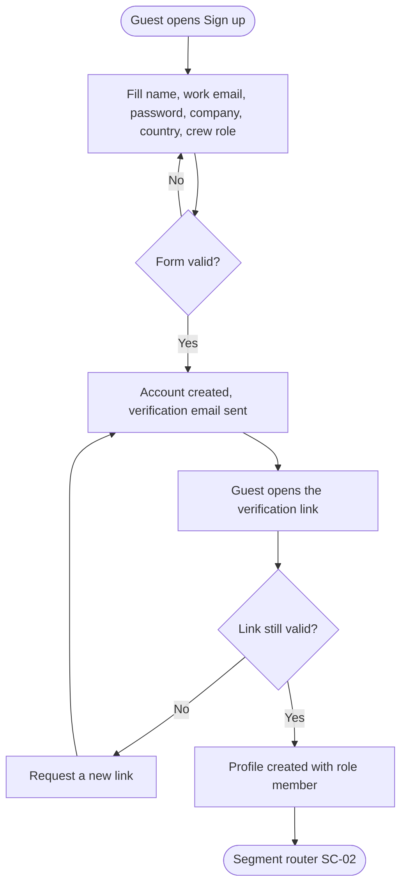
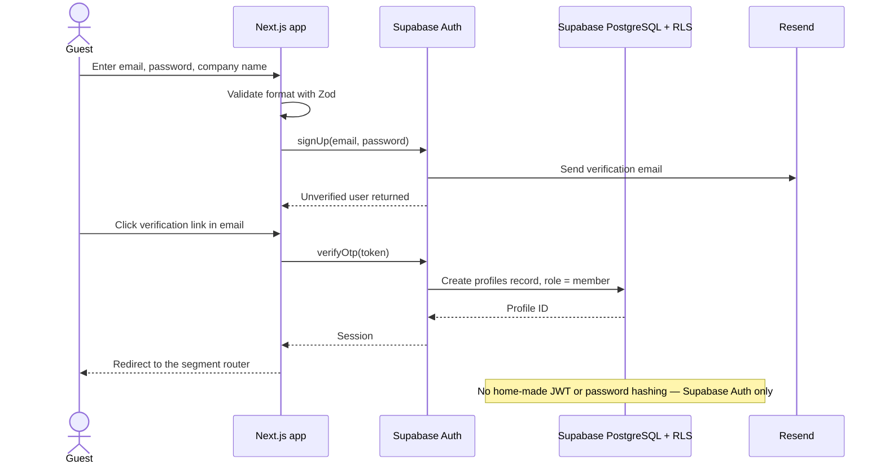

# Spec Document: Platform foundation — accounts, roles, bilingual UI, notifications, search

> DBIZ3 Session 4 template — one file per module. Written for a reader who has never seen the DBIZ2 report.

| Field | Value |
|---|---|
| Module ID | SYS |
| Module name | Platform foundation — accounts, roles, bilingual UI, notifications, search |
| Spec version | v0.1 |
| Author (team member) | Nam Tran — Group C |
| Date | 22/09/2026 |
| Status | Draft |
| Approved by (Client role) | *Not yet — VFDA project lead (and VFDA Legal Board for legal rules)* |
| DBIZ2 source | Function List rows 1–11 (F-SYS-01 .. F-SYS-11); Use Case: none of its own (used by every UC); Screens SC-04, SC-05, SC-06, SC-07, SC-08, SC-09, SC-42, SC-43 |

## 1. Purpose and scope

This module lets people create an account, sign in, and see only what their role allows, in Vietnamese or English. It also delivers in-app and email notifications and provides the search indexes the other modules rely on.

**In scope**

- Sign-up, sign-in, password reset and email verification.
- Six roles (guest, member, partner, vfda_staff, vfda_legal, admin) enforced at the database layer.
- Vietnamese / English interface switching and the display dictionary.
- In-app notifications, the notification centre and transactional email.
- Accent-insensitive Vietnamese full-text index and the semantic (vector) index.

**Out of scope**

- Partner (supplier) self-registration — suppliers are invited by VFDA (module M4).
- Single sign-on with Google / Apple (open question).
- A translation CMS — the dictionary is two JSON files in the repository.
- Any business content: projects, locations, partners, dossiers belong to M0–M7.

**Depends on**

- External: Supabase Auth, Supabase PostgreSQL (RLS, unaccent, pgvector), Resend (email).
- M10 (audit log write, F-M10-08, for role grants — BR-002)

## 2. Actors

| Actor | Role in this module | Where it comes from |
|---|---|---|
| Guest | Primary — signs up, signs in, resets a password | Function List Actor column (F-SYS-01) |
| Member / Partner / VFDA roles | Secondary — sign in, switch language, read notifications | Function List (F-SYS-02, 05, 09) |
| System | Assigns roles, sends notifications and email, builds indexes | Function List (F-SYS-04, 07, 08, 10, 11) |

## 3. User scenarios and acceptance criteria

### US-1 (P1): Producer creates an account with company details

**Journey.** As an international producer, I want to create an account that records my production company, so that I can unlock local authority contacts and send collaboration requests.

**Acceptance scenarios**

1. **Given** a guest on the sign-up tab, **When** they submit full name, work email, a password of at least 10 characters, company name, country and crew role and tick the terms box, **Then** an unverified account is created and a verification email is sent.
2. **Given** an unverified account, **When** the user opens the verification link, **Then** a session starts, the role is `member`, and the user lands on the segment router (SC-02).
3. **Given** an email that already has an account, **When** the guest submits the form, **Then** the form shows *This email already has an account — Log in?* and no second account is created.

### US-2 (P1): A role sees only what it is allowed to see

**Journey.** As VFDA, I want every record to be filtered by role inside the database, so that sensitive data never reaches a user who should not see it.

**Acceptance scenarios**

1. **Given** a guest session, **When** any page queries `location_authority_contacts`, **Then** the database returns 0 rows (BR-001).
2. **Given** a member session, **When** the same query runs, **Then** the contacts for published locations are returned.

### US-3 (P2): Switch language

**Journey.** As a foreign producer, I want to use the site in English, so that I understand every requirement without a translator.

**Acceptance scenarios**

1. **Given** any page in Vietnamese, **When** the user selects EN, **Then** all interface text switches to English, the scroll position is kept, and the choice is remembered on the next visit.

### US-4 (P2): Be told when something needs me

**Journey.** As a member, I want a notification when a partner or a province replies, so that I do not have to keep checking.

**Acceptance scenarios**

1. **Given** a partner responds to my request, **When** the response is saved, **Then** I receive one in-app notification and one email within 1 minute.
2. **Given** unread notifications, **When** I open the notification centre, **Then** I see them newest first with an unread count.

### Edge cases

- Email provider is down during sign-up: the account is created, the verification email is queued and retried; the user sees *Resend email* after 60 seconds.
- The same user signs up twice in two tabs: only one account exists; the second submit gets the *already has an account* error.
- A verification link is opened after it expired: the user sees *Link expired* and can request a new one.
- A user types a Vietnamese search term without accents (e.g. *trang an*): it still matches *Tràng An* (F-SYS-10).

## 4. Flows

### 4.1 Usage flow — sign-up and first sign-in

> **Derived — not a DBIZ2 figure.** The DBIZ2 usage flow has no sign-up branch; this flow is written from SEQ-01 and F-SYS-01..03. Decision diamonds C and F are new and were confirmed by the Client.

### 4.2 Sequence — sign-up and sign-in (SEQ-01)

> Textualised from `docs/architecture/sequence-diagrams.md` SEQ-01 (System Design v2.0, Figure 4); labels translated to English, participants and messages unchanged (5 participants, 11 messages).

## 5. Functional requirements

| FR ID | DBIZ2 Subfunction ID | Requirement (system MUST ...) | Actor | Priority |
|---|---|---|---|---|
| FR-001 | F-SYS-01 | The system MUST let a guest create an account with full name, work email, password, company name, country and crew role, and MUST verify the email before the account is active. | Guest | Must |
| FR-002 | F-SYS-02 | The system MUST sign users in with email and password through Supabase Auth and return to the page that required sign-in. | User | Must |
| FR-003 | F-SYS-03 | The system MUST send a single-use password reset link and let the user set a new password. | User | Must |
| FR-004 | F-SYS-04 | The system MUST assign exactly one of six roles to every user and enforce access with Row Level Security in the database. | System | Must |
| FR-005 | F-SYS-05 | The system MUST switch all interface text between Vietnamese and English and remember the choice. | User | Must |
| FR-006 | F-SYS-06 | The system MUST read every interface string from a bilingual display dictionary, never from hard-coded text. | System | Must |
| FR-007 | F-SYS-07 | The system MUST create an in-app notification for every event addressed to a user. | System | Must |
| FR-008 | F-SYS-08 | The system MUST send transactional email from a domain authenticated with SPF, DKIM and DMARC. | System | Must |
| FR-009 | F-SYS-09 | The system MUST show a user their notifications, newest first, and let them mark them as read. | User | Must |
| FR-010 | F-SYS-10 | The system MUST index Vietnamese text so that searches match with or without diacritics. | System | Must |
| FR-011 | F-SYS-11 | The system COULD build a semantic (vector) index for location and supplier descriptions. [NEEDS CLARIFICATION: vector dimension depends on the embedding model] | System | Could |

### 5.1 Input / Output contract

Types and required flags come from `docs/function-list.md` (columns *Input — type and required* and *Output — type*). Changes made in Session 4 are stated in *Notes* and listed in 11.1.

| FR ID | Input field | Type | Required | Output field | Type | Notes / validation |
|---|---|---|---|---|---|---|
| FR-001 | `full_name` | `VARCHAR(120)` | Yes | `user_id` | `UUID` | org_name changed from Opt (DBIZ2) to Req; country, crew_role, website, consent_version added — see §11 reconciliation |
|  | `email` | `VARCHAR(254)` | Yes | `email_verified` | `BOOLEAN` |  |
|  | `password` | `VARCHAR(72)` | Yes |  |  |  |
|  | `org_name` | `VARCHAR(200)` | Yes |  |  |  |
|  | `country` | `CHAR(2)` | Yes |  |  |  |
|  | `crew_role` | `ENUM(producer, director, production_coordinator, line_producer, other)` | Yes |  |  |  |
|  | `website` | `VARCHAR(300)` | No |  |  |  |
|  | `consent_version` | `VARCHAR(20)` | Yes |  |  |  |
| FR-002 | `email` | `VARCHAR(254)` | Yes | `session_token` | `TEXT` | `next` accepts internal paths only |
|  | `password` | `VARCHAR(72)` | Yes | `expires_at` | `TIMESTAMPTZ` |  |
|  | `next` | `VARCHAR(300)` | No |  |  |  |
| FR-003 | `email` | `VARCHAR(254)` | Yes | `reset_status` | `ENUM(sent, ok, expired)` | new_password ≥ 10 characters |
|  | `reset_token` | `TEXT` | Yes |  |  |  |
|  | `new_password` | `VARCHAR(72)` | Yes |  |  |  |
| FR-004 | `user_id` | `UUID` | Yes | `access_granted` | `BOOLEAN` | role set in the database, never from the client; a deactivated account gets no access (BR-005) |
|  | `role` | `ENUM(guest, member, partner, vfda_staff, vfda_legal, admin)` | Yes | `policy_name` | `TEXT` |  |
|  | `account_status` | `ENUM(active, deactivated)` | No |  |  |  |
| FR-005 | `locale` | `ENUM(vi, en)` | Yes | `rendered_locale` | `ENUM(vi, en)` | stored in cookie `locale` |
| FR-006 | `message_key` | `VARCHAR(120)` | Yes | `message_text` | `TEXT` | missing key fails the build |
|  | `locale` | `ENUM(vi, en)` | Yes |  |  |  |
| FR-007 | `event_type` | `VARCHAR(60)` | Yes | `notification_id` | `UUID` |  |
|  | `recipient_id` | `UUID` | Yes | `created_at` | `TIMESTAMPTZ` |  |
|  | `payload` | `JSONB` | Yes |  |  |  |
| FR-008 | `recipient_email` | `VARCHAR(254)` | Yes | `delivery_status` | `ENUM(queued, sent, bounced)` | retried up to 3 times |
|  | `template_id` | `VARCHAR(60)` | Yes | `provider_message_id` | `TEXT` |  |
|  | `variables` | `JSONB` | Yes |  |  |  |
| FR-009 | `user_id` | `UUID` | Yes | `notifications` | `notification[]` | a user reads only their own |
|  | `unread_only` | `BOOLEAN` | No | `unread_count` | `INTEGER` |  |
| FR-010 | `source_text` | `TEXT` | Yes | `search_vector` | `TSVECTOR` | unaccent + `simple` configuration |
|  | `locale` | `ENUM(vi, en)` | Yes |  |  |  |
| FR-011 | `source_text` | `TEXT` | Yes | `embedding` | `VECTOR(n)` | [NEEDS CLARIFICATION: n] |

### 5.2 Business rules

| Rule ID | Rule | Why it exists |
|---|---|---|
| BR-001 | Sensitive data (authority contacts, partner private layer, project documents) is filtered by Row Level Security in the database. Hiding it in the interface does not count. | A page's HTML source is public; only the database can guarantee a guest never receives the data. |
| BR-002 | A new account is always `member`. The roles `partner`, `vfda_staff`, `vfda_legal` and `admin` are granted only by an admin, and every grant is written to the audit log. | Supplier accounts carry the VFDA Verified trust; they cannot be self-declared. |
| BR-003 | Acceptance of the terms is stored with the document version and timestamp. | To prove later which terms a user agreed to. |
| BR-004 | Passwords, password hashing and tokens are handled only by Supabase Auth. | Home-made authentication is the most common source of security bugs. |
| BR-005 | An account is never hard-deleted. When its owner deletes it (SC-08), it is deactivated at once, loses all access, and its name, email and phone are replaced by anonymous values within 30 days; projects, uploads, access logs and approvals it created stay and are shown as *Former member*. | Personal data must be removable on request, while projects, legal approvals and audit records must stay intact for the other people who rely on them. |

## 6. Key entities

| Entity | Attributes (from Input/Output fields) | Relationships |
|---|---|---|
| UserAccount | user_id, email, email_verified, role, created_at | has one Profile |
| Profile | full_name, crew_role, locale, producer_org_id | belongs to UserAccount; belongs to ProducerOrganisation |
| ProducerOrganisation | org_name, country, website | has many Profiles; has many Projects (M0) |
| Consent | user_id, consent_version, accepted_at | belongs to UserAccount |
| Notification | notification_id, recipient_id, event_type, payload, read_at | belongs to UserAccount |
| EmailDelivery | template_id, recipient_email, delivery_status, provider_message_id | may relate to a Notification |

### 6.1 Attribute types

Types and required flags of the attributes above that no field in 5.1 declares (keys, timestamps, stored statuses). Every column of the data model now has a declared type.

| Entity | Attribute | Type | Required | Notes |
|---|---|---|---|---|
| UserAccount | `created_at` | `TIMESTAMPTZ` | Yes | set by the system at sign-up |
| Profile | `producer_org_id` | `UUID` | No | empty for VFDA staff, Legal Board, admin and partner accounts, which are not created through sign-up (BR-002) |
| ProducerOrganisation | `producer_org_id` | `UUID` | Yes | identifier |
| Consent | `accepted_at` | `TIMESTAMPTZ` | Yes | BR-003 |
| Notification | `read_at` | `TIMESTAMPTZ` | No | empty while unread (FR-009) |
| EmailDelivery | `email_delivery_id` | `UUID` | Yes | identifier; declared 01/10/2026 (no identifier before) |

## 7. Screens involved

| Screen ID | Screen name | Priority | Screen Spec file |
|---|---|---|---|
| SC-04 | Sign up / Log in | Must | `docs/screens/screen-spec-SC-04.md` |
| SC-06 | Forgot password | Must | `docs/screens/screen-spec-SC-06.md` |
| SC-07 | Reset password | Must | `docs/screens/screen-spec-SC-07.md` |
| SC-08 | My account | Must | `docs/screens/screen-spec-SC-08.md` |
| SC-09 | Notification centre | Must | `docs/screens/screen-spec-SC-09.md` |
| SC-42 | Privacy policy | Must | `docs/screens/screen-spec-SC-42.md` |
| SC-43 | Terms of use | Must | `docs/screens/screen-spec-SC-43.md` |

## 8. Success criteria

| SC ID | Criterion | How it is measured |
|---|---|---|
| SC-001 | A first-time producer completes sign-up, including company details, in under 3 minutes. | Timed walkthrough with 5 non-Vietnamese testers. |
| SC-002 | A visitor who has not signed in can never obtain a local authority phone number or email from the site. | Private-window check of the full page content on 10 location pages. |
| SC-003 | Every interface string on the 44 MVP screens is available in both languages. | Switch language on each screen; count untranslated strings (target 0). |
| SC-004 | A member learns that a partner has replied within 5 minutes of the reply. | Timestamp of reply vs timestamp of notification on 10 test requests. |

## 9. Assumptions

- Email + password is enough for the MVP; social sign-in is not required at launch.
- Six roles are enough; there is no per-province VFDA staff role in the MVP.
- Country is recorded as ISO 3166-1 alpha-2.

## 10. Open questions

| # | Question | Blocking? | Owner | Status |
|---|---|---|---|---|
| 1 | [NEEDS CLARIFICATION: Must a producer company be verified (e.g. business registration, IMDbPro) before seeing local authority contacts?] *(also raised in SC-04)* | Yes | Client (VFDA) | Open |
| 2 | [NEEDS CLARIFICATION: Is Google / Apple sign-in required at launch?] *(also raised in SC-04)* | No | Client (VFDA) | Open |
| 3 | [NEEDS CLARIFICATION: Which embedding model (and vector dimension) is used for F-SYS-11?] | No | Group C | Open |
| 4 | [NEEDS CLARIFICATION: SEQ-01 has no error branch (email provider down, expired link). Confirm the behaviour written in the edge cases.] *(also raised in SC-07)* | No | Client (VFDA) | Open |
| 5 | [NEEDS CLARIFICATION: How long is a password reset link valid before it expires (e.g. 1 hour)?] *(from SC-06)* | No | Group C | Open |
| 6 | [NEEDS CLARIFICATION: SYS BR-005 anonymises name, email and phone, but SYS §5.1 has no phone field for an account — which phone field is meant?] *(from SC-08)* | No | Client (VFDA) | Open |
| 7 | [NEEDS CLARIFICATION: May a member turn off email notifications (per event type or all), or is every notification always emailed?] *(from SC-08)* | No | Client (VFDA) | Open |
| 8 | [NEEDS CLARIFICATION: Which `event_type` values exist in the MVP and what readable label does each get? SYS §5.1 declares the field but not its values.] *(from SC-09)* | No | Group C | Open |
| 9 | [NEEDS CLARIFICATION: How long are pre-check texts kept, and may they be used to improve the rule base? (same question as spec-M2.md question 6)] *(from SC-42)* | Yes | Client (VFDA) | Open |
| 10 | [NEEDS CLARIFICATION: Does one `consent_version` cover both the privacy policy and the terms of use, or does each document need its own version and acceptance record?] *(from SC-42)* | No | Client (VFDA Legal Board) | Open |
| 11 | [NEEDS CLARIFICATION: When the terms get a new version, must existing members accept it again (e.g. at their next sign-in) before continuing?] *(from SC-43)* | No | Client (VFDA Legal Board) | Open |

## 11. Traceability to DBIZ2

| Spec section | DBIZ2 source | Location |
|---|---|---|
| 1. Purpose | System Design v2.0 — 1. Schematic, §1.1–1.2 | `docs/architecture/context.md` |
| 4.1 Usage flow | Derived from SEQ-01 + F-SYS-01..03 (no DBIZ2 figure) | this document |
| 4.2 Sequence | Sequence diagram SEQ-01 (Figure 4) | `docs/architecture/sequence-diagrams.md` — SEQ-01 |
| 5. Functional requirements | Function List rows 1–11 | `docs/function-list.md` rows 1–11 |
| 7. Screens | Screen List SC-04..SC-09, SC-42, SC-43 | `docs/screen-list.md` §1 |

### 11.1 Reconciliation with DBIZ2 (System Design v2.0)

Where the 20-screen design or this spec differs from the DBIZ2 Function List, the difference is written here instead of being silently changed.

| Topic | DBIZ2 / System Design v2.0 | This spec | Status |
|---|---|---|---|
| Sign-up fields | F-SYS-01: org_name optional; no country / crew role | org_name, country, crew_role required (screen list note #2: *collect organisation / production company details*) | Changed — Confirmed by the Client |
| F-SYS-11 priority | Must | Could — only used by semantic partner search (F-M4-07), itself Could in the MVP Scope | Changed — Confirmed by the Client |

## Completion checklist

- [x] Every subfunction of this module in the DBIZ2 Function List appears as an FR row (11 of 11, rows 1–11) — machine-checked.
- [x] Every Input and Output field has a type and a required flag — machine-checked.
- [x] Every Mermaid block renders without an error — rendered with mermaid-cli 11.14 on 22/09/2026.
- [x] Every node and arrow in the Mermaid flow exists in the original DBIZ2 diagram, and nothing was invented. Diagrams marked *Derived* and decision diamonds added in Step 3 are labelled above and were confirmed by the Client.
- [x] At least one business rule is written that is not visible in any diagram (see 5.2).
- [x] Every screen this module touches is listed with an existing Screen Spec file.
- [x] Success criteria contain no technology words — machine-checked against a word list.
- [x] Open questions carry the unresolved items from the Session 3 scope review (recorded in `docs/prd.md` section 5) and every point found while writing this spec; each has an owner.
- [x] The traceability table points to real files and figures, not "see the report".

---
*Template source: adapted from GitHub Spec Kit `templates/spec-template.md`, mapped onto the DBIZ2 Product Design Package. DBIZ3, VJCBI College — FTU. Group C · CINEMATCH.*
